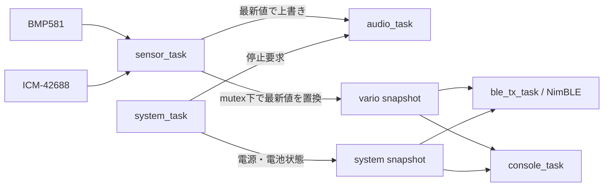

# バリオメーター ソフトウェア要件・簡易設計

- 対象機種: Aohazuku Rev.0
- MCU: ESP32-S3-WROOM-1-N16R8
- 開発環境: ESP-IDF 6.0系 / C言語
- 文書状態: 初期実装ベースライン（レビュー反映版）
- 仕様基準日: 2026-07-19

## 目的

本書は、ハンググライダーおよびパラグライダーで使用するバリオメーターの、初期開発に必要なソフトウェア要件と簡易設計を定義する。

初期開発では、気圧・IMUから高度と昇降率を求め、バリオ音とBLEで操縦者へ伝えるところまでを完成範囲とする。オープンソースでの開発・保守に必要な判断基準を残しつつ、詳細な内部仕様や実装手順の固定は避ける。

本書の「こと」は必須要件、「推奨」は必須ではない設計指針を表す。本書は初期実装の基準文書とする。ハードウェア接続は `hw_spec.md`、BLE電文の一般形式は `ble.md`、バリオ音の体験要求は `vario_sound_spec.md`を参照するが、本書が初期実装値を明示した項目は本書を優先する。競合を発見したまま実装で暗黙に選択せず、該当文書を同時に修正する。

## 現在の実装状態と完成条件

レビュー時点では、`sdkconfig.defaults`、安全GPIO、共有I2C、ADC、LEDC、NimBLE NUS、RTOS資源、タスク生成および省電力管理までの基盤が存在する。BMP581、ICM-42688、推定、音声判定、LK8EX1送信およびコンソールコマンドの機能実装は未完了である。したがって、基盤が存在することを理由に本書の初期版機能が完成済みとみなしてはならない。

初期版の完成には、少なくとも次を含める。

- `idf.py set-target esp32s3` 後に警告を確認できる状態でビルドできるプロジェクト設定
- N16R8に対応する16 MB Flash、8 MB Octal PSRAM、USB Serial/JTAGコンソールの既定設定
- 本書の初期開発範囲に含まれるドライバ、タスク、アルゴリズムおよび診断機能
- ホスト単体テストとESP32-S3実機受け入れ試験
- 基板固有値の静的検証と、不正・未定義値で該当機能を無効化するフェイルセーフ

Wi-Fiは初期版で有効化しない。Bluetooth Controllerが必要とするNVSは初期化するが、ユーザーパラメータは初期版ではNVSへ保存しない。

## 開発範囲

### 初期開発に含める機能

- 電源自己保持、電源OFF処理
- スイッチ、LED、バッテリー電圧、外部電源状態の入出力
- BMP581による気圧・温度取得
- ICM-42688による加速度・角速度取得
- 気圧高度、高度、昇降率の推定
- IMUを使用した姿勢推定および鉛直加速度との融合
- 上昇、沈下、無音域を知らせるバリオ音
- BLEによるXCTrack向けデータ送信
- USB Serial/JTAGによる診断・設定

### 初期開発に含めない機能

次の機能は、初期版のセンサー取得、推定、音声、BLEが安定した後に追加する。

- Sharp Memory LCDのグラフィック表示
- microSDカードへのログ記録
- GPSデータおよびPPSの読み込み
- OTA更新

初期版では、これらの周辺機能のタスクやドライバを起動しない。将来追加できるようにGPIO定義とデータモデルの拡張余地は残すが、未実装機能を初期版の動作条件にしない。

## 基本方針

1. ESP-IDFのFreeRTOS SMPを使用する。AMP構成や片側コアのベアメタル実行は行わない。
2. 高周期のセンサー処理と音声処理を優先し、BLE、コンソールなどの遅延で停止させない。
3. GPIO番号、極性、I2C設定などのボード依存値は、ボード設定モジュールへ集約する。コンパイルスイッチにより、将来的なボード変更に耐えうる設計とする。
4. センサードライバ、推定アルゴリズム、バリオ音の判定ロジックを、ESP-IDFの周辺ドライバから分離する。
5. 異常な測定値や古い測定値では、誤った音声・BLEデータを出力しない。
6. 一部のデバイスが使用できない場合でも、安全を確保し、可能な範囲で動作を継続する。

## 機能要件

### 電源、スイッチ、LED

- `app_main()`の先頭で、他の初期化より先に `PIN_PWR_HOLD`（GPIO47）を出力Highへ設定し、電源を自己保持すること。ROM・2nd stage bootloaderの起動時間中はハードウェア側のラッチで電源が維持されることを実機で確認すること。
- 初期化中はブザーを停止し、緑・黄LEDを消灯状態にすること。
- 電源OFF要求を受けた場合、直ちに新規BLE送信を禁止してブザーを停止し、終了処理を開始してから1秒以内に `PIN_PWR_HOLD` をLowにすること。BLE停止やログ出力が失敗またはタイムアウトしても、電源保持解除を妨げてはならない。
- `PIN_PWR_EXT`（GPIO42）からUSB外部電源の有無を取得できること。
- `PIN_BAT_ADC`（GPIO1）はADC oneshot mode、12 bit、12 dB attenuationで読み、ADC calibration driverで校正済みmVへ変換すること。分圧はバッテリー側1 MΩ、GND側330 kΩとする。
- ボード設定は `BAT_ADC_R_HIGH_OHM=1000000`、`BAT_ADC_R_LOW_OHM=330000`、`BAT_ADC_SCALE=(R_HIGH+R_LOW)/R_LOW=133/33`、`BAT_ADC_GAIN_CORRECTION=1.0`、`BAT_ADC_OFFSET_V=0.0`を単一定義とする。実装では整数除算を避けること。バッテリー電圧は `battery_v = adc_mv / 1000 * BAT_ADC_SCALE * BAT_ADC_GAIN_CORRECTION + BAT_ADC_OFFSET_V` で求めること。
- 12 dB attenuationのADC入力上限約3.1 Vに対する分圧前の電気的測定上限は約12.49 Vである。この値は対応バッテリーの定格を意味しない。ADC rawのsaturation、校正失敗、非有限値または換算後の負値は電池電圧を無効とし、BLEのbatteryフィールドへ `999` を送ること。
- 分圧回路のThevenin抵抗は約248 kΩと高いため、ADCチャネル設定直後の初回値を破棄し、複数回取得後の値を使用すること。実機でDMMとの比較を行い、必要な実測補正は `BAT_ADC_GAIN_CORRECTION` と `BAT_ADC_OFFSET_V`へ記録すること。
- バッテリーADCは10 Hzで取得し、直近5件の中央値を診断・BLE値に使用すること。ADC読出し失敗は無効値として扱い、センサー・音声処理を停止させないこと。
- SW1～SW3は10 ms周期で読み、同じ入力が30 ms継続した時点で確定状態とすること。押下時Lowとして扱うこと。
- SW1は、起動後に一度「離された」状態を確認した後の2秒長押しで電源OFF要求を生成すること。起動のために押しているSW1をそのまま電源OFF操作と判定してはならない。
- LEDはLowで点灯、Highで消灯するものとして制御すること。
- GPIO43のROM起動ログによる一時的な緑LED点滅は許容し、アプリ初期化後はUART0として使用しないこと。

USB外部電源があるため `PIN_PWR_HOLD` をLowにしてもMCUが動作を継続する場合は、ブザーとBLEを停止し、両LEDを消灯した安全停止状態を維持する。安全停止loopは必要なWatchdog処理を継続し、Watchdog resetによって通常起動へ戻ってはならない。安全停止状態から通常動作へ自動復帰せず、明示的なリセットまたは全電源の再投入を必要とする。

初期版のLED表示は次を標準とする。より詳細な表示を追加しても、初期化中と電源OFF中の安全状態を変更してはならない。

| 状態 | 緑LED | 黄LED |
| --- | --- | --- |
| 初期化中／電源OFF処理中 | 消灯 | 消灯 |
| 有効な推定値を出力中 | 2秒ごとに50 ms点灯 | 消灯 |
| BMP581待機中または推定無効 | 消灯 | 1 Hz、各50 ms点灯 |
| IMU較正中または気圧単独へ縮退 | 2秒ごとに50 ms点灯 | 1 Hz、各50 ms点灯 |
| 必須リソース生成失敗のfatal state | 消灯 | 2 Hz、各50 ms点灯 |
| 安全停止 | 消灯 | 消灯 |

複数状態が重なる場合は、電源OFF／安全停止、BMP581異常、IMU縮退、正常の順に優先する。SW2とSW3は初期版では押下状態を診断表示できればよく、操作機能は割り当てない。

### BMP581

- GPIO4（SDA）、GPIO5（SCL）のI2C Masterを1MHzで使用すること。
- I2Cアドレス `0x46` を探索し、CHIP_ID `0x50` を確認すること。
- 温度1倍、気圧8倍のオーバーサンプリング、Normal mode、約100 Hzで測定すること。
- 初期設定後に `OSR_CONFIG=0x58`、`ODR_CONFIG=0xA9`、`DSP_CONFIG=0x03`、`DSP_IIR=0x00` をread-backして確認すること。
- `OSR_EFF`の`ODR_IS_VALID`を確認し、無効なOSR/ODR組合せのまま測定を開始しないこと。
- レジスタ `0x1D` から温度・気圧の6 byteを約10 ms周期で連続読み出しすること。
- 読み出した温度と気圧にタイムスタンプと有効状態を付けること。
- 起動時に検出できない場合は約2秒周期で再検出し、単発の通信エラーでは次周期の取得を継続すること。
- 連続10回の読出しエラー、または最後の有効サンプルから100 ms超過をBMP581 staleとし、推定を無効化すること。連続エラー回数はパラメータで変更可能とすること。
- 連続エラー時は、まずBMP581 device handleとBMP581だけを再初期化すること。BMP581とICM-42688-Pの双方で通信異常が発生した場合、またはSDA/SCL stuckを検出した場合に限り、共有I2C busを停止・再生成して両デバイスを再初期化すること。
- 初期化ではソフトウェアリセット後2 ms以上待ち、POR/soft-reset完了状態とNVM readyを確認してから設定すること。

BMP581の割り込み端子は `PIN_INT_BMP`（GPIO21）とする。初期版は周期読み出しを基本とし、割り込み使用は周期精度や消費電力に効果がある場合に採用する。

同じ変換結果を重複配信しないことを目標とするが、初期版はData Ready割り込みを使用しないため、読出し成功ごとにsequenceを進める。取得周期、重複値率および周期超過を診断値として測定し、実機で問題が確認された場合に `PIN_INT_BMP` のData Ready方式へ切り替える。

### ICM-42688と姿勢推定

#### 接続と基本設定

- ICM-42688-Pを、BMP581と同じGPIO4（SDA）、GPIO5（SCL）のI2Cバスへ接続し、1MHzで使用すること。
- AD0はLow固定とし、7 bit I2Cアドレスを `0x68` に固定すること。`0x69`の探索は行わないこと。
- `REG_BANK_SEL`（`0x76`）へ `0x00` を書き、以降の基本設定とデータ取得をUser Bank 0で行うこと。
- `WHO_AM_I`（`0x75`）を読み出し、`0x47`であることを確認すること。不一致の場合はICM-42688-P未検出として扱うこと。
- 加速度レンジを±8 g、角速度レンジを±2000 dps、双方のODRを500 Hzとすること。
- 加速度と角速度はLow Noise modeで動作させること。
- ICM-42688-PへのI2Cアクセスは `sensor_task` だけが行い、BMP581へのアクセスと直列化すること。
- 通常のI2C transaction timeoutは5 ms以下とし、無応答デバイスによって `sensor_task` を長時間blockさせないこと。約2秒の再試行間隔はtask delayで待たず、次回試行時刻として管理すること。

初期版で使用するUser Bank 0の設定値を次に示す。

| レジスタ | Address | 設定値 | 内容 |
| --- | ---: | ---: | --- |
| `DEVICE_CONFIG` | `0x11` | `0x01` | ソフトウェアリセット。書込み後1 ms以上はレジスタへアクセスしない |
| `INT_CONFIG` | `0x14` | `0x03` | INT1をPulsed、Push-pull、Active Highに設定 |
| `FIFO_CONFIG` | `0x16` | `0x00` | FIFOをBypass modeに設定。初期版はFIFOを使用しない |
| `PWR_MGMT0` | `0x4E` | `0x0F` | 温度有効、Gyro Low Noise、Accel Low Noise |
| `GYRO_CONFIG0` | `0x4F` | `0x0F` | ±2000 dps、500 Hz |
| `ACCEL_CONFIG0` | `0x50` | `0x2F` | ±8 g、500 Hz |
| `INT_CONFIG1` | `0x64` | `0x00` | `INT_ASYNC_RESET`を0にし、INT1を正常動作させる |
| `INT_SOURCE0` | `0x65` | `0x08` | UI Data ReadyをINT1へ出力 |
| `REG_BANK_SEL` | `0x76` | `0x00` | User Bank 0を選択 |

デジタルフィルタの初期設定はICM-42688-Pのリセット値を使用する。帯域と遅延は実機データで評価し、変更する場合は設定値と採用理由を本書へ追記する。

#### 初期化手順

1. ICM-42688-Pの電源安定後、1 ms以上待つ。
2. `REG_BANK_SEL`（`0x76`）へ `0x00` を書く。
3. `DEVICE_CONFIG`（`0x11`）へ `0x01` を書いてソフトウェアリセットし、1 ms以上待つ。
4. 再度User Bank 0を選択し、`WHO_AM_I`（`0x75`）が `0x47`であることを確認する。
5. `FIFO_CONFIG`、`GYRO_CONFIG0`、`ACCEL_CONFIG0`、`INT_CONFIG`、`INT_CONFIG1`、`INT_SOURCE0`の順で設定する。
6. `PWR_MGMT0`（`0x4E`）へ `0x0F` を書き、加速度・角速度をLow Noise modeへ移行する。
7. ジャイロの起動を考慮して45 ms以上待つ。
8. 設定したレジスタをread-backし、期待値と一致することを確認する。
9. ESP32-S3のGPIO14を立ち上がりエッジ割り込み入力として有効にする。

初期化の途中でI2Cエラー、`WHO_AM_I`不一致、または設定値のread-back不一致が発生した場合は、ICM-42688-Pを無効として気圧単独推定を開始し、約2秒後に再初期化を試みる。

#### データレジスタ読み出し

INT1 ISRでは、`sensor_task`へタスク通知を送るだけとし、I2Cアクセスや姿勢計算を行わない。`sensor_task`は通知を受けた後、次の順序で処理する。

1. Read-to-clearの `INT_STATUS`（`0x2D`）を読み、bit 3の `DATA_RDY_INT` が1であることを確認する。
2. `TEMP_DATA1`（`0x1D`）を開始アドレスとして14 byteをrepeated-start付きI2Cトランザクションで連続読み出しする。
3. 読み出し完了時刻を単調増加タイマーで記録する。
4. signed 16 bit、ビッグエンディアンとして各値を復元する。

| Offset | レジスタ | Address | データ |
| ---: | --- | ---: | --- |
| 0～1 | `TEMP_DATA1`, `TEMP_DATA0` | `0x1D`～`0x1E` | 温度 |
| 2～3 | `ACCEL_DATA_X1`, `ACCEL_DATA_X0` | `0x1F`～`0x20` | X軸加速度 |
| 4～5 | `ACCEL_DATA_Y1`, `ACCEL_DATA_Y0` | `0x21`～`0x22` | Y軸加速度 |
| 6～7 | `ACCEL_DATA_Z1`, `ACCEL_DATA_Z0` | `0x23`～`0x24` | Z軸加速度 |
| 8～9 | `GYRO_DATA_X1`, `GYRO_DATA_X0` | `0x25`～`0x26` | X軸角速度 |
| 10～11 | `GYRO_DATA_Y1`, `GYRO_DATA_Y0` | `0x27`～`0x28` | Y軸角速度 |
| 12～13 | `GYRO_DATA_Z1`, `GYRO_DATA_Z0` | `0x29`～`0x2A` | Z軸角速度 |

初期レンジにおける物理値への変換は次のとおりとする。

```text
temperature_c = raw_temperature / 132.48 + 25.0
acceleration_g = raw_acceleration / 4096.0
acceleration_mps2 = acceleration_g * 9.80665
angular_rate_dps = raw_angular_rate / 16.4
angular_rate_rad_s = angular_rate_dps * pi / 180
```

14 byteの一括読み出しにより、同一サンプル時刻の温度、3軸加速度、3軸角速度を組として扱う。途中の軸だけを個別に読み出してサンプル時刻を混在させない。

#### 較正、姿勢推定、異常判定

- 起動時に500 Hzの有効サンプルを200件以上使用してジャイロバイアスを較正すること。
- 較正候補サンプルは、加速度ノルムが0.9～1.1 gかつ角速度ノルムが3 dps未満の場合に静止と判定すること。200件の途中で条件を外れた場合は候補を破棄し、先頭から再試行すること。
- 起動後30秒以内に較正できない場合も気圧単独推定を継続し、1秒間隔で新しい較正窓を試すこと。較正待ちによってBMP581取得を停止してはならない。
- 較正中または未較正であることを診断状態として示すこと。（外部モジュールによってLEDに標示する目的）
- ICM-42688-Pのセンサー座標は基板座標と一致する。基板上面視で右方向をX+、上方向をY+、基板上面から鉛直上向きをZ+とし、初期版のセンサー座標から基板座標への変換はidentityとする。
- 6DoF Mahony方式を初期実装とし、基板座標の加速度から地球座標の鉛直加速度を求めること。加速度ノルムが0.75～1.25 gの範囲だけ、重力方向の姿勢補正へ使用すること。
- 水平方向の加速度も診断値として求められる構造を残すが、Total Energy Compensationは初期版の出力計算へ適用しない。
- `DATA_RDY_INT`から100 msを超えて有効サンプルを取得できない場合、IMUをstaleとして融合を停止すること。
- 通信異常を示す `INT16_MIN`、14-byte frameが100サンプル連続で完全一致する固定値、飽和値の継続、範囲外値、タイムスタンプ異常を検出した場合、そのサンプルを姿勢・融合計算へ使用しないこと。固定値判定だけでI2C通信の成否を決めず、診断理由を区別すること。
- ISR通知が処理前に複数回発生した場合は通知回数を診断へ記録すること。FIFOを使用しない初期版では過去サンプルを復元できないため、最新の1サンプルだけを読み、重複した通知回数をmissed sampleとして加算すること。

姿勢推定と融合処理はICM-42688-Pのレンジ、ODR、軸定義、タイムスタンプを入力条件として設計する。採用する数式と実装は、ICM-42688-Pの記録データを用いた単体テストと実機評価を通過したものに限定する。

### 高度・昇降率推定

- 気圧から次式で気圧高度を求めること。`altitude_m = 44330 * (1 - (pressure_pa / sea_level_pressure_pa)^(1 / 5.255))`
- 基準海面気圧の初期値を101325 Pa、許容範囲を80000～110000 Paとし、実行時に変更できること。
- BMP581のみで高度と昇降率を推定できること。
- IMUが有効な場合は、気圧高度と鉛直加速度を融合して高度と昇降率を推定できること。
- IMU融合が無効になった場合、動作を停止せず気圧単独推定へ切り替えること。
- 起動直後、およびBMP581のstale・再初期化からの復帰後は、連続する有効なBMP581サンプル100件をウォームアップに使用し、その間の推定値を無効として扱うこと。約100 Hzでは約1秒に相当するが、経過時間ではなく有効サンプル数を完了条件とすること。
- サンプルのタイムスタンプ差から実際の `dt` を求め、処理周期の揺らぎを計算へ反映すること。
- NaN、無限大、範囲外の気圧・加速度、時間逆行を検出し、無効な結果を配信しないこと。
- 出力元を気圧単独と融合の間で切り替える際は、融合フィルタを現在の気圧単独推定値へ整合させてから有効化し、切替だけを原因とする昇降率のスパイクを発生させないこと。

気圧単独フィルタおよび気圧・IMU融合フィルタは、同じ入力ログに対してホストPC上でも実行できる構成とする。

### バリオ音

操縦者が画面を見ずに上昇、沈下、無音域を区別できることを目的とする。詳細な体験要求は `vario_audio_requirements.adoc` を参照する。

- `PIN_BUZZER_PWM`（GPIO40）からPWMを出力し、PAM8904Eを駆動すること。
- 初期化中、推定無効時、音声無効時、または推定値が500 msを超えて更新されない場合は、DINをLowとして無音にすること。
- 上昇時は断続音とし、上昇が強いほど音程を高く、テンポを速くすること。
- 強い沈下時は連続音とし、沈下が強いほど音程を低くすること。
- 通常の無音域では音を鳴らさないこと。予測ブザーは初期状態では無効とすること。
- 上昇開始 `+0.1 m/s`、上昇終了 `+0.05 m/s`、沈下開始 `-1.0 m/s`、沈下終了 `-0.8 m/s` を初期値とし、ヒステリシスを持たせること。
- 音声状態の最小保持時間を約60 msとし、しきい値付近の細かな変動による音のばたつきを抑えること。
- 周波数、テンポ、しきい値、デューティ、PAM8904Eの1倍／2倍／3倍モードを調整できる構成とすること。
- 音声制御タスクだけがLEDCおよびブザー制御GPIOを操作すること。
- 鳴動中だけPAM8904EのEN1/EN2を選択した増幅モードへ設定し、無音時はDIN、EN1、EN2をLowにしてshutdown状態とすること。

音声状態と遷移条件は次のとおりとする。

- `SILENT`: 初期状態および通常の無音域。リフト、シンク、または有効な予測ブザー条件が成立するまで無音とする。
- `LIFT`: 上昇率が `+0.1 m/s` を超えた場合に開始する。上昇率が `+0.05 m/s` 未満となった場合は、原則として現在の鳴動周期の区切りで終了する。
- `SINK`: シンク音が有効で上昇率が `-1.0 m/s` 未満となった場合に開始し、`-0.8 m/s` を超えた場合に終了する。
- `AUDIO_BUZZER`: 予測ブザーが有効な場合だけ使用する。初期設定では無効とする。
- しきい値と等しい場合は新しい状態を開始または終了せず、現在の状態を維持する。
- 推定無効、音声無効、500 msを超える更新停止、または電源OFF要求は強制無音条件とし、最小保持時間や鳴動周期の区切りを待たず停止する。

リフト音の標準テンポは次のとおりとする。各値は鳴動時間と休止時間を個別に示し、時間デューティ比は50 %とする。

- `+0.2 m/s`: 鳴動約480 ms、休止約480 ms
- `+1.0 m/s`: 鳴動約220 ms、休止約220 ms
- `+2.5 m/s`: 鳴動約100 ms、休止約100 ms
- `+5.0 m/s以上`: 鳴動70 ms、休止70 ms
- 上記の点間では音程とテンポを連続的に変化させ、上昇が強くなるほど周波数を下げず、周期を長くしない。
- `+5.0 m/s` 以上でも、鳴動時間と休止時間を70 ms未満にしない。

テンポは上記の制御点間を区分線形補間する。`+0.1 m/s`超から`+0.2 m/s`までは480 ms、`+5.0 m/s`以上は70 msへクランプし、鳴動時間と休止時間へ同じ値を使用する。

初期実装で使用する暫定音響値を次に示す。実機の聴感評価前でも実装と試験が可能な基準値であり、評価後は同じパラメータ表の既定値だけを変更する。

- リフト周波数: `1300 Hz + 100 Hz * max(climb_rate_mps, 0)`、上限1800 Hz
- シンク周波数: 沈下開始時400 Hz、`-1.0 m/s`から沈下が1 m/s強まるごとに70 Hz低下、最低130 Hz
- PWM時間デューティ比: 50 %
- PAM8904E: 1倍モード（EN1=Low、EN2=High）
- 予測ブザー: 800 Hz、20 ms鳴動／20 ms休止、対象範囲 `-0.1～+0.1 m/s`、初期状態は無効

シンク音は連続音とし、沈下が強くなるほど周波数を上げない。最低周波数は130 Hzとする。起動時と設定リセット時の既定値は、必ず単一のパラメータ定義を使用する。PAM8904E、ブザー、供給電圧および筐体を組み合わせた実機評価で、130～1800 Hzの生成誤差、音圧、歪みおよび聞き分けやすさを確認すること。

### BLE・XCTrack連携

- NimBLEを使用し、BLE Peripheralとして動作すること。
- 初期版のdevice nameを `CloudBaseVario` とし、connectable undirected advertisingを行うこと。NUS Service UUIDをadvertisingまたはscan responseへ含めること。
- advertising intervalの初期値を250 ms、送信出力を0 dBmとする。接続後は30～50 msのconnection interval、slave latency 1、supervision timeout 4秒を要求するが、peerが別の有効値を選んでも切断理由にせず実際の値を診断表示すること。
- 初期版はペアリング、ボンディング、暗号化を必須とせず、RXから受信したデータを設定コマンドとして実行しないこと。将来リモート設定を追加する場合は認証・権限・入力長を別要件として定義すること。
- Nordic UART Service互換のService、TX Notify、RX Write characteristicを公開すること。
- 有効な最新値から `$LK8EX1` センテンスを生成し、標準10 HzでXCTrackへNotifyすること。
- 気圧はPa、昇降率はcm/sへ変換し、未使用フィールドには `ble.md` で定めた無効値を使用すること。
- センテンス末尾をCRLFとし、規定範囲のXORチェックサムを付加すること。
- 接続していない場合、Notifyが許可されていない場合、または推定値が無効な場合は送信しないこと。
- センテンスが `ATT_MTU - 3` を超える場合は、NUSのbyte streamとして必ず分割送信すること。MTU negotiationの成功を送信条件にしてはならない。
- BLE処理の遅延や切断がセンサー取得と音声処理を停止させないこと。

NUSのUUIDは次の値とする。

- Service: `6e400001-b5a3-f393-e0a9-e50e24dcca9e`
- RX Characteristic: `6e400002-b5a3-f393-e0a9-e50e24dcca9e`、Write / Write Without Response
- TX Characteristic: `6e400003-b5a3-f393-e0a9-e50e24dcca9e`、Notify

送信センテンスは次の形式とする。

```text
$LK8EX1,<pressure_pa>,99999,<vario_cm_s>,<temperature_c>,<battery>,*<checksum>\r\n
```

- `pressure_pa` はBMP581の有効な気圧をPa単位の整数へ丸めた値とする。
- 高度フィールドは、XCTrack側で気圧高度を算出させるため `99999` とする。
- `vario_cm_s` は有効な昇降率をcm/s単位の整数へ丸めた値とする。
- `temperature_c` は有効な温度を℃単位の整数へ丸める。送信に使用できない場合は `99` とする。
- `battery` は有効な電池電圧をV単位の値に100を乗じた整数とする。換算値を使用できない場合は `999` とする。
- チェックサムは、`$` の次の文字から `*` の直前までを対象に、カンマを含む各ASCII byteをXORして求め、大文字2桁の16進数で出力する。
- 1センテンスが `ATT_MTU - 3` を超える場合、CRLFまでのbyte列を複数Notifyへ順序どおり分割する。受信側が1行へ復元できるよう、別センテンスを途中へ割り込ませない。
- 切断、Notify無効化または送信エラーが発生した場合は残りのfragmentを破棄する。再接続後に途中から再開せず、新しい完全なセンテンスの先頭から送ること。
- 同一接続で複数のNotifyを同時に積み上げず、NimBLEのmbuf不足やbusy時はその10 Hz周期のセンテンスを破棄して診断カウンタを加算すること。センサーまたは音声タスクを待たせて再送しないこと。

初期版ではBLEのRXデータを受理できればよく、リモート設定コマンドは必須としない。

### コンソールと診断

- 通常の診断・設定にはESP32-S3内蔵USB Serial/JTAGを主コンソールとして使用し、`CONFIG_ESP_CONSOLE_USB_SERIAL_JTAG`を選択すること。初期版ではUSB Device CDCを別途実装せず、UART0をアプリ稼働中に使用しないこと。
- センサー検出状態、気圧、温度、高度、昇降率、融合状態、BLE状態、電源状態を確認できること。
- I2Cエラー数、周期超過数、キュー破棄数、各タスクのスタック余裕を確認できること。
- 現在のCPU周波数、アプリケーションPMロック状態、Light-sleep復帰回数、観測できた周波数遷移回数およびPMロック異常数を確認できること。
- パラメータの一覧、取得、変更、初期値への復帰ができること。
- 任意の昇降率を注入してバリオ音とBLEを確認し、注入状態を解除できること。
- 不正なコマンド、未知のパラメータ、範囲外の値にはエラーを返し、設定を変更しないこと。

初期版のコンソールは、少なくとも次のコマンドを提供する。

```text
PARAM LIST
PARAM GET <name>
PARAM SET <name> <value>
PARAM RESET <name|ALL>
DEBUG VARIO <mps> [pressure_pa]
DEBUG CLEAR
DIAG STATUS
```

- `PARAM SET` は型、値域、パラメータ間の関係を検証し、妥当な場合だけ変更を反映する。
- `DEBUG VARIO` はセンサー推定値とは区別できる診断状態として保持し、バリオ音とBLEの試験入力に使用する。`pressure_pa`省略時は最新の有効なBMP581気圧を使用し、有効な気圧がない場合は音声だけを試験してBLE測定値を送らない。任意引数を指定した場合は30000～125000 Paの範囲だけ受理し、BLE試験用の診断気圧として使用する。
- `DEBUG CLEAR` は注入値を解除し、センサーから得た有効な推定値へ復帰する。
- `DIAG STATUS` はセンサー、推定、音声、BLE、電源、キュー、および主要エラーカウンタの現在状態を表示する。
- 初期版で実装しない周辺機能のコマンドは追加しない。

コマンドはASCII、行末CRまたはLF、最大128 byteとする。キーワードとパラメータ名は大文字・小文字を区別しない。空白だけの行は無視し、長すぎる行は行末まで破棄してエラーを返す。浮動小数点値はC localeの小数点 `.` だけを受理し、末尾に未解釈文字がある入力を拒否する。

コンソール出力がホスト未接続などで遅延しても、高周期タスクへ直接ログを書かない。高周期タスクは固定長の診断イベントまたはカウンタだけを更新し、文字列整形とUSB出力は `console_task` が行う。

## 非機能要件

- BMP581の目標取得周期を10 ms、ICM-42688の目標取得周期を2 ms、音声評価周期を10 ms以下とすること。
- 定常動作10分間の実測で、BMP581とICM-42688-Pの有効取得数をそれぞれ目標値の99 %以上とすること。周期超過、missed interruptおよびI2Cエラーは別々に計数すること。
- 周期処理は単調増加時刻と絶対期限を使用し、処理時間を次周期へ累積させないこと。
- 最新値だけが必要な経路では、キュー満杯時に古い値を破棄し、高優先度タスクを待たせないこと。
- ISRおよびタイマーコールバックでは、I2Cアクセス、BLE送信、複雑な演算を行わないこと。
- GPIO35、36、37および通常動作で使用しないstrapping pinを初期化しないこと。
- GPIO、I2Cポート、LEDC channel、周期、しきい値などをソース各所へ重複定義しないこと。
- タスクのスタック、ヒープ、実行周期、エラー数を実機で計測し、初期値を調整できること。
- `sensor_task`と`audio_task`をTask Watchdogの監視対象とし、正常ループ内でのみresetすること。Watchdog回避だけを目的に異常状態でresetし続けないこと。
- 定常ループで動的メモリを確保・解放しないこと。NimBLEなどESP-IDF内部の動的確保は、アプリケーション側の所有範囲外としてヒープ監視で評価すること。
- 推定と音声判定の主要ロジックを、ESP-IDFに依存しない単体テストで検証できること。
- 初期版の連続動作試験を1時間以上行い、リセット、ヒープ減少、スタック不足がないこと。

### ESP-IDFビルド設定

- targetは `esp32s3`、ESP-IDFは6.0系とし、プロジェクトで使用したminor/patch versionをビルドログへ残すこと。
- Flash sizeは16 MB、PSRAMは8 MB Octal modeとして設定し、起動時に検出容量を診断表示すること。検出容量が基板仕様と異なる場合は警告を出すこと。
- ESP-IDF標準の2コアFreeRTOSを使用し、`CONFIG_FREERTOS_UNICORE`と実験的Amazon SMP kernelを選択する`CONFIG_FREERTOS_SMP`はいずれも無効とする。`CONFIG_FREERTOS_NUMBER_OF_CORES=2`、tick rate 1000 Hzとすること。
- BluetoothはBLE + NimBLE Hostだけを有効にし、Classic BluetoothとWi-Fiを初期版では無効にすること。
- console primaryはUSB Serial/JTAG、UART consoleは無効とすること。GPIO19/20を通常GPIOとして再設定しないこと。
- CPU既定・最大周波数を80 MHz、DFS最小周波数を40 MHzとし、アプリケーションが `esp_pm_configure()` で明示的に設定すること。通常計測中はLight-sleep禁止ロックを保持し、全worker停止後の安全停止状態だけで解放すること。
- tickless idle、Bluetooth modem sleepおよびBluetooth low-power clockのmain XTALを有効にすること。USB Serial/JTAG接続中は自動Light-sleepを禁止すること。
- Wi-Fi/Bluetoothソフトウェア共存制御、NimBLEの未使用role・標準service・BLE 5.x追加機能・DTM testを無効にし、NimBLEはPeripheral/GATT Server、接続数1、ATT MTU 23に限定すること。
- OTAを含まないcustom partition tableを使用し、少なくともNVS、PHY init data、2 MB以上のfactory application領域を確保すること。未使用Flashを初期版で無理に用途へ割り当てないこと。
- `sdkconfig.defaults`とpartition tableをリポジトリへ含め、開発者個人の生成済み `sdkconfig` だけを前提にしないこと。

## 簡易ソフトウェア設計

### コアとタスク

ESP32-S3の両コアでESP-IDF標準FreeRTOSを動作させる。FreeRTOSをcore0、ベアメタル処理をcore1で動かすAMP構成はESP-IDF 6.0で未サポートのため使用しない。ESP-IDF内部タスクとの競合を抑えるため、高周期処理をcore1へ固定し、アプリケーションの通信・操作系タスクはcore0へ固定する。ESP-IDFが生成するNimBLE内部タスクのaffinityはESP-IDF設定に従う。

| タスク | Core | 初期優先度 | 初期stack | 主な責務 |
| --- | --- | ---: | ---: | --- |
| `sensor_task` | core1固定 | 20 | 8192 byte | I2C所有、BMP581・ICM-42688取得、姿勢推定、カルマンフィルタ、結果配信 |
| `audio_task` | core1固定 | 18 | 4096 byte | 最新昇降率の状態判定、LEDC、PAM8904E制御 |
| `system_task` | core0固定 | 12 | 4096 byte | スイッチ、LED、ADC、外部電源、電源OFF処理 |
| `ble_tx_task` | core0固定 | 8 | 6144 byte | LK8EX1生成とNimBLE Notify要求 |
| `console_task` | core0固定 | 5 | 6144 byte | USBコンソール、パラメータ、デバッグ入力、診断文字列整形 |

優先度は `configMAX_PRIORITIES >= 25` を前提とする。初期stackは実測開始値であり、1時間試験におけるstack high-water markが1024 byte未満となるタスクは増量する。ESP-IDFの `xTaskCreatePinnedToCore()` へ渡すstackサイズはbyte単位である。

`sensor_task`はIMU通知待ちと次のBMP581絶対期限の短い方までblockし、busy loopにしない。姿勢・フィルタ計算を含む1回の処理が次のIMU期限まで継続しないよう計測する。NimBLE HostはESP-IDFが生成する専用タスクで動作し、`ble_tx_task`はセンサーキューやI2Cを直接操作しない。

### データの流れ



推定結果には、少なくとも次の情報を含める。

```c
typedef struct {
    uint32_t sequence;
    int64_t timestamp_us;
    int32_t temperature_c_x100;
    int32_t pressure_pa_x100;
    float altitude_m;
    float climb_rate_mps;
    float vertical_accel_mps2;
    bool estimate_valid;
    bool bmp581_online;
    bool imu_online;
    bool imu_fusion_active;
    bool debug_input_active;
    uint32_t i2c_error_count;
    uint32_t missed_imu_sample_count;
} vario_result_t;
```

`temperature_c_x100`と`pressure_pa_x100`はBMP581由来とする。ICM-42688-Pの温度はIMU診断値として別に保持し、LK8EX1の温度へ混在させない。system snapshotには少なくとも、timestamp、外部電源状態、電池電圧とそのvalid flag、debounce後のSW1～SW3、電源OFF要求を含める。

センサーから音声へのキューは長さ1とし、常に最新値で上書きする。`sensor_task`だけがvario snapshot、`system_task`だけがsystem snapshotを書き、BLEとコンソールはそれぞれをmutexまたは短いcritical sectionの下で構造体ごとコピーする。複数writerが古い構造体コピーで互いのフィールドを上書きしてはならない。ロックを保持したまま文字列整形、BLE送信またはUSB出力を行わない。状態変化イベントは最新snapshotと別の固定長診断キューへ置き、通常サンプルによって重要イベントが上書きされないようにする。

### モジュール分割

実装は、少なくとも次の責務を分離する。

| レイヤー | モジュール | 責務 |
| --- | --- | --- |
| `platform` | `board` | GPIO番号、極性、I2C、LEDC、ADC換算、軸方向 |
| `platform` | `bmp581` | レジスタ設定、検出、生データ変換 |
| `platform` | `icm42688` | センサー設定、割り込み、加速度・角速度変換 |
| `domain` | `vario_estimator` | 気圧高度、姿勢、気圧単独／IMU融合フィルタ |
| `domain` | `vario_audio` | 音声状態、しきい値、音程・テンポ計算 |
| `platform` | `audio_output` | ESP-IDF LEDCとPAM8904E GPIO制御 |
| `platform` | `ble_vario` | NimBLE NUS、LK8EX1生成、Notify |
| `platform` | `app_power` | 40/80 MHz DFS、センサーCPU lock、通常時Light-sleep禁止、安全停止時の解放、PM診断 |
| `domain` | `app_config` | 既定値、値域検証、実行時設定 |
| `app` | `diagnostics` | エラーカウンタ、周期、状態の収集 |

初期段階ではファイル数を必要以上に増やさなくてよいが、アルゴリズムとハードウェアアクセスを同じ関数へ混在させない。

ソースは単一のESP-IDFコンポーネント内で `app`、`domain`、`platform` の3レイヤーへ分割する。`app` は起動、タスクおよび共有RTOS資源を管理し、`domain` はESP-IDFとFreeRTOSに依存しない型と純粋Cロジックを保持し、`platform` はESP-IDF、NimBLEおよびハードウェアアクセスを隠蔽する。依存方向は `app` から `domain`／`platform`、および必要な場合の `platform` から `domain` だけを許可し、`domain` から他レイヤー、または `platform` から `app` を参照してはならない。プロジェクト内ヘッダは `app/app_tasks.h`、`domain/app_types.h`、`platform/board.h` のようにレイヤー名を含むパスで参照する。

### 初期化順序

1. `PIN_PWR_HOLD` をHighにし、LEDとブザーを安全な初期状態へ設定する。
2. ボード設定を検証し、診断カウンタと単一テーブルのパラメータ既定値を準備する。ADC分圧定数とIMU座標変換が本書の確定値と一致しない場合は該当機能を無効として診断へ示す。
3. 最大80 MHz、最小40 MHz、Light-sleep許可でPMを初期化し、通常動作用Light-sleep禁止lockを取得する。初期化またはlock生成に失敗した場合は80 MHz固定・Light-sleep無効へ戻し、主要機能を継続する。
4. キュー、mutex、Event Groupを生成する。必須同期オブジェクトを生成できない場合はブザーを停止したfatal stateへ入り、電源OFF操作だけを受理する。
5. NVSを初期化する。`ESP_ERR_NVS_NO_FREE_PAGES`または`ESP_ERR_NVS_NEW_VERSION_FOUND`の場合はNVS partitionを消去して1回だけ再初期化する。
6. USB Serial/JTAGコンソールを初期化する。
7. I2C bus、BMP581、ICM-42688を初期化する。センサー不在はfatalとせず、規定の縮退状態へ移る。
8. LEDCとPAM8904Eを無音状態で初期化し、無音中はLEDC timerをpauseする。
9. `audio_task`、`system_task`、`sensor_task`、`console_task`、`ble_tx_task`の順に開始する。作成失敗時は新しい処理を開始せずfatal stateへ移る。
10. NimBLEを初期化して広告を開始する。失敗時もセンサー、推定、音声とコンソールを継続する。
11. 有効な推定値が得られるまで、音声とBLE測定値送信を抑止する。

LCD、microSD、GPSは初期版では初期化しない。microSDのCSは非選択状態を維持し、未使用の出力が周辺回路を誤動作させないようボード初期化で扱う。

### 縮退・異常時動作

| 異常 | 動作 |
| --- | --- |
| BMP581未検出 | 推定値を無効化して無音とし、BLE測定値を送らず、約2秒周期で再検出する |
| ICM-42688未検出／stale | 気圧単独推定で動作を継続し、バックグラウンドで再検出する |
| 単発I2Cエラー | エラーを記録し、次周期の取得を継続する |
| 連続I2Cエラー | 対象デバイスを再初期化し、必要に応じてI2C busを復旧する |
| BLE初期化失敗／切断 | センサー取得、推定、音声を継続する |
| キュー満杯 | 古い測定値を破棄し、最新値と高周期処理を優先する |
| 推定値無効／古い | ブザーを停止し、BLE測定値を送信しない |
| 電源OFF要求 | Event Groupへ停止要求を設定し、新規通信を停止してブザーを直ちに停止する。各タスクのackを最大1秒待ち、未応答タスクがあっても電源保持を解除する |
| 必須キュー／mutex／タスク生成失敗 | ブザーをshutdown、BLE未開始または停止、黄LED 2 Hz点滅のfatal stateとし、診断と電源OFF操作だけを継続する。`system_task`を生成できない場合は `app_main()` の低周期fallback loopがSW1と電源保持を扱う |

### パラメータ管理

- 既定値は単一のテーブルで定義し、起動時とRESET時で共用する。
- 型、最小値、最大値、相互関係を検証してから変更を反映する。
- センサー・音声タスクは周期の先頭で必要な設定をローカルへコピーし、処理途中で設定が変化しないようにする。
- 初期版のユーザー設定はRAMだけに保持し、再起動で既定値へ戻す。Bluetooth Controller用NVSとユーザーパラメータ保存を混同しない。NVS保存を追加する場合は、設定バージョン、CRCまたは全項目の妥当性検証、atomic updateおよび不正値からの復帰方法を合わせて設計する。

初期版で公開する主要パラメータを次に示す。表にない内部調整値を追加する場合も、型・単位・値域・既定値を同じテーブルへ登録する。

| name | 型 | 既定値 | 許容範囲／関係 |
| --- | --- | ---: | --- |
| `sea_level_pressure_pa` | float | 101325 | 80000～110000 Pa |
| `filter_mode` | enum | `AUTO` | `AUTO` / `BARO_ONLY` |
| `i2c_reinit_error_count` | uint32 | 10 | 1～100 |
| `imu_accel_correction_min_g` | float | 0.75 | 0.5～1.0、max未満 |
| `imu_accel_correction_max_g` | float | 1.25 | 1.0～1.5、minより大きい |
| `audio_enabled` | bool | true | true / false |
| `sink_enabled` | bool | true | true / false |
| `predictive_buzzer_enabled` | bool | false | true / false |
| `lift_start_mps` | float | 0.10 | -1.0～5.0、`lift_end_mps <= lift_start_mps` |
| `lift_end_mps` | float | 0.05 | -1.0～5.0 |
| `sink_start_mps` | float | -1.00 | -10.0～0.0、`sink_start_mps <= sink_end_mps` |
| `sink_end_mps` | float | -0.80 | -10.0～0.0 |
| `audio_state_hold_ms` | uint32 | 60 | 0～1000 ms |
| `audio_stale_ms` | uint32 | 500 | 100～500 ms |
| `lift_freq_base_hz` | uint32 | 1300 | 200～5000 Hz、max以下 |
| `lift_freq_rate_hz_per_mps` | float | 100 | 0～1000 Hz/(m/s) |
| `lift_freq_max_hz` | uint32 | 1800 | base～5000 Hz |
| `lift_time_ms_at_0p2` | uint32 | 480 | 20～2000 ms |
| `lift_time_ms_at_1p0` | uint32 | 220 | 20～2000 ms、0.2 m/s点以下 |
| `lift_time_ms_at_2p5` | uint32 | 100 | 20～2000 ms、1.0 m/s点以下 |
| `lift_time_ms_at_5p0` | uint32 | 70 | 70～2000 ms、2.5 m/s点以下 |
| `sink_freq_start_hz` | uint32 | 400 | 130～2000 Hz |
| `sink_freq_rate_hz_per_mps` | float | 70 | 0～500 Hz/(m/s) |
| `sink_freq_min_hz` | uint32 | 130 | 130～start Hz |
| `audio_duty_percent` | uint32 | 50 | 10～90 % |
| `audio_amp_mode` | uint32 | 1 | 1～3 |
| `predictive_freq_hz` | uint32 | 800 | 200～5000 Hz |
| `predictive_on_ms` | uint32 | 20 | 10～1000 ms |
| `predictive_off_ms` | uint32 | 20 | 10～1000 ms |
| `predictive_min_mps` | float | -0.10 | -2.0～1.0、max以下 |
| `predictive_max_mps` | float | 0.10 | -1.0～2.0、min以上 |

`PARAM SET`は単一項目の変更後に全パラメータの相互関係を検証し、失敗時は構造体全体を変更前へ戻す。しきい値は `sink_start_mps <= sink_end_mps < lift_end_mps <= lift_start_mps` を必須とし、各リフト時間制御点は上昇率の増加に対して同じか短くなること。読取り側が部分更新を観測しないよう、mutex下で設定構造体を一括置換する。

## センサー・推定アルゴリズム設計

センサーのレジスタアクセスとESP-IDFドライバ処理は、物理値変換、姿勢推定、フィルタ、音声判定から分離する。アルゴリズム層はESP-IDFの型や周辺機器APIを参照せず、記録データをホストPC上で入力できるCモジュールとする。

### BMP581の物理値変換

- 温度と気圧はレジスタ `0x1D` から6 byteを一括で読み出す。
- 温度生値は2の補数の符号付き24 bit、リトルエンディアンとして復元し、`int32_t`へ符号拡張する。
- 気圧生値は符号なし24 bit、リトルエンディアンとして復元し、`uint32_t`へ格納する。気圧を符号拡張してはならない。
- 温度は `temperature_c = raw_temperature / 65536.0` で℃へ変換する。
- 気圧は `pressure_pa = raw_pressure / 64.0` でPaへ変換する。
- 内部整数表現は温度を0.01 ℃単位、気圧を0.01 Pa単位とし、最も近い整数へ丸める。負の温度も0から遠ざかる側を含む対称なround-to-nearestとし、Cの整数除算による単純な切捨てを使用しないこと。
- 生値、変換値、取得時刻、および有効状態を同一サンプルとして扱う。

### 姿勢と鉛直加速度

- ICM-42688-Pの3軸角速度を積分し、3軸加速度による重力方向の補正を加えた6DoF姿勢推定を行う。
- ボード設定で定義した軸変換と符号補正を、姿勢推定へ入力する前に適用する。
- 基板座標は上面視でX=右、Y=上、Z=基板上面法線の上向きとなる右手系とし、地球座標のZと上昇率・鉛直加速度は上向きを正とすること。
- ジャイロ較正完了後の静止加速度からroll/pitch初期値を求める。磁気センサーを使用しないためyaw絶対方位は未観測とし、初期値0 radとして診断上も絶対方位として公開しないこと。
- 姿勢quaternionは各更新後に正規化し、normが有限でない、または正規化できない場合は姿勢を無効化して静止較正から再初期化すること。
- 地球座標へ変換したZ軸加速度から標準重力加速度を減算し、鉛直加速度を求める。
- ジャイロバイアス較正が未完了、IMUがstale、入力値が異常、または姿勢が無効な場合は、鉛直加速度を融合処理へ渡さない。
- 姿勢更新の `dt` はIMUサンプルの単調増加タイムスタンプ差から求める。

### 高度・昇降率フィルタ

- 気圧単独フィルタは、高度と鉛直速度を状態とし、気圧高度を観測値とする。
- 起動後のBMP581有効サンプル100件をウォームアップに使用し、その間は高度・昇降率を外部出力用の有効値としない。
- 気圧・IMU融合フィルタは、高度、鉛直速度、鉛直加速度、加速度バイアスを状態とし、気圧高度と姿勢補正済み鉛直加速度を観測値とする。
- 気圧単独フィルタはIMUの状態にかかわらず更新を継続し、融合結果を使用できない場合の出力元とする。
- フィルタの `dt` はサンプルの単調増加タイムスタンプ差から求める。`dt <= 0`または`dt > 0.5秒`の場合はその値で予測せず、出力を無効化してフィルタと100サンプルのウォームアップを再開始すること。長い欠測を0.5秒として扱って計算を継続してはならない。
- NaN、無限大、時間逆行、または設定した物理範囲外の入力を検出した場合、そのサンプルによる更新を行わない。

初期版の物理範囲はBMP581気圧30000～125000 Pa、温度-40～85 ℃とする。IMUは設定したフルスケールを超えないことに加え、姿勢補正へ使用する加速度ノルム範囲を個別に検証する。範囲外値を安全な上限へ丸めて有効値として扱わない。

### アルゴリズムの検証

- 物理値変換は、既知の生データと期待する単位変換値を用いて境界値を試験する。
- 姿勢推定は、静止、一定角速度、既知の傾斜、および異常タイムスタンプを含む入力系列で試験する。
- 高度・昇降率フィルタは、一定高度、一定上昇、一定沈下、ステップ変化、欠測、およびIMU停止を含む入力系列で試験する。
- IMU融合の開始・停止時に、出力がNaNにならず、不連続な誤音声を発生させないことを確認する。
- 実機でセンサー周期、異常復帰、姿勢変化時の昇降率、および音の聞こえ方を確認して採用値を確定する。

## 初期版の受け入れ基準

- clean checkoutで `idf.py set-target esp32s3` と `idf.py build` が成功し、Flash、PSRAM、console、NimBLEおよびpartition設定が本書と一致する。
- 通常計測中はLight-sleep禁止lockが保持され、センサー処理区間ではCPUが80 MHz、workerのblock中は他のPM lockがなければ40 MHzへ遷移することを確認する。
- 電源OFF時に全workerが停止した場合だけLight-sleep禁止lockを解放し、USB Serial/JTAG接続中は自動Light-sleepせず、切断後は安全出力を維持したまま自動Light-sleepへ入ることを確認する。
- 起動直後に電源が自己保持され、LED消灯・ブザー停止の安全状態から初期化を開始する。
- 起動用にSW1を2秒以上押したままでも即座に電源OFFせず、一度離してから再度2秒長押しした場合だけ電源OFF処理を開始する。
- 電源OFF要求から1秒以内にブザーが停止して `PIN_PWR_HOLD` がLowとなる。USB外部電源で動作が続く場合も安全停止状態から通常動作へ戻らない。
- バッテリー入力端子へ既知の3.0 Vおよび4.2 Vを印加し、GPIO1ではそれぞれ約0.744 Vおよび1.042 Vとなることを確認する。ソフトウェアのバッテリー換算値が入力端子のDMM値に対して初期目標±0.10 V以内となること。GPIO1へ3.0 Vまたは4.2 Vを直接印加してはならない。外れる場合は回路条件と実測gain/offsetを記録してboard設定を更新すること。
- BMP581の設定レジスタが規定値となり、約10 ms周期で気圧を連続取得できる。
- BMP581の既知raw data試験で、負温度は符号拡張され、気圧のbit 23が1でも負値にならず正しいPaへ変換される。
- I2Cアドレス `0x68`で `WHO_AM_I=0x47`を確認し、規定レジスタをread-backした後、500 HzのData Readyに応じて14 byteの温度・加速度・角速度を連続取得できる。
- 基板上面を水平・上向きに静置したとき、軸変換後の加速度が概ねX=0 g、Y=0 g、Z=+1 gとなること。基板を各軸方向へ傾け、X/Y/Zの符号が本書の基板座標と一致すること。
- 連続する有効なBMP581サンプル100件のウォームアップ終了後、高度と昇降率が有効になる。途中に欠測または再初期化があれば完了扱いにしない。
- 室内静止60秒の試験で、ウォームアップ後の気圧単独昇降率の平均絶対値が0.1 m/s以下、95 %のサンプルが±0.2 m/s以内となること。気流や空調の影響を避け、元データと試験条件を保存すること。
- ホスト入力で一定上昇1.0 m/s相当の気圧系列を与えた場合、出力がNaNや発散を起こさず定常値へ追従すること。応答時間とovershootは記録し、初回実機評価後に数値基準を確定すること。
- IMUを切断または停止すると、音声を不必要に中断せず気圧単独推定へ切り替わる。
- BMP581を切断すると最後の有効サンプルから100 ms超過で推定を無効化し、遅くとも音声鮮度期限500 ms以内に無音となり、誤ったBLE測定値を送信しない。
- 0.5秒を超える欠測または時間逆行を入力すると、`dt`をクランプした見かけの有効出力を生成せず、フィルタとウォームアップを再開始する。
- `+0.2`、`+1.0`、`+2.5`、`+5.0 m/s` の注入値で、上昇が強いほど音程が高くテンポが速く聞こえる。
- `DEBUG VARIO`の有効な入力から30 ms以内に音声状態判定へ反映されること。
- `-1.0 m/s`未満でシンク音を開始し、`-0.8 m/s`より大きくなると停止する。
- しきい値付近の値を変動させても、音が細かくオン・オフを繰り返さない。
- XCTrackがNUSへ接続し、10 HzのLK8EX1から気圧と昇降率を受信できる。
- ATT MTU 23で1行が複数Notifyへ分割されても、XCTrack側でCRLFまでの1センテンスとして復元・受理され、fragment間へ別センテンスが混入しない。
- LK8EX1の単体テストで、batteryと`*`の間のカンマを含む本文に対するXOR checksumが一致する。
- BLEを切断または送信停止しても、センサー取得とバリオ音が継続する。
- USBコンソールから主要状態とエラーカウンタを確認し、昇降率注入テストを実行・解除できる。
- 1時間以上の連続動作で、意図しない再起動、継続的なヒープ減少、スタック不足が発生しない。
- 初期版でLCD、microSD、GPSの未接続または未実装が、ビルド・起動・主要機能の妨げにならない。

## 確定した基板固有項目

初期実装で使用する基板固有値を次に示す。`board`モジュールと `hw_spec.md` でも同じ値を使用し、別の既定値を持たないこと。

| 項目 | 確定値 | 実装条件 |
| --- | --- | --- |
| バッテリーADC換算 | バッテリー側1 MΩ、GND側330 kΩ、scale=`133/33`（約4.030303）、初期gain correction=1.0、初期offset=0 V | ADC校正後の端子電圧へscale、gain correction、offsetを適用する |
| ICM-42688-P実装方向 | 上面視で右=X+、上=Y+、基板上面法線の上向き=Z+ | rawセンサー座標から基板座標への変換はidentity |

リフト・シンク周波数とPAM8904E増幅モードは本書の暫定値で実装できるため、初期実装のblockerとはしない。実機聴感評価の結果は単一の既定値テーブルと関連音声文書へ反映する。

## 推奨実装順序

1. ESP-IDF設定、board、安全GPIO、USBコンソール、電源OFF
2. I2C bus、BMP581、物理値変換単体テスト、気圧単独フィルタ
3. ICM-42688-P、割り込み、較正、軸変換、姿勢推定
4. 気圧・IMU融合と縮退／復帰試験
5. バリオ音ロジック、LEDC、PAM8904E、安全無音化
6. NimBLE NUS、LK8EX1、MTU 23分割試験、XCTrack実機確認
7. ADC、スイッチ、LED、診断、1時間連続試験

## 将来拡張

初期版完了後、次の順序を目安に独立した要件と受け入れ基準を追加する。

1. Sharp Memory LCDによるグラフィック表示
2. microSDカードへのフライトログ記録
3. GPS測位、時刻、PPSの利用
4. 設定のNVS永続化およびOTA更新

将来機能を追加する際も、センサー取得、推定、バリオ音の周期と安全動作を悪化させないことを共通条件とする。

## 関連文書

- `hw_spec.md`: GPIO、信号極性、周辺回路の仕様
- `vario_audio_requirements.adoc`: 操縦者視点のバリオ音要求
- `vario_sound_spec.md`: バリオ音の状態、標準テンポ、安全動作、および受け入れ条件の詳細
- `ble.md`: XCTrack向けNUS／LK8EX1インターフェース
- `CODING_RULES.md`: 実装時のコーディング規約
- [Bosch Sensortec BMP581 product page / datasheet](https://www.bosch-sensortec.com/products/environmental-sensors/pressure-sensors/bmp581/): BMP581公式データシート
- [Bosch Sensortec BMP5 SensorAPI](https://github.com/boschsensortec/BMP5_SensorAPI): BMP581の公式C実装例。温度rawはsigned 24 bit、気圧rawはunsigned 24 bitとして扱う
- [TDK InvenSense ICM-42688-P Datasheet](https://www.invensense.tdk.com/en-us/products/consumer/icm-42688-p): ICM-42688-Pの公式データシートおよび技術資料
- [ESP-IDF USB Serial/JTAG Controller Console](https://docs.espressif.com/projects/esp-idf/en/stable/esp32s3/api-guides/usb-serial-jtag-console.html): ESP32-S3の主コンソール設定と制約
- [ESP-IDF NimBLE-based Host APIs](https://docs.espressif.com/projects/esp-idf/en/stable/esp32s3/api-reference/bluetooth/nimble/index.html): NimBLE HostとController初期化
- [ESP-IDF ESP32-S3 ADC](https://docs.espressif.com/projects/esp-idf/en/stable/esp32s3/api-reference/peripherals/adc/index.html): ADC oneshot、attenuationおよび校正の前提
