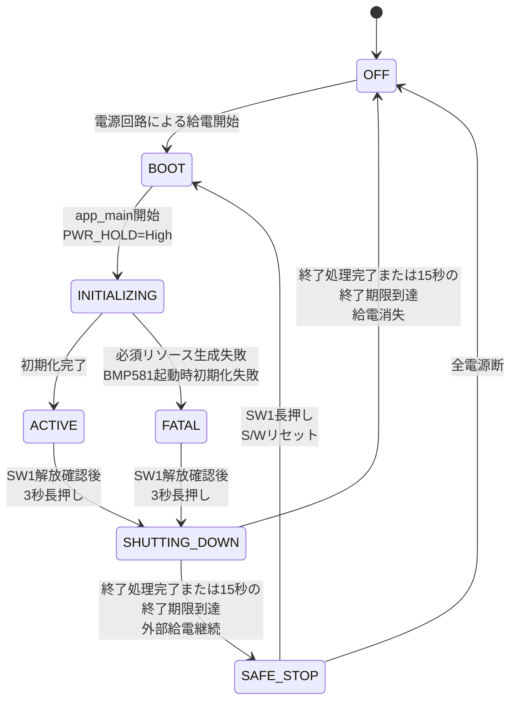
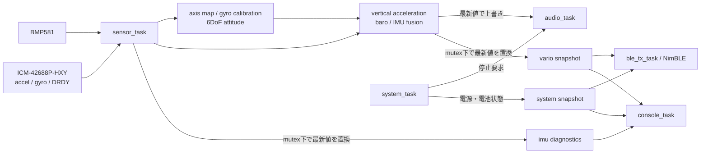

# バリオメーター ソフトウェア要件・簡易設計

- 対象機種: Aohazuku Rev.0
- MCU: ESP32-S3-WROOM-1-N16R8
- 開発環境: ESP-IDF 6.0系 / C言語
- 文書状態: 初期実装

## 目的

本書は、ハンググライダーおよびパラグライダーで使用するバリオメーターの、初期開発に必要なソフトウェア要件と簡易設計を定義する。

初期開発では、BMP581の気圧とICM-42688P-HXYの姿勢補正済み鉛直加速度から高度と昇降率を求め、バリオ音とBLEで操縦者へ伝えるところまでを完成範囲とする。IMUを使用できない場合も気圧単独で継続できることを必須とする。オープンソースでの開発・保守に必要な判断基準を残しつつ、詳細な内部仕様や実装手順の固定は避ける。


## 機能

### 現在の機能

- 電源自己保持、電源OFF処理
- スイッチ、LED、バッテリー電圧、外部電源状態の入出力
- BMP581による気圧・温度取得
- ICM-42688P-HXYの設定、生データ取得、静止較正、6DoF姿勢推定
- 気圧高度、高度、昇降率の気圧単独推定
- 姿勢補正済み鉛直加速度との融合、およびIMU異常時の気圧単独推定への自動縮退
- 上昇、沈下、無音域を知らせるバリオ音
- BLEによるXCTrack向けデータ送信
- TinyUSB CDCによる診断・設定、およびUSB MSCによるパラメータファイルの参照・編集
- USB MSC上の `UPDATE.BIN`によるdual-OTA更新と自動rollback

### 将来実装の機能

- Sharp Memory LCDのグラフィック表示
- microSDカードへのログ記録
- GPSデータおよびPPSの読み込み


## 基本方針

1. ESP-IDFのFreeRTOS SMPを使用する。
2. 高周期のセンサー処理と音声処理を優先し、BLE、コンソールなどの遅延で停止させない。
3. GPIO番号、極性、I2C設定などのボード依存値は、ボード設定モジュールへ集約する。コンパイルスイッチにより、将来的なボード変更に耐えうる設計とする。
4. センサードライバ、推定アルゴリズム、バリオ音の判定ロジックを、ESP-IDFの周辺ドライバから分離する。
5. 異常な測定値や古い測定値では、誤った音声・BLEデータを出力しない。
6. 一部のデバイスが使用できない場合でも、安全を確保し、可能な範囲で動作を継続する。

## 機能要件

### 電源、スイッチ、LED

- `app_main()`の先頭で、他の初期化より先に `PIN_PWR_HOLD`（GPIO47）を出力Highへ設定し、電源を自己保持すること。ROM・2nd stage bootloaderの起動時間中はハードウェア側のラッチで電源が維持されることを実機で確認すること。
- 初期化中はブザーを停止し、緑・黄LEDを消灯状態にすること。
- 電源OFF要求を受けた場合、直ちに新規BLE送信を禁止して通常のバリオ音を停止し、`SHUTTING_DOWN`への遷移時点から15秒の終了期限を開始すること。system task以外の起動済みworkerの停止ack、および既に処理を開始している永続化workerの完了を待ち、期限前にすべて完了した場合は終了サウンドの再生後に`PIN_PWR_HOLD`をLowにすること。初期版ではSD処理を起動せず、将来追加するSDなどの永続化workerも、実際に起動済みかつ処理開始済みの場合だけ待機対象とする。未保存のRAM上のパラメータを暗黙に保存してはならない。15秒の終了期限に達した場合は、SW1の状態、workerのack、書き込み、保存および終了サウンドの状態にかかわらず、直ちに`PIN_PWR_HOLD`をLowにすること。
- `PIN_PWR_EXT`（GPIO42）からUSB外部電源の有無を取得できること。
- `PIN_BAT_ADC`（GPIO1）はADC oneshot mode、12 bit、12 dB attenuationで読み、ADC calibration driverで校正済みmVへ変換すること。分圧はバッテリー側1 MΩ、GND側330 kΩとする。
- ボード設定は `BAT_ADC_R_HIGH_OHM=1000000`、`BAT_ADC_R_LOW_OHM=330000`、`BAT_ADC_SCALE=(R_HIGH+R_LOW)/R_LOW=133/33`、`BAT_ADC_GAIN_CORRECTION=1.0`、`BAT_ADC_OFFSET_V=0.0`を単一定義とする。実装では整数除算を避けること。バッテリー電圧は `battery_v = adc_mv / 1000 * BAT_ADC_SCALE * BAT_ADC_GAIN_CORRECTION + BAT_ADC_OFFSET_V` で求めること。
- 12 dB attenuationのADC入力上限約3.1 Vに対する分圧前の電気的測定上限は約12.49 Vである。この値は対応バッテリーの定格を意味しない。ADC rawのsaturation、校正失敗、非有限値または換算後の負値は電池電圧を無効とし、BLEのbatteryフィールドへ `999` を送ること。
- 分圧回路のThevenin抵抗は約248 kΩと高いため、ADCチャネル設定直後の初回値を破棄し、複数回取得後の値を使用すること。実機でDMMとの比較を行い、必要な実測補正は `BAT_ADC_GAIN_CORRECTION` と `BAT_ADC_OFFSET_V`へ記録すること。
- バッテリーADCは10 Hzで取得し、直近5件の中央値を診断・BLE値に使用すること。ADC読出し失敗は無効値として扱い、センサー・音声処理を停止させないこと。
- SW1～SW3は10 ms周期で読み、同じ入力が30 ms継続した時点で確定状態とすること。電源ラッチ回路を介するSW1は押下時High、外付けプルアップのSW2とSW3は押下時Lowとして扱うこと。
- SW1は、起動後に一度「離された」状態を確認した後の3秒長押しで電源OFF要求を生成すること。起動のために押しているSW1をそのまま電源OFF操作と判定してはならない。
- LEDはLowで点灯、Highで消灯するものとして制御すること。
- GPIO43のROM起動ログによる一時的な黄LED点滅は許容し、アプリ初期化後はUART0として使用しないこと。

`PIN_PWR_HOLD` をLowにしてもMCUが動作を継続する場合は、ブザーとBLEを停止し、両LEDを消灯した安全停止状態を維持する。安全停止loopは必要なWatchdog処理を継続し、Watchdog resetによって通常起動へ戻ってはならない。ただし、SW1が長押しされた場合には電源ON要求と解釈し、S/Wリセットを行いBOOT状態に遷移すること。

#### 電源ライフサイクル

装置の電源状態は次のライフサイクルに従う。`OFF`はMCUが動作していないためソフトウェア外の状態である。センサー、BLE、音声などの個別機能の縮退は電源状態と分離し、回復可能な異常では`ACTIVE`を維持する。



| 電源状態 | `PIN_PWR_HOLD` | ブザー | BLE | LED | 状態の説明 |
| --- | --- | --- | --- | --- | --- |
| `OFF` | Low相当 | 停止 | 停止 | 消灯 | MCUへの給電がなく、ソフトウェアは動作していない |
| `BOOT` | ハードウェアラッチによる保持からHighへ移行 | 停止 | 未開始 | 消灯 | ROMおよび2nd stage bootloader通過後、`app_main()`の先頭で電源保持を確立する |
| `INITIALIZING` | High | 停止 | 原則未開始 | 消灯 | GPIO、PM、RTOS資源、I2C、音声出力、タスクおよびBLEを順に初期化する |
| `ACTIVE` | High | 推定状態と設定に従う | 有効データと接続状態に従う | 診断状態に従う | 通常計測を行う。回復可能な周辺機能の異常時は縮退動作を行い、この電源状態を維持する |
| `FATAL` | High | 停止 | 未開始または停止 | 「LED（FATAL中）」の詳細表による | 必須RTOS資源・タスクの生成失敗、またはBMP581の起動時初期化失敗後、診断と電源OFF操作だけを受理する |
| `SHUTTING_DOWN` | 終了処理完了または15秒の終了期限到達時にLow | 通常音を停止し、期限前に終了処理が完了した場合だけ終了サウンドを鳴動 | 新規送信禁止後に停止 | 消灯 | 遷移時に15秒の終了期限を開始し、system task以外の起動済みworkerの停止ackと、処理開始済みの永続化workerの完了を待つ。期限到達時は直ちに電源保持を解除する |
| `SAFE_STOP` | Low | 停止 | 停止 | 消灯 | 外部給電によりMCUが動作を続ける安全停止状態。通常動作へ自動復帰せず、SW1長押しによる電源ON要求を待機する |

`ACTIVE`または`FATAL`から`SHUTTING_DOWN`への遷移は、起動後にSW1の解放を一度確認し、その後の3秒長押しを検出した場合にだけ行う。`SHUTTING_DOWN`へ遷移した時点で15秒の終了期限を開始し、通常のバリオ音を停止して新規BLE送信を禁止し、Event Groupへ停止要求を設定する。system task以外の起動済みworkerからのack、および既に処理を開始している永続化workerの完了を待つ。初期版ではSD処理を起動しない。将来追加するSDなどの永続化workerも、実際に起動済みかつ処理開始済みの場合だけ待機対象とする。未保存のRAM上のパラメータを暗黙に保存せず、USB hostが所有するFAT領域へアクセスしない。期限前にすべての終了処理が完了した場合は終了サウンドを鳴らし、その再生完了後に`PIN_PWR_HOLD`をLowへ変更する。終了期限に達した場合は、SW1の状態、ack、書き込み、保存および終了サウンドの開始・再生状態にかかわらず、終了サウンドを開始または継続せず、直ちに`PIN_PWR_HOLD`をLowへ変更する。

`PIN_PWR_HOLD`をLowへ変更した結果、給電が失われた場合は`OFF`へ遷移する。USBなどの外部給電によってMCUの動作が継続する場合は`SAFE_STOP`へ遷移する。この分岐は電源保持解除後の実際の給電状態によって決まり、`PIN_PWR_EXT`の値を理由に電源保持解除を省略してはならない。`SAFE_STOP`でSW1の長押しを検出した場合は電源ON要求と解釈し、S/Wリセットを行って`BOOT`へ遷移する。これは明示的なユーザー操作による遷移であり、Watchdog resetなどによって`ACTIVE`へ自動復帰してはならない。全電源が失われた場合は`OFF`へ遷移する。

#### LED表示

緑LEDは主に電源状態とセンサー状態、GPS状態(T.B.D)を表す。
黄LEDは主に異常状態とBLE状態、SDカード状態(T.B.D)を表す。

電源ライフサイクルに対応するLED表示は次の表の通りとする。`ACTIVE`中のLED表示は、センサー、GPS、BLEおよびSDカードの状態を含めて別途定め、本表では規定しない。

| 電源状態 | 緑LED | 黄LED | 表示要件 |
| --- | --- | --- | --- |
| `OFF` | 消灯 | 消灯 | MCUへ給電されていない状態であり、ソフトウェアによるLED制御は行わない |
| `BOOT` | 原則消灯 | 消灯 | 状態表示を行わない。ただし、GPIO43のROM起動ログによる一時的な黄LED点滅は許容する |
| `INITIALIZING` | 消灯 | 消灯 | 初期化完了前に正常動作または異常状態を示す表示を行わない |
| `ACTIVE` | 原則、点灯 | 原則消灯 | UIアプリケーション仕様によって制御される |
| `FATAL` | 「LED（FATAL中）」の詳細表による | 「LED（FATAL中）」の詳細表による | 致命的エラーの種別を詳細表の表示で示す |
| `SHUTTING_DOWN` | 消灯 | 消灯 | 3秒の長押し成立時点で両LEDを消灯し、終了処理中も消灯を維持する |
| `SAFE_STOP` | 消灯 | 消灯 | 外部給電中も消灯を維持する。SW1長押しによる電源ON要求の受付中およびS/Wリセット開始まで点灯しない |

`BOOT`から`INITIALIZING`へ遷移してLED GPIOの制御を開始した時点で、両LEDを明示的に消灯する。`INITIALIZING`から`ACTIVE`へ遷移するまでは、初期化の進捗をLEDで表示しない。

状態遷移が成立したときは、LEDの点滅などを待たず、即座に遷移先のLED表示に切り替える。

#### 起動サウンド

BMP581の起動時初期化に成功した場合は、NimBLE初期化を開始する前に、音声制御タスクだけが電源ONを示す起動サウンドを1回再生する。起動サウンドはPAM8904Eの1倍モード、デューティ50 %で、700 Hzを180 ms鳴動、80 ms無音、1200 Hzを120 ms鳴動する。全長は380 msとする。

起動サウンドは通常のバリオ音に対する `audio_enabled`、`audio_amp_mode`およびSW2の実行時音量overrideに依存しない固定システム音とする。再生前後は通常のバリオ音を停止し、再生完了後にバリオ音状態をリセットして通常評価へ戻す。起動サウンドとリフト音、シンク音または予測ブザーを同時に出力してはならない。

BMP581の起動時初期化失敗、必須タスク生成失敗などによって`FATAL`へ遷移する起動では再生しない。`ACTIVE`移行後のBMP581再検出または再初期化では再生しない。`SAFE_STOP`からSW1長押しでS/Wリセットし、BMP581の起動時初期化に成功した場合は、新しい正常起動として再生する。

起動処理が音声制御タスクへ再生を要求してから完了通知を待つ上限は1秒とする。音声出力失敗またはtimeoutはfatalとせず、ブザーをshutdown状態へ戻し、警告を診断して起動を継続する。再生中に`FATAL`または電源OFF要求が発生した場合は、10 ms以内に起動サウンドを停止し、FATALの安全無音またはシャットダウンシーケンスを優先する。

#### シャットダウンシーケンス

SW1の長押しにより、電源OFF操作を行う。

- SW1を3秒間長押しした場合、シャットダウン処理を開始する。
- 3秒が経過する前にSW1を離した場合はシャットダウン処理を開始せず、電源ON状態を維持する。
- SW1の押下中は、緑LEDを点灯状態から徐々に減光し、押下開始から3秒後に完全消灯する。
- シャットダウン処理を開始する前にSW1を離した場合は、緑LEDを押下前の点灯状態へ戻す。

シャットダウン処理を開始した場合は、`SHUTTING_DOWN`への遷移と同時に15秒の終了期限を開始し、次の順に終了処理を行う。

1. system task以外の起動済みworkerへ停止要求を通知し、その停止ackを待つ。
2. 既に処理を開始している永続化workerがある場合は完了を待つ。初期版ではSD処理を起動せず、将来追加するSDなどの永続化workerも、起動済みかつ処理開始済みの場合だけ対象とする。未保存のRAM上のパラメータを暗黙に保存せず、USB hostが所有するFAT領域へアクセスしない。
3. 終了期限前に待機対象がすべて完了した場合は、終了サウンドを鳴らす。
4. 終了サウンドの再生が終了期限前に完了した場合は、`PIN_PWR_HOLD`をLowへ変更する。

終了サウンドは音声制御タスクだけが出力し、PAM8904Eの1倍モード、デューティ50 %で、1200 Hzを120 ms鳴動、80 ms無音、700 Hzを180 ms鳴動する。全長は380 msとする。再生中も15秒の終了期限を監視し、期限到達時は直ちに無音化する。

#### 終了期限による強制シャットダウン

- `SHUTTING_DOWN`への遷移時点から15秒後を終了期限とする。SW1を押し続けることは終了期限の条件ではない。
- 終了期限に達した場合は、SW1の状態、workerのack、書き込み、保存および終了サウンドの開始・再生状態にかかわらず、終了処理を中断して直ちに`PIN_PWR_HOLD`をLowへ変更する。

### BMP581

- GPIO4（SDA）、GPIO5（SCL）のI2C Masterを1MHzで使用すること。
- I2Cアドレス `0x46` を探索し、CHIP_ID `0x50` を確認すること。
- 温度1倍、気圧8倍のオーバーサンプリング、Normal mode、約100 Hzで測定すること。
- 初期設定後に `OSR_CONFIG=0x58`、`ODR_CONFIG=0xA9`、`DSP_CONFIG=0x03`、`DSP_IIR=0x00` をread-backして確認すること。
- `OSR_EFF`の`ODR_IS_VALID`を確認し、無効なOSR/ODR組合せのまま測定を開始しないこと。
- `INITIALIZING`中のBMP581起動時初期化に失敗した場合は、バリオとしての動作が期待できないため、`ACTIVE`へ遷移せず`FATAL`へ遷移すること。`FATAL`中は自動再検出を行わないこと。
- レジスタ `0x1D` から温度・気圧の6 byteを約10 ms周期で連続読み出しすること。
- 読み出した温度と気圧にタイムスタンプと有効状態を付けること。
- `ACTIVE`移行後にBMP581が未検出、staleまたは連続通信エラーとなった場合は、`ACTIVE`を維持して約2秒間隔で再初期化または再検出を試行すること。単発の通信エラーでは次周期の取得を継続すること。
- 連続10回の読出しエラー、または最後の有効サンプルから100 ms超過をBMP581 staleとし、推定を無効化すること。連続エラー回数はパラメータで変更可能とすること。
- 連続エラー時は、まずBMP581 device handleとBMP581だけを再初期化すること。BMP581 timeoutまたはSDA/SCL stuckにより共有I2C busを停止・再生成する場合は、先にICM-42688P-HXYのdevice handleとGPIO14割り込みも解除し、bus再生成後にHXY IMUを再初期化すること。
- 初期化ではソフトウェアリセット後2 ms以上待ち、POR/soft-reset完了状態とNVM readyを確認してから設定すること。

BMP581の割り込み端子は `PIN_INT_BMP`（GPIO21）とする。初期版は周期読み出しを基本とし、割り込み使用は周期精度や消費電力に効果がある場合に採用する。

同じ変換結果を重複配信しないことを目標とするが、初期版はData Ready割り込みを使用しないため、読出し成功ごとにsequenceを進める。取得周期、重複値率および周期超過を診断値として測定し、実機で問題が確認された場合に `PIN_INT_BMP` のData Ready方式へ切り替える。

### ICM-42688P-HXY取得、姿勢推定、鉛直加速度

- 対象部品はLCSC品番`C46550687`のHXY製`ICM-42688P-HXY`とする。TDK純正ICM-42688-Pのレジスタマップを流用しないこと。
- BMP581と同じGPIO4（SDA）、GPIO5（SCL）のI2C busを共有する。BMP581は1 MHzのままとし、ICM-42688P-HXYのdevice handleだけ400 kHz以下とすること。
- SDOはLow固定であるため、7 bit I2Cアドレスは`0x18`に固定する。`0x19`およびその他のアドレスを探索しないこと。
- `WHO_AM_I`レジスタ`0x01`を読み出し、`0x6A`であることを確認すること。ACKがあってもIDが不一致なら未検出として扱うこと。
- `sensor_task`だけがI2Cアクセスを行い、BMP581アクセスと直列化すること。transaction timeoutは5 ms以下とすること。
- 識別前のデバイスへ設定を書かないこと。識別成功後はソフトウェアリセット、電源起動、設定値の順で書き込み、各設定値を1 ms以上待ってread-backすること。電源起動後は10 ms以上待つこと。
- HXY版には500 HzのODR設定がないため、加速度とジャイロを400 Hzに設定すること。設定値は次表を単一の根拠とする。

| レジスタ | address | write値 | 用途 |
| --- | ---: | ---: | --- |
| `SOFT_RST` | `0x4A` | `0xA5` | ソフトウェアリセット |
| `PWR_CTRL` | `0x7D` | `0x0E` | 温度、ジャイロ、加速度を有効化 |
| `COM_CFG` | `0x05` | `0x50` | HXY I2C通信設定 |
| `ACC_CONF` | `0x40` | `0xAA` | high-performance、normal average 4、400 Hz |
| `ACC_RANGE` | `0x41` | `0x02` | ±8 g |
| `GYR_CONF` | `0x42` | `0xAA` | high-performance、normal average 4、400 Hz |
| `GYR_RANGE` | `0x43` | `0x00` | ±2000 dps |
| `INT_CFG1` | `0x06` | `0x03` | ジャイロData ReadyをINT1へ出力 |

- `DATA_STAT`（`0x0B`）から加速度・ジャイロのData Readyと設定エラーを確認し、出力レジスタ`0x0C`～`0x17`を同一transactionで連続読み出しすること。設定エラーbit mask `0x30`が非0、またはData Ready mask `0x03`が揃っていないframeは有効サンプルとしないこと。
- 3軸加速度と3軸ジャイロはbig-endianのsigned 16 bitとして復元すること。±8 gは4096 LSB/g、±2000 dpsは0.061 dps/LSBとしてSI単位へ変換すること。
- GPIO14はHXY INT1の立上りData Ready入力とする。ISRは`sensor_task`へのtask notificationだけを行い、I2C、姿勢計算、ログ整形またはBLE送信を行わないこと。
- 起動後は加速度ノルム0.9～1.1 gかつ各軸ジャイロ絶対値3 dps以下の連続サンプルで静止ジャイロ較正を行うこと。既定の完了条件は200サンプルとし、途中で静止条件を外れた場合は蓄積をやり直すこと。
- 静止加速度からroll/pitchを初期化し、ジャイロ積分と加速度の重力方向補正を行う6DoF姿勢推定を400 Hzサンプルの実時刻差で更新すること。磁気センサーを使用しないためyawは絶対方位として扱わないこと。
- 基板座標へ軸変換後、加速度を地球座標へ回転し、上向きZ成分から標準重力9.80665 m/s²を減算して鉛直加速度を得ること。加速度ノルムが既定0.75～1.25 gの範囲外では姿勢の加速度補正を止めるが、ジャイロ積分は継続すること。
- 姿勢のタイムスタンプが逆行、同値または50 ms超の間隔となった場合、非有限値または正規化不能なquaternionとなった場合は、姿勢と較正を破棄し、気圧単独へ縮退して静止較正から再開すること。
- 未検出、無応答、ID不一致、連続通信エラー、100 ms超のstale、較正未完了または姿勢無効は非FATALとし、BMP581による気圧単独推定、音およびBLEを継続すること。再初期化は約2秒間隔とし、task delayで待たず次回試行時刻として管理すること。
- `CONFIG_CBV_IMU_HXY_ENABLE`を無効にしたビルドでは、ICM-42688P-HXYへI2Cアクセスせず、GPIO14を初期化せず、常に気圧単独推定を行うこと。
- `imu_diagnostics_t`に有効、online、設定済み、較正済み、姿勢有効、融合中、stale、アドレス、`WHO_AM_I`、`DATA_STAT`、最終エラー、試行・サンプル・連続エラー・較正・取りこぼし回数、加速度ノルム、ジャイロバイアス、クォータニオンおよびroll／pitch／yawを保持し、10 Hz連続モニターと`DIAG STATUS`へ表示すること。yawは磁気方位ではなく、6DoF推定開始時を基準とする相対角として扱う。

TDK純正品向けの`0x68`、`WHO_AM_I=0x75/0x47`、User BankおよびBank Select方式は本部品へ適用しない。

### 高度・昇降率推定

- 気圧から次式で気圧高度を求めること。`altitude_m = 44330 * (1 - (pressure_pa / sea_level_pressure_pa)^(1 / 5.255))`
- 基準海面気圧の初期値を101325 Pa、許容範囲を80000～110000 Paとし、実行時に変更できること。
- BMP581のみで高度と昇降率を推定できること。
- `filter_mode=AUTO`かつIMU較正・姿勢・鉛直加速度が有効でfreshな場合は、気圧高度と姿勢補正済み鉛直加速度を融合すること。
- `filter_mode=BARO_ONLY`、IMU未検出、較正未完了、姿勢無効、通信異常またはstaleの場合も動作を停止せず、気圧単独推定へ切り替えること。
- 起動直後、およびBMP581のstale・再初期化からの復帰後は、連続する有効なBMP581サンプル100件をウォームアップに使用し、その間の推定値を無効として扱うこと。約100 Hzでは約1秒に相当するが、経過時間ではなく有効サンプル数を完了条件とすること。
- サンプルのタイムスタンプ差から実際の `dt` を求め、処理周期の揺らぎを計算へ反映すること。
- NaN、無限大、範囲外の気圧・加速度、時間逆行を検出し、無効な結果を配信しないこと。
- 出力元を気圧単独と融合の間で切り替える際は、融合フィルタを現在の気圧単独推定値へ整合させてから有効化し、切替だけを原因とする昇降率のスパイクを発生させないこと。

気圧単独フィルタ、姿勢推定および気圧・IMU融合フィルタは、同じ入力ログに対してホストPC上でも実行できる構成とする。

### バリオ音

操縦者が画面を見ずに上昇、沈下、無音域を区別できることを目的とする。詳細な要件は `vario_sound_spec.md` を参照する。設定可能な特性は具体値で重複定義せず、対応するパラメータ名で示す。

- `PIN_BUZZER_PWM`（GPIO40）からPWMを出力し、PAM8904Eを駆動すること。
- 初期化中、推定無効時、`audio_enabled` が無効な場合、または推定値の経過時間が `audio_stale_ms` を超えた場合は、DINをLowとして無音にすること。
- 上昇時は断続音とし、上昇が強いほど音程を高く、テンポを速くすること。
- 強い沈下時は連続音とし、沈下が強いほど音程を低くすること。
- 通常の無音域では音を鳴らさないこと。予測ブザーは `predictive_buzzer_enabled` で制御すること。
- リフト判定は `lift_start_mps` と `lift_end_mps`、シンク判定は `sink_start_mps` と `sink_end_mps` によるヒステリシスを持たせること。
- 通常の音声状態を `audio_state_hold_ms` の間保持し、しきい値付近の細かな変動による音のばたつきを抑えること。
- 周波数、テンポ、しきい値、出力デューティ比およびPAM8904Eの増幅モードを、対応するバリオ音パラメータで調整できる構成とすること。
- 音声制御タスクだけがブザー用LEDC channelおよびブザー制御GPIOを操作すること。緑LEDの減光には、ブザー用とは別のLEDC timer/channelを使用すること。
- 鳴動中だけPAM8904EのEN1/EN2を選択した増幅モードへ設定し、無音時はDIN、EN1、EN2をLowにしてshutdown状態とすること。

音声状態と遷移条件は次のとおりとする。

- `SILENT`: 初期状態および通常の無音域。リフト、シンク、または有効な予測ブザー条件が成立するまで無音とする。
- `LIFT`: 上昇率が `lift_start_mps` を超えた場合に開始する。上昇率が `lift_end_mps` 未満となった場合は、原則として現在の鳴動区間の終了時に停止する。
- `SINK`: `sink_enabled` が有効で上昇率が `sink_start_mps` 未満となった場合に開始し、`sink_enabled` が無効または上昇率が `sink_end_mps` を超えた場合に終了する。
- `AUDIO_BUZZER`: `predictive_buzzer_enabled` が有効で、上昇率が `predictive_min_mps` 以上かつ `predictive_max_mps` 以下の場合に使用する。
- しきい値と等しい場合は新しい状態を開始または終了せず、現在の状態を維持する。
- 推定無効、`audio_enabled` が無効、または推定値の経過時間が `audio_stale_ms` を超える場合は強制無音条件とし、`audio_state_hold_ms` や鳴動区間の終了を待たず停止する。電源OFF要求時は通常のバリオ音を同様に直ちに停止するが、終了期限前に終了処理が完了した後の終了サウンドだけは例外として鳴らしてよい。強制シャットダウン時は、終了サウンドを開始または継続しない。

リフト音は、`lift_time_ms_at_0p2`、`lift_time_ms_at_1p0`、`lift_time_ms_at_2p5` および `lift_time_ms_at_5p0` をテンポ制御点として使用する。制御点間を連続的に補間し、範囲外では端の制御点を保持する。各制御点は、上昇率が強くなる方向に対して同じか短くなる関係を満たすこと。

リフト音の周波数は `lift_freq_base_hz`、`lift_freq_rate_hz_per_mps` および `lift_freq_max_hz` で定め、上昇が強くなるほど周波数を下げないこと。
シンク音の周波数は `sink_freq_start_hz`、`sink_freq_rate_hz_per_mps` および `sink_freq_min_hz` で定め、沈下が強くなるほど周波数を上げず、`sink_freq_min_hz` を下回らないこと。
予測ブザーの音型は `predictive_freq_hz`、`predictive_on_ms` および `predictive_off_ms` で定めること。
出力特性は `audio_duty_percent` および `audio_amp_mode` で定めること。

起動時と設定リセット時の既定値は、必ず単一のパラメータ定義を使用する。PAM8904E、ブザー、供給電圧および筐体を組み合わせた実機評価で、生成誤差、音圧、歪みおよび聞き分けやすさを確認すること。

### BLE・XCTrack連携

- NimBLEを使用し、BLE Peripheralとして動作すること。
- 初期版のdevice nameを `CloudBaseVario` とし、connectable undirected advertisingを行うこと。NUS Service UUIDをadvertisingまたはscan responseへ含めること。
- advertising intervalの初期値を250 ms、送信出力を0 dBmとする。接続後は30～50 msのconnection interval、slave latency 1、supervision timeout 4秒を要求するが、peerが別の有効値を選んでも切断理由にせず実際の値を診断表示すること。
- ペアリング、ボンディング、暗号化を必須としないこと。NUS互換のためRX characteristicを公開するが、RXへ書き込まれたbyte列にはアプリケーション上の意味を持たせず、解釈せずに破棄すること。
- Nordic UART Service互換のService、TX Notify、RX Write characteristicを公開すること。
- 最新値から `$LK8EX1` センテンスを生成し、標準10 HzでXCTrackへNotifyすること。
- 気圧はPa、昇降率はcm/sへ変換し、各フィールドの値が無効な場合は `ble.md` で定めたフィールド固有の無効値を使用すること。
- XCTrackでは、`vario_cm_s`を昇降率表示に使用し、`pressure_pa`をバリオ音の生成に使用するものとする。両フィールドを同じセンテンスで送信し、どちらか一方から他方を代用生成しないこと。
- センテンス末尾をCRLFとし、規定範囲のXORチェックサムを付加すること。
- 接続していない場合、Notifyが許可されていない場合、または気圧と昇降率の両方が無効な場合は送信しないこと。
- センテンスが `ATT_MTU - 3` を超える場合は、NUSのbyte streamとして必ず分割送信すること。MTU negotiationの成功を送信条件にしてはならない。
- BLE処理の遅延や切断がセンサー取得と音声処理を停止させないこと。

NUSのUUIDは次の値とする。

- Service: `6e400001-b5a3-f393-e0a9-e50e24dcca9e`
- RX Characteristic: `6e400002-b5a3-f393-e0a9-e50e24dcca9e`、Write / Write Without Response
- TX Characteristic: `6e400003-b5a3-f393-e0a9-e50e24dcca9e`、Notify

送信センテンスは次の形式とする。

```text
$LK8EX1,<pressure_pa>,99999,<vario_cm_s>,<temperature_c>,<battery>,*<checksum>\r\n
```

- `pressure_pa` はBMP581の有効な気圧をPa単位の整数へ丸めた値とし、気圧が無効な場合は `999999` とする。
- 高度フィールドは、XCTrack側で気圧高度を算出させるため `99999` とする。
- `vario_cm_s` は有効な昇降率をcm/s単位の整数へ丸めた値とし、昇降率が無効な場合は `9999` とする。
- `temperature_c` は、BMP581の測定温度を外気温として使用できることが実機評価で確認されるまで `99` とする。
- `battery` は有効な電池電圧をV単位の小数で表し、小数点には `.` を使用する。初期版は小数点以下2桁とし、例えば3.95 Vは `3.95` とする。換算値を使用できない場合は `999` とする。
- チェックサムは、`$` の次の文字から `*` の直前までを対象に、カンマを含む各ASCII byteをXORして求め、大文字2桁の16進数で出力する。
- 1センテンスが `ATT_MTU - 3` を超える場合、CRLFまでのbyte列を複数Notifyへ順序どおり分割する。受信側が1行へ復元できるよう、別センテンスを途中へ割り込ませない。
- 切断、Notify無効化または送信エラーが発生した場合は残りのfragmentを破棄する。再接続後に途中から再開せず、新しい完全なセンテンスの先頭から送ること。
- 同一接続で複数のNotifyを同時に積み上げず、NimBLEのmbuf不足やbusy時はその10 Hz周期のセンテンスを破棄して診断カウンタを加算すること。センサーまたは音声タスクを待たせて再送しないこと。

### ユーザーインターフェース

#### LED（ACTIVE中）
電源ライフサイクルが 'ACTIVE'時のLED表示を定める。

各状態は独立して成立し、複数の状態が同時に成立する場合がある。緑LED、黄LEDおよび備考はユーザーが定める。

- 点滅時間は「点灯時間／消灯時間」の各フェーズで定義する。1秒点灯／1秒消灯は、全体で2秒のサイクルとする。
- ホタル点滅は減光時間／増光時間の各フェーズで定義する。1秒かけて点灯から消灯まで減光し、1秒かけて消灯から点灯まで増光する場合は、全体で2秒のサイクルとする。
- 複数の状態が同時に成立する場合は、表の上から順に優先度が高いものとする。ただし、N/CのLEDは優先度を持たず、他の状態の点灯・点滅を妨げない。

| 状態 | 緑LED | 黄LED | 表示要件 | 備考 |
| --- | --- | --- | --- | --- |
| 推定値無効・stale | 消灯 | 点滅 | 有効かつ新しい昇降率を出力できず、通常のバリオ音を停止していることを示す | 0.5秒点灯／0.5秒消灯（1秒サイクル） |
| 推定ウォームアップ中 | 点滅 | N/C | BMP581の有効サンプルを蓄積中で、推定値をまだ出力できないことを示す | 1秒点灯／1秒消灯（2秒サイクル） |
| BMP581復旧中 | 点滅 | N/C | ACTIVE中にBMP581がstaleまたは連続読出しエラーとなり、測定値を無効化して再初期化または再検出を試行していることを示す | 1秒点灯／1秒消灯（2秒サイクル） |
| IMU初期化・較正中 | ホタル点滅 | N/C | IMUはonlineだが、静止較正または有効な姿勢の確立が完了していないことを示す | 1秒減光／1秒増光（2秒サイクル） |
| IMU縮退動作中 | ホタル点滅 | N/C | IMU未検出、通信異常またはstaleにより気圧単独推定へ縮退したことを示す | 0.5秒減光／0.5秒増光（1秒サイクル） |
| BLE接続中 | N/C | 点滅 | XCTrackと接続中で、Notify送信が行えている状態 | 0.1秒点灯、0.9秒消灯のサイクル |
| 正常動作中 | 点灯 | 消灯 | 必須の計測機能が正常で、有効な推定値を出力できることを示す |  |

#### LED（FATAL中）
電源ライフサイクルが 'FATAL'時のLED表示を定める。緑LED、黄LEDおよび備考はユーザーが定める。

| 状態 | 緑LED | 黄LED | 表示要件 | 備考 |
| --- | --- | --- | --- | --- |
| 必須リソース・タスク生成失敗 | 点滅 | 点滅 | 必須のキュー、mutex、Event Groupまたはタスクを生成できず、通常動作を開始できないことを示す | 緑LEDと黄LEDを0.5秒間隔で交互に点灯（各LEDは0.5秒点灯／0.5秒消灯） |
| BMP581起動時初期化失敗 | 消灯 | 点滅 | `INITIALIZING`中にBMP581を検出または初期化できず、バリオとして動作できないことを示す | 緑LEDは消灯、黄LEDは0.5秒点灯／0.5秒消灯（1秒サイクル） |


### TinyUSB CDC + MSC構成

- ESP32-S3のUSB OTG内蔵PHYを使用し、CDC ACM 1 interfaceとMSC 1 LUNを同時に公開する。USB Serial/JTAG、UART consoleおよびUSB DFU interfaceは併用しない。
- TinyUSB device taskはcore0固定、priority 6、stack 4096 byteとする。CDC RX/TX/endpoint bufferは512/4096/512 byte、MSC転送bufferは8192 byteとする。
- CDCはESP-IDF log、10 Hzテレメトリーおよびコマンドコンソールを提供する。MSCは4 MiB共有FATを公開する。
- MSC class driverはFAT mountより先に初期化する。FATをmountできない場合はLUNへmediaを登録せず、CDC + MSC descriptorを維持してSCSI要求へ「メディアなし」として応答する。未初期化のMSC class callbackをhostへ公開してはならない。
- FAT mount失敗時もTinyUSB CDC、センサー、推定、音声およびBLEを継続する。MSC class driver自体を初期化できない場合はTinyUSB compositeを開始せず、USB以外の主要機能を継続する。
- self-powered deviceとしてGPIO42をVBUS監視に使用する。CDCまたはMSCがhostに接続している間はLight-sleepへ移行しない。
- `DIAG STATUS`はTinyUSB driver、CDC、MSC class driver、MSC media、DTR、VBUS、FAT所有者、最後のstorage error、mount失敗、設定読込み・保存結果およびOTA状態を表示する。
- MSCへ接続中もセンサー、音声およびBLEの通常動作を継続する。CDC出力またはMSC転送の遅延を高周期taskから待たない。

### コンソールと診断

- 通常の診断・設定にはTinyUSB CDCを主コンソールとして使用し、設定ファイル公開用のMSCと同じUSB接続上の複合デバイスとして提供すること。UART0およびUSB Serial/JTAGをアプリ稼働中のコンソールとして使用しないこと。
- センサー検出状態、気圧、温度、高度、昇降率、融合状態、BLE状態、電源状態を確認できること。
- I2Cエラー数、周期超過数、キュー破棄数、各タスクのスタック余裕を確認できること。
- 現在のCPU周波数、アプリケーションPMロック状態、Light-sleep復帰回数、観測できた周波数遷移回数およびPMロック異常数を確認できること。
- パラメータの一覧、取得、変更、初期値への復帰ができること。
- パラメータファイルの読込み元、検証結果、保存結果、FAT領域の所有者およびUSB MSC状態を確認できること。
- 任意の昇降率を注入してバリオ音とBLEを確認し、注入状態を解除できること。
- 不正なコマンド、未知のパラメータ、範囲外の値にはエラーを返し、設定を変更しないこと。

初期版のコンソールは、少なくとも次のコマンドを提供する。

```text
PARAM LIST
PARAM GET <name>
PARAM SET <name> <value>
PARAM RESET <name|ALL>
PARAM SAVE
DEBUG VARIO <mps> [pressure_pa]
DEBUG CLEAR
DIAG STATUS
```

- `PARAM SET` は型、値域、パラメータ間の関係を検証し、妥当な場合だけRAM上の設定へ変更を反映する。
- `PARAM RESET` は指定した項目または全項目をRAM上で既定値へ戻し、それだけではファイルを更新しない。
- `PARAM SAVE` はRAM上の全パラメータを `parameters.json`へ明示的に保存する。USB hostがMSC領域を所有している場合はファイルを変更せず `BUSY`を返すこと。
- `DEBUG VARIO` はセンサー推定値とは区別できる診断状態として保持し、バリオ音とBLEの試験入力に使用する。`pressure_pa`省略時は最新の有効なBMP581気圧を使用し、有効な気圧がない場合はLK8EX1の気圧フィールドを `999999` として、注入した昇降率を送信する。任意引数を指定した場合は30000～125000 Paの範囲だけ受理し、BLE試験用の診断気圧として使用する。
- `DEBUG CLEAR` は注入値を解除し、センサーから得た有効な推定値へ復帰する。
- `DIAG STATUS` はセンサー、推定、音声、BLE、電源、キュー、および主要エラーカウンタの現在状態を表示する。
- 初期版で実装しない周辺機能のコマンドは追加しない。

TinyUSB CDCでhostがDTRをassertしている間は、`console_task`から100 ms周期で次の固定1行を連続出力する。明示的なSTART／STOP操作は設けず、各項目は機械処理可能な`key=value`形式とする。

```text
BARO seq=... timestamp_us=... online=... pressure_valid=... raw_temp=... raw_pressure=... temp_c=... pressure_pa=... altitude_m=... climb_mps=... climb_valid=... estimate_valid=... i2c_errors=... overruns=... ble_pressure_pa=... ble_altitude_m=... ble_vario_cm_s=... ble_temperature_c=... ble_battery=... ble_available=... ble_notify=... imu_online=... imu_calibrated=... imu_attitude_valid=... imu_stale=... q_w=... q_x=... q_y=... q_z=... roll_deg=... pitch_deg=... yaw_deg=... vertical_accel_mps2=... vertical_accel_valid=... fusion_active=... imu_samples=... imu_missed=... stream_drops=...
```

`ble_*`の5値は、同じsnapshotからLK8EX1へ実際に整形する値と一致させ、無効値`999999`／`99999`／`9999`／`99`／`999`もそのまま表示する。yawは磁気センサーを使わない相対角であり、絶対方位として扱わない。host未接続時は行を蓄積せず、出力失敗または周期超過時は古い行を再送せず`stream_drops`を増加させる。

コマンドはASCII、行末CRまたはLF、最大128 byteとする。キーワードとパラメータ名は大文字・小文字を区別しない。空白だけの行は無視し、長すぎる行は行末まで破棄してエラーを返す。浮動小数点値はC localeの小数点 `.` だけを受理し、末尾に未解釈文字がある入力を拒否する。

コンソール出力がホスト未接続などで遅延しても、高周期タスクへ直接ログを書かない。高周期タスクは固定長の診断イベントまたはカウンタだけを更新し、文字列整形とUSB出力は `console_task` が行う。

### パラメータの保存と読み込み

#### 保存領域とUSBインターフェース

- 内蔵Flashに4 MiBの設定・更新共有FAT partitionを設け、512 byte sectorのwear levelling Safety modeを介して使用すること。Bluetooth Controller用NVSおよび将来のmicroSDとは分離すること。
- wear levelling Performance modeでformatした既存FATからSafety modeへ移行してmountできない場合も自動formatしないこと。必要な設定を退避したうえで、SW2とSW3を押したまま電源ONする明示操作または `idf.py config-flash`により再初期化すること。
- ESP32-S3のUSB OTG peripheralと内蔵PHYをTinyUSBで使用し、CDCとMSCを同時に公開する複合デバイスとすること。USB OTGが内蔵PHYを使用している間はUSB Serial/JTAGを同時に使用しないこと。
- CDCは既存のコンソール入出力を提供し、MSCは設定保存用FAT partitionをリムーバブルストレージとして公開すること。
- FAT mount失敗時はMSC classをLUN数0の「メディアなし」として維持し、同じ複合デバイスのCDCとUSB以外の主要機能を継続すること。MSC class driver自体を生成できない場合は複合USBを公開せず、バリオ本体を継続すること。
- CDCおよびMSCはOS標準driverで利用できるUSB classとして実装し、Windows 11以外の主要OSでもvendor固有driverを要求しないこと。
- 本機はバッテリー動作中にもUSB接続されるself-powered deviceとして構成し、`PIN_PWR_EXT`（GPIO42）をVBUS監視に使用すること。
- VBUS監視回路はVBUSが4.75 V以上のときvalid（GPIO42 High）、4.35 V以下のときinvalid（GPIO42 Low）となること。4.35 V超4.75 V未満は切替しきい値の許容帯とする。USB切断後3 ms以内にGPIO42がLowとなること。
- ROM download modeによる書込みおよび復旧手段を維持すること。ROM／bootloaderからアプリケーションへ移行してTinyUSBを開始するときのUSB再認識は許容する。
- FAT領域はESP32アプリケーションとUSB hostが同時にアクセスしてはならない。USB hostへMSCとして公開している間はhostだけが所有し、ESP32側からmount、読込みまたは書込みを行わないこと。
- USB hostが安全な取り外しを完了し、FAT領域の所有権がESP32側へ戻ったことを確認した後にだけ、ESP32側からファイル操作を再開すること。hostの未flushデータを破壊する可能性があるため、保存目的でMSCを強制切断しないこと。
- MSCのWRITE(10)はwear levelling領域への実書込みが完了するまでcommandを完了扱いにせず、その後にだけhostへ成功応答すること。SCSI SYNCHRONIZE CACHE(10/16)へ成功応答し、安全な取り外し完了時にdevice側の遅延書込みを残さないこと。

#### MSCファイルによるファームウェア更新

- build成功時に通常の `CloudBaseVario.bin` と同一内容の `UPDATE.BIN`を生成し、3.5 MiB（`0x380000` byte）を超える場合はbuildを失敗させる。
- USBドライブ直下へ `UPDATE.BIN`をコピーして安全な取り外しを行い、次回起動時にだけ更新を適用する。稼働中に検出または適用しない。
- 更新処理は通常task開始前に行い、GPIO42がHighの外部給電中に限る。外部給電がない場合はファイルを保持して `UPDATE.TXT`へdeferred理由を記録し、現在のfirmwareを起動する。
- 入力はESP-IDFが生成したraw application imageとし、3.5 MiB以下、ESP image magic、ESP32-S3 chip ID、`esp_app_desc_t` magicおよびproject name `CloudBaseVario`を検証する。同一versionとdowngradeを許可する。secure bootおよび署名検証は本仕様の対象外とする。
- `esp_ota_begin/write/end`でinactive OTA partitionへ書き、`esp_ota_end`によるimage checksum検証に成功した場合だけboot partitionを変更する。更新中は電源保持を継続し、緑LEDを消灯、黄LEDを100 ms周期で点滅させ、通常taskを開始しない。
- partition tableは `nvs 0x9000/0x6000`、`phy_init 0xf000/0x1000`、`factory 0x10000/4 MiB`、`config 0x410000/4 MiB`、`otadata 0x810000/0x2000`、`ota_0 0x820000/0x380000`、`ota_1 0xba0000/0x380000`とする。
- `UPDATE.BIN`は未処理入力、`UPDATE.PND`は書込み済み・初回boot確認待ち、`UPDATE.BAD`は拒否またはrollbackされたimage、`UPDATE.TXT`はASCIIの状態・理由・version・対象partitionを記録するstatus fileとする。
- 更新firmwareの初回bootでは、5個の必須application workerが生成されたことを条件に10秒後に有効化する。確認中はTinyUSB CDC + MSCを開始しない。有効化後、ESP32側がFATを所有した状態で `UPDATE.TXT`を `CONFIRMED`へ更新し、`UPDATE.PND`の削除に成功した後にだけTinyUSB CDC + MSCを開始する。状態ファイルの更新または削除に失敗した場合はUSBを公開せず、次回bootで整理を再試行する。BMP581、IMU、音声、BLEなど個別peripheralの失敗は有効化を妨げない。必須worker生成前のcrash、resetまたは10秒timeoutはbootloader rollback対象とする。
- USB DFU classは実装しない。MSC更新が使用できない場合も、GPIO0 + resetによるROM download modeを最終復旧手段として維持する。
- 旧partition tableからの初回移行、bootloader／partition table／factoryの更新および完全復旧はMSC更新の対象外とし、ROM download modeから有線flashする。MSC更新は本partition構成を導入済みの機器でapplicationだけを更新する。

#### ファイル形式

設定ファイルはUSBドライブ直下の `parameters.json`とし、次の形式とする。

```json
{
  "format_version": 1,
  "parameters": {
    "sea_level_pressure_pa": 101325.0,
    "audio_enabled": true
  }
}
```

- 出力はUTF-8、BOMなし、2 space indent、LF改行、末尾改行ありの整形済みJSONとする。読込みではUTF-8 BOM、LFおよびCRLFを許容するが、JSON commentは許容しない。
- top-levelには整数の `format_version`とobject型の `parameters`だけを置くこと。初期版で受理する `format_version`は `1`だけとする。
- `parameters`には値だけを格納する。パラメータ名、型、単位、値域、既定値および相互関係は、本書の単一パラメータ表と対応する実装テーブルを正本とすること。
- boolはJSON boolean、uint32は0以上の整数、floatは有限のJSON number、enumは定義済み名称のJSON stringとして表すこと。NaNおよび無限大を受理しないこと。
- ファイルサイズの上限は32 KiBとする。上限を超えるファイルは途中まで解析せず無効とすること。
- 将来のパラメータ追加に備え、`parameters`に存在しない項目は組込み既定値で補完すること。未知の項目名、同一階層の重複key、未対応version、型違い、値域違反または相互関係違反が1件でもあれば、ファイル全体を無効とすること。
- 設定ファイルには認証情報、秘密鍵、tokenなどの秘密情報を保存しないこと。

#### 起動時の読み込み

- 起動時は組込み既定値から一時設定を作成し、USB MSCをhostへ公開する前にFAT領域をESP32側へmountして `parameters.json`を読み込むこと。
- 安全GPIO初期化直後にSW2とSW3が同時押下されている状態を10 ms周期で確認し、30 ms継続した場合だけ、設定FATを明示的にformatしてからmountし、組込み既定値の `parameters.json`を生成すること。この操作は保存済み設定を全消去する。SW2またはSW3の単独押下、30 ms未満の同時押下および通常起動ではformatしないこと。
- JSON全体の構文、形式version、key、型、値域およびパラメータ間の関係を一時設定上で検証し、すべて妥当な場合だけmutex下で実行時設定を一括置換すること。検証途中の値を部分的に反映してはならない。
- 有効なファイルを反映した後は、読込み元がファイルであることと形式versionを診断状態へ記録すること。
- `parameters.json`が存在しない場合は組込み既定値で起動し、FAT領域をUSB hostへ渡す前に既定値を使用した整形済みファイルを自動生成すること。
- ファイルの構文または内容が無効な場合は、ファイルを自動上書きせずに組込み既定値で起動し、失敗理由を診断状態とconsole logへ記録すること。
- SW2とSW3による明示的な初期化要求がない状態でFAT領域をmountできない場合は自動formatせず、組込み既定値で主要機能を継続すること。設定ファイルの異常をセンサー取得、推定、音声またはBLEのfatal条件にしてはならない。
- USB hostが編集したファイルは動作中に自動再読込みせず、次回起動時に検証して反映すること。動作中の各機能は起動時またはconsole操作で確定したRAM上の設定を使用すること。

#### 明示保存

- `PARAM SET`および`PARAM RESET`はRAM上の値だけを変更すること。通常シャットダウンを含め、`PARAM SAVE`なしで変更を暗黙に永続化してはならない。
- `PARAM SAVE`は現在のRAM上の全パラメータを検証し、FAT領域をESP32側が所有している場合だけ保存を開始すること。USB hostが所有している場合は保存を予約せず、ファイルを変更せずに `BUSY`を返すこと。
- 保存は同じFAT領域の一時ファイルへ全量を書き、flushおよびmedia syncを行い、書き戻した内容を検証してから `parameters.json`へrenameすること。既存の `parameters.json`へ直接、途中まで上書きしてはならない。
- 保存中のresetまたは電源断が発生しても、次回起動時に途中内容を部分適用してはならない。起動時に残った一時ファイルは設定の正本として扱わず、診断へ記録した後にESP32側がFAT領域を所有しているときだけ削除してよい。
- 保存成功、`BUSY`、保存前検証失敗およびI/O失敗をconsole応答と診断状態で区別できること。通常シャットダウン要求後は新しい保存を開始せず、既に開始済みの保存だけを通常終了処理の対象とすること。

#### 将来のHTML設定UI

- USBドライブ直下の `index.html`を将来のパラメータ設定UI用に予約すること。初期版ではHTML、JavaScriptおよびブラウザからのファイル保存機能を実装対象としない。
- 将来のUIは同じ `parameters.json`と `format_version`を使用し、UI追加だけを理由に設定ファイル形式を変更しないこと。
- ブラウザからの保存方式、対応ブラウザおよび権限取得方法は将来仕様で定めること。ローカルHTMLが隣接ファイルを無条件に読み書きできることを前提にしないこと。

### スイッチ仕様

SW2とSW3の仕様は以下の通りとする。（仮仕様）

SW2：音量選択　消音・小・中・大の4段階に変更できる。初期値は小。押すたびに小→中→大→消音→…と遷移する。音量は圧電素子ドライバのMODEで選択する。
SW3：シンク音ON/OFF　押すたびにシンク音のON/OFFを切り替える。初期値はパラメータ通りとする。ここでの変更はパラメータに反映せず、電源OFFでリセットする。

SW2とSW3を同時に押したまま電源ONした場合は、30 msのdebounce成立後に設定FATをformatし、全パラメータを組込み既定値へ初期化する。起動判定に使用した押下状態を音量選択またはシンク音切替の操作として扱わない。

## 非機能要件

- BMP581の目標取得周期を10 ms、ICM-42688P-HXYの目標取得周期を2.5 ms、音声評価周期を10 ms以下とすること。IMUのData Ready通知が複数回蓄積した場合は最新frameを優先し、取りこぼし数を計数すること。未検出時は約2秒間隔で再初期化すること。
- MSCへの連続書込みを行わない通常の定常動作10分間の実測で、BMP581の有効取得数を目標値の99 %以上とすること。周期超過とI2Cエラーは別々に計数すること。
- 周期処理は単調増加時刻と絶対期限を使用し、処理時間を次周期へ累積させないこと。
- 最新値だけが必要な経路では、キュー満杯時に古い値を破棄し、高優先度タスクを待たせないこと。
- センサー取得および音声処理のアプリケーション経路は、USB処理またはファイル処理の完了を同期的に待たないこと。内蔵Flashのerase／writeによって発生し得るSoCレベルの実行停止は、このアプリケーション層の非同期化要件とは分けて計測・評価すること。
- MSC連続書込み中は、10分間の実測でBMP581の有効取得数を目標値の95 %以上とし、BMP581の連続欠測時間を100 ms未満とすること。ICM-42688P-HXYの未検出時再初期化を含め、Watchdog resetを発生させず、BLEおよび音声が永続的に停止しないこと。
- ISRおよびタイマーコールバックでは、I2Cアクセス、BLE送信、複雑な演算を行わないこと。
- GPIO35、36、37および通常動作で使用しないstrapping pinを初期化しないこと。
- GPIO、I2Cポート、LEDC channel、周期、しきい値などをソース各所へ重複定義しないこと。
- タスクのスタック、ヒープ、実行周期、エラー数を実機で計測し、初期値を調整できること。
- `sensor_task`と`audio_task`をTask Watchdogの監視対象とし、正常ループ内でのみresetすること。Watchdog回避だけを目的に異常状態でresetし続けないこと。
- 定常ループで動的メモリを確保・解放しないこと。NimBLEなどESP-IDF内部の動的確保は、アプリケーション側の所有範囲外としてヒープ監視で評価すること。
- 推定と音声判定の主要ロジックを、ESP-IDFに依存しない単体テストで検証できること。
- 初期版の連続動作試験を1時間以上行い、リセット、ヒープ減少、スタック不足がないこと。

### ESP-IDFビルド設定

- targetは `esp32s3`、ESP-IDFは6.0系とし、プロジェクトで使用したminor/patch versionをビルドログへ残すこと。
- Flash sizeは16 MB、PSRAMは8 MB Octal modeとして設定し、起動時に検出容量を診断表示すること。検出容量が基板仕様と異なる場合は警告を出すこと。
- ESP-IDF標準の2コアFreeRTOSを使用し、`CONFIG_FREERTOS_UNICORE`と実験的Amazon SMP kernelを選択する`CONFIG_FREERTOS_SMP`はいずれも無効とする。`CONFIG_FREERTOS_NUMBER_OF_CORES=2`、tick rate 1000 Hzとすること。
- BluetoothはBLE + NimBLE Hostだけを有効にし、Classic BluetoothとWi-Fiを初期版では無効にすること。
- アプリケーションのstandard I/OをTinyUSB CDCへ接続し、同じTinyUSB deviceでMSCを提供すること。TinyUSBと競合する `CONFIG_ESP_CONSOLE_USB_CDC`、アプリ稼働中の `CONFIG_ESP_CONSOLE_USB_SERIAL_JTAG`およびUART consoleは使用せず、GPIO19/20をUSB OTG以外の通常GPIOとして再設定しないこと。
- CPU既定・最大周波数を80 MHz、DFS最小周波数を40 MHzとし、アプリケーションが `esp_pm_configure()` で明示的に設定すること。通常計測中はLight-sleep禁止ロックを保持し、全worker停止後の安全停止状態だけで解放すること。
- tickless idle、Bluetooth modem sleepおよびBluetooth low-power clockのmain XTALを有効にすること。TinyUSB CDCまたはMSCがUSB hostへ接続している間は自動Light-sleepを禁止すること。
- Wi-Fi/Bluetoothソフトウェア共存制御、NimBLEの未使用role・標準service・BLE 5.x追加機能・DTM testを無効にし、NimBLEはPeripheral/GATT Server、接続数1、ATT MTU 23に限定すること。
- factory、4 MiB共有FAT、OTA dataおよび2個の3.5 MiB OTA slotを持つcustom partition tableを使用し、bootloader rollbackを有効にすること。
- `sdkconfig.defaults`とpartition tableをリポジトリへ含め、開発者個人の生成済み `sdkconfig` だけを前提にしないこと。

## 簡易ソフトウェア設計

### コアとタスク

ESP32-S3の両コアでESP-IDF標準FreeRTOSを動作させる。FreeRTOSをcore0、ベアメタル処理をcore1で動かすAMP構成はESP-IDF 6.0で未サポートのため使用しない。ESP-IDF内部タスクとの競合を抑えるため、高周期処理をcore1へ固定し、アプリケーションの通信・操作系タスクはcore0へ固定する。ESP-IDFが生成するNimBLE内部タスクのaffinityはESP-IDF設定に従う。

| タスク | Core | 初期優先度 | 初期stack | 主な責務 |
| --- | --- | ---: | ---: | --- |
| `sensor_task` | core1固定 | 20 | 8192 byte | I2C所有、BMP581取得、HXY IMUの割り込み駆動取得・姿勢推定、気圧単独／IMU融合フィルタ、結果配信 |
| `audio_task` | core1固定 | 18 | 4096 byte | 最新昇降率の状態判定、LEDC、PAM8904E制御 |
| `system_task` | core0固定 | 12 | 4096 byte | スイッチ、LED、ADC、外部電源、電源OFF処理 |
| `ble_tx_task` | core0固定 | 8 | 6144 byte | LK8EX1生成とNimBLE Notify要求 |
| TinyUSB device task | core0固定 | 6 | 4096 byte | USB OTG device、CDC + MSC class処理 |
| `console_task` | core0固定 | 5 | 6144 byte | USBコンソール、パラメータ、デバッグ入力、診断文字列整形 |

優先度は `configMAX_PRIORITIES >= 25` を前提とする。初期stackは実測開始値であり、1時間試験におけるstack high-water markが1024 byte未満となるタスクは増量する。ESP-IDFの `xTaskCreatePinnedToCore()` へ渡すstackサイズはbyte単位である。

`sensor_task`はGPIO14のtask notification、次のBMP581絶対期限、BMP581再試行時刻、ICM-42688P-HXYのstale期限または再試行時刻のうち最も早い条件までblockし、busy loopにしない。NimBLE HostはESP-IDFが生成する専用タスクで動作し、`ble_tx_task`はセンサーキューやI2Cを直接操作しない。

### データの流れ



推定結果には、少なくとも次の情報を含める。

```c
typedef struct {
    uint32_t sequence;
    int64_t timestamp_us;
    int32_t raw_temperature;
    uint32_t raw_pressure;
    int32_t temperature_c_x100;
    int32_t pressure_pa_x100;
    float altitude_m;
    float climb_rate_mps;
    float vertical_accel_mps2;
    bool pressure_valid;
    bool climb_rate_valid;
    bool estimate_valid;
    bool bmp581_online;
    bool imu_online;
    bool imu_calibrated;
    bool imu_stale;
    bool imu_fusion_active;
    bool vertical_accel_valid;
    bool debug_input_active;
    uint32_t i2c_error_count;
    uint32_t bmp_period_overrun_count;
    uint32_t missed_imu_sample_count;
} vario_result_t;
```

出力選択に必要なIMU状態はvario結果に含め、詳細なICM-42688P-HXY状態は次の独立した診断snapshotで保持する。

```c
typedef struct {
    bool enabled;
    bool online;
    bool configured;
    bool calibrated;
    bool attitude_valid;
    bool fusion_active;
    bool stale;
    uint8_t address;
    uint8_t who_am_i;
    uint8_t data_status;
    int32_t last_error;
    uint32_t retry_count;
    uint32_t sample_count;
    uint32_t consecutive_error_count;
    uint32_t calibration_sample_count;
    uint32_t missed_interrupt_count;
    float accel_norm_g;
    float gyro_bias_radps[3];
    float quaternion[4];
    float roll_deg;
    float pitch_deg;
    float yaw_deg;
} imu_diagnostics_t;
```

`pressure_valid`はBMP581の気圧値が範囲内かつfreshであること、`climb_rate_valid`は選択中の昇降率推定値が範囲内かつfreshであることを個別に表す。`estimate_valid`は高度および昇降率の推定結果を音声処理へ使用できることを表し、BLE送信可否を単独では決定しない。`imu_fusion_active`は現在の出力が融合フィルタ由来であること、`vertical_accel_valid`は直近の姿勢補正済み鉛直加速度を融合へ入力できることを表す。`raw_temperature`、`raw_pressure`、`temperature_c_x100`および`pressure_pa_x100`は同一のBMP581サンプル由来とする。BMP581の温度は外気温としての実機評価が完了するまでLK8EX1へ送信せず、温度フィールドを `99` とする。ICM-42688P-HXYの温度は取得しない。system snapshotには少なくとも、timestamp、外部電源状態、電池電圧とそのvalid flag、debounce後のSW1～SW3、電源OFF要求を含める。

センサーから音声へのキューは長さ1とし、常に最新値で上書きする。`sensor_task`だけがvario snapshot、`system_task`だけがsystem snapshotを書き、BLEとコンソールはそれぞれをmutexまたは短いcritical sectionの下で構造体ごとコピーする。複数writerが古い構造体コピーで互いのフィールドを上書きしてはならない。ロックを保持したまま文字列整形、BLE送信またはUSB出力を行わない。状態変化イベントは最新snapshotと別の固定長診断キューへ置き、通常サンプルによって重要イベントが上書きされないようにする。

### モジュール分割

実装は、少なくとも次の責務を分離する。

| レイヤー | モジュール | 責務 |
| --- | --- | --- |
| `platform` | `board` | GPIO番号、極性、I2C、LEDC、ADC換算、軸方向 |
| `platform` | `bmp581` | レジスタ設定、検出、温度・気圧の一括読出しと変換 |
| `platform` | `icm42688_hxy` | HXY識別、設定read-back、GPIO14 ISR、accel/gyro一括読出しと物理値変換 |
| `platform` | `sensor_bus` | 共有I2C busの生成、参照および異常時再生成 |
| `domain` | `imu_fusion` | 軸変換、静止ジャイロ較正、6DoF姿勢、姿勢補正済み鉛直加速度 |
| `domain` | `vario_estimator` | 気圧高度、気圧単独フィルタ、4状態の気圧・IMU融合と出力切替 |
| `domain` | `vario_audio` | 音声状態、しきい値、音程・テンポ計算 |
| `platform` | `audio_output` | ESP-IDF LEDCとPAM8904E GPIO制御 |
| `platform` | `ble_vario` | NimBLE NUS、LK8EX1生成、Notify |
| `platform` | `usb_device_service` | TinyUSB CDC + MSC、self-powered VBUS、共有FAT所有権、設定保存、接続診断 |
| `platform` | `firmware_update` | `UPDATE.BIN`検証、dual-OTA書込み、状態ファイル、初回boot確認とrollback |
| `platform` | `config_storage` | wear levelling対応FAT、JSON読込み、atomic保存 |
| `platform` | `app_power` | 40/80 MHz DFS、センサーCPU lock、通常時Light-sleep禁止、安全停止時の解放、PM診断 |
| `domain` | `app_config` | 既定値、値域検証、実行時設定 |
| `app` | `diagnostics` | エラーカウンタ、周期、状態の収集 |

初期段階ではファイル数を必要以上に増やさなくてよいが、アルゴリズムとハードウェアアクセスを同じ関数へ混在させない。

ソースは単一のESP-IDFコンポーネント内で `app`、`domain`、`platform` の3レイヤーへ分割する。`app` は起動、タスクおよび共有RTOS資源を管理し、`domain` はESP-IDFとFreeRTOSに依存しない型と純粋Cロジックを保持し、`platform` はESP-IDF、NimBLEおよびハードウェアアクセスを隠蔽する。依存方向は `app` から `domain`／`platform`、および必要な場合の `platform` から `domain` だけを許可し、`domain` から他レイヤー、または `platform` から `app` を参照してはならない。プロジェクト内ヘッダは `app/app_tasks.h`、`domain/app_types.h`、`platform/board.h` のようにレイヤー名を含むパスで参照する。

### 初期化順序

1. `PIN_PWR_HOLD` をHighにし、LEDとブザーを安全な初期状態へ設定する。
2. SW2とSW3の起動時同時押下を10 ms周期、30 ms継続の条件で判定し、設定FATの明示format要求として保持する。
3. ボード設定を検証し、診断カウンタと単一テーブルのパラメータ既定値を準備する。ADC分圧定数、ICM-42688P-HXYの固定アドレス、識別値、I2C速度、ODRおよびrangeが本書の確定値と一致しない場合は該当機能を無効として診断へ示す。
4. 最大80 MHz、最小40 MHz、Light-sleep許可でPMを初期化し、通常動作用Light-sleep禁止lockを取得する。初期化またはlock生成に失敗した場合は80 MHz固定・Light-sleep無効へ戻し、主要機能を継続する。
5. SW2とSW3による明示format要求がある場合だけ共有FATをformatする。ESP32側へmountして `parameters.json`を検証・反映し、ない場合は既定値から生成する。mount失敗時は自動formatせず既定値で継続する。
6. `UPDATE.PND/BAD/TXT`を整理し、GPIO42 Highかつ `UPDATE.BIN`がある場合はimageを検証してinactive OTA slotへ書き、成功時は再起動する。更新firmwareの初回bootでは10秒の確認taskを開始し、その間はTinyUSB CDC + MSCの開始を保留する。
7. OTA確認が不要な通常bootではTinyUSB CDC + MSCを開始する。OTA初回bootでは、有効化、`UPDATE.TXT`の `CONFIRMED`更新および `UPDATE.PND`削除がすべて成功してから開始する。共有FATが正常な場合は初期所有者をESP32側とし、USB attachでhostへ、安全な取り外しまたはdetachでESP32側へ切り替える。USBまたはFAT失敗はfatalとせず、利用できない機能を診断へ示す。
8. キュー、mutex、Event Groupを生成する。必須同期オブジェクトを生成できない場合はブザーを停止したfatal stateへ入り、電源OFF操作だけを受理する。
9. NVSを初期化する。`ESP_ERR_NVS_NO_FREE_PAGES`または`ESP_ERR_NVS_NEW_VERSION_FOUND`の場合はNVS partitionを消去して1回だけ再初期化する。NVSはBluetooth Controller用とし、ユーザーパラメータを保存しない。
10. I2C busを初期化する。bus初期化に失敗した場合は、`sensor_task`の起動時初期化処理で再生成を試み、BMP581の初期化成否を確定するまで`ACTIVE`へ遷移しない。
11. LEDCとPAM8904Eを無音状態で初期化し、無音中はLEDC timerをpauseする。
12. `audio_task`、`system_task`、`sensor_task`、`console_task`、`ble_tx_task`の順に開始する。5 task生成後はperipheral成否を待たずOTA初回boot確認条件を満たしたと記録する。BMP581の起動時初期化に失敗した場合は`ACTIVE`へ遷移せず`FATAL`へ移り、ICM-42688P-HXYだけが未検出の場合は気圧単独のまま`ACTIVE`へ移る。
13. BMP581の起動時初期化成功後、音声制御タスクへ起動サウンドを要求し、完了通知を最大1秒待つ。音声出力失敗またはtimeoutは警告して起動を継続する。
14. NimBLEを初期化して広告を開始する。失敗時もセンサー、推定、音声と利用可能なconsoleを継続する。
15. 有効な推定値が得られるまで通常のバリオ音を抑止する。BLEは有効な気圧または昇降率が得られた時点で送信可能とし、無効な側のフィールドには規定の無効値を使用する。

LCD、microSD、GPSは初期版では初期化しない。microSDのCSは非選択状態を維持し、未使用の出力が周辺回路を誤動作させないようボード初期化で扱う。

### 縮退・異常時動作

| 異常 | 動作 |
| --- | --- |
| BMP581起動時初期化失敗 | 起動サウンドを再生せず、`INITIALIZING`から`ACTIVE`へ遷移せず`FATAL`へ移る。自動再検出は行わず、「LED（FATAL中）」の詳細表に従って表示する |
| `ACTIVE`移行後のBMP581未検出／stale | `ACTIVE`を維持し、推定値を無効化して無音とし、無効なBLE測定値を送らず、約2秒間隔で再初期化または再検出する |
| ICM-42688P-HXY未検出／ID不一致／設定失敗 | 気圧単独推定、音、BLEを継続し、`0x18`だけを約2秒間隔で再初期化する |
| ICM-42688P-HXY較正未完了／姿勢無効 | 気圧単独推定を継続し、静止条件を満たすサンプルで較正と姿勢初期化をやり直す |
| ICM-42688P-HXY連続通信エラー／100 ms超のstale | GPIO14割り込みとdevice handleを解除し、気圧単独推定へ直ちに縮退して約2秒間隔で再初期化する |
| 単発I2Cエラー | エラーを記録し、次周期の取得を継続する |
| `ACTIVE`中の連続I2Cエラー | `ACTIVE`を維持して対象デバイスを再初期化し、必要に応じてI2C busを復旧する。BMP581は約2秒間隔で再試行する |
| BLE初期化失敗／切断 | センサー取得、推定、音声を継続する |
| 設定ファイルなし | 組込み既定値で起動し、MSC公開前に既定の `parameters.json`を生成する |
| 設定ファイル不正 | ファイルを上書きせず全項目を組込み既定値として起動し、検証失敗理由を診断する |
| 設定用FAT mount失敗 | 自動formatせず組込み既定値で起動する。MSC class driverを維持してLUNを「メディアなし」とし、CDC、センサー取得、推定、音声およびBLEを継続する。mount失敗回数と最後のstorage errorを診断する |
| SW2＋SW3起動時format失敗 | 組込み既定値で主要機能を継続し、設定保存を無効化してformat失敗をconsole logと診断へ記録する |
| MSC class driver初期化失敗 | 未初期化MSC interfaceを公開せずTinyUSB compositeを開始しない。USB以外のセンサー取得、推定、音声およびBLEを継続する |
| TinyUSB CDC初期化失敗 | 利用できないconsole機能を診断し、センサー取得、推定、音声およびBLEを継続する |
| MSC host所有中の `PARAM SAVE` | 保存を予約せずファイルを変更せずに `ERR SAVE BUSY`を返す |
| `UPDATE.BIN`不正／OTA書込み失敗 | boot partitionを変更せず入力を `UPDATE.BAD`へ移し、理由を `UPDATE.TXT`へ記録して現行firmwareを継続する |
| OTA初回bootで必須worker生成失敗／reset | TinyUSB CDC + MSCを開始せず、現firmwareを有効化せずbootloader rollbackを実行し、次回bootで `UPDATE.PND`を `UPDATE.BAD`へ移す |
| OTA確定後の状態ファイル更新／`UPDATE.PND`削除失敗 | TinyUSB CDC + MSCを開始せず主要機能を継続し、次回bootでFATをhostへ公開する前に整理を再試行する |
| 起動サウンド出力失敗／1秒timeout | ブザーをshutdown状態へ戻して警告を診断し、NimBLE初期化以降の起動処理を継続する |
| キュー満杯 | 古い測定値を破棄し、最新値と高周期処理を優先する |
| 推定値無効／古い | ブザーを停止し、LK8EX1の昇降率を `9999` とする。有効な気圧がある場合は気圧送信を継続し、気圧も無効な場合はBLE測定値を送信しない |
| 電源OFF要求 | `SHUTTING_DOWN`への遷移時に15秒の終了期限を開始し、Event Groupへ停止要求を設定して新規通信と通常のバリオ音を直ちに停止する。新しいパラメータ保存を開始せず、system task以外の起動済みworkerの停止ackと、処理開始済みの永続化workerの完了を待つ。初期版ではSD処理を起動しない。期限前に完了した場合は終了サウンドの再生後に電源保持を解除する。USB hostが所有するFAT領域へアクセスしない。期限到達時はSW1、ack、書き込み、保存および終了サウンドの状態にかかわらず直ちに電源保持を解除する |
| 必須キュー／mutex／タスク生成失敗 | ブザーをshutdown、BLE未開始または停止の`FATAL`とし、「LED（FATAL中）」の詳細表に従って表示して診断と電源OFF操作だけを継続する。`system_task`を生成できない場合は `app_main()` の低周期fallback loopがSW1と電源保持を扱う |

### パラメータ管理

- 既定値は単一のテーブルで定義し、起動時とRESET時で共用する。
- 型、最小値、最大値、相互関係を検証してから変更を反映する。
- センサー・音声タスクは周期の先頭で必要な設定をローカルへコピーし、処理途中で設定が変化しないようにする。
- 起動時に有効な `parameters.json`がある場合はその値をRAMへ一括反映し、ファイルにない項目だけを既定値とする。Bluetooth Controller用NVSとユーザーパラメータ保存を混同しない。
- consoleによる変更は `PARAM SAVE`が成功するまでRAMだけに保持し、再起動時は最後に正常保存されたファイルから再構成する。

初期版で公開する主要パラメータを次に示す。表にない内部調整値を追加する場合も、型・単位・値域・既定値を同じテーブルへ登録する。

| name | 型 | 既定値 | 許容範囲／関係 |
| --- | --- | ---: | --- |
| `sea_level_pressure_pa` | float | 101325 | 80000～110000 Pa |
| `filter_mode` | enum | `AUTO` | `AUTO` / `BARO_ONLY`。`AUTO`は有効なIMUを融合し、利用不可時は自動縮退 |
| `i2c_reinit_error_count` | uint32 | 10 | 1～100 |
| `imu_gyro_calibration_samples` | uint32 | 200 | 50～2000 samples |
| `imu_accel_correction_min_g` | float | 0.75 | 0.5～1.0 g、max未満 |
| `imu_accel_correction_max_g` | float | 1.25 | 1.0～1.5 g、min超 |
| `imu_mahony_kp` | float | 5.0 | 0～20 |
| `imu_mahony_ki` | float | 0.0 | 0～5 |
| `imu_accel_x_source` / `y` / `z` | uint32 | 0 / 1 / 2 | 各0～2、3軸全体で重複しないpermutation |
| `imu_accel_x_sign` / `y` / `z` | float | +1 / +1 / +1 | 各値は厳密に-1または+1 |
| `imu_gyro_x_source` / `y` / `z` | uint32 | 0 / 1 / 2 | 各0～2、3軸全体で重複しないpermutation |
| `imu_gyro_x_sign` / `y` / `z` | float | +1 / +1 / +1 | 各値は厳密に-1または+1 |
| `audio_enabled` | bool | 組込み定義 | バリオ音全体の有効／無効 |
| `sink_enabled` | bool | 組込み定義 | シンク音の有効／無効 |
| `predictive_buzzer_enabled` | bool | 組込み定義 | 予測ブザーの有効／無効 |
| `lift_start_mps` | float | 組込み定義 | `lift_end_mps <= lift_start_mps` |
| `lift_end_mps` | float | 組込み定義 | `sink_end_mps < lift_end_mps` |
| `sink_start_mps` | float | 組込み定義 | `sink_start_mps <= sink_end_mps` |
| `sink_end_mps` | float | 組込み定義 | `sink_end_mps < lift_end_mps` |
| `audio_state_hold_ms` | uint32 | 組込み定義 | 通常状態の最小保持時間 |
| `audio_stale_ms` | uint32 | 組込み定義 | 強制無音とする入力鮮度期限 |
| `lift_freq_base_hz` | uint32 | 組込み定義 | `lift_freq_base_hz <= lift_freq_max_hz` |
| `lift_freq_rate_hz_per_mps` | float | 組込み定義 | 非負の周波数変化率 |
| `lift_freq_max_hz` | uint32 | 組込み定義 | リフト音の上限周波数 |
| `lift_time_ms_at_0p2` | uint32 | 組込み定義 | 最弱側のリフトテンポ制御点 |
| `lift_time_ms_at_1p0` | uint32 | 組込み定義 | 直前の制御点以下 |
| `lift_time_ms_at_2p5` | uint32 | 組込み定義 | 直前の制御点以下 |
| `lift_time_ms_at_5p0` | uint32 | 組込み定義 | 直前の制御点以下 |
| `sink_freq_start_hz` | uint32 | 組込み定義 | シンク開始側の基準周波数 |
| `sink_freq_rate_hz_per_mps` | float | 組込み定義 | 非負の周波数変化率 |
| `sink_freq_min_hz` | uint32 | 組込み定義 | `sink_freq_min_hz <= sink_freq_start_hz` |
| `audio_duty_percent` | uint32 | 組込み定義 | PWM出力デューティ比 |
| `audio_amp_mode` | uint32 | 組込み定義 | PAM8904Eの有効な増幅モード |
| `predictive_freq_hz` | uint32 | 組込み定義 | 予測ブザーの周波数 |
| `predictive_on_ms` | uint32 | 組込み定義 | 予測ブザーの鳴動時間 |
| `predictive_off_ms` | uint32 | 組込み定義 | 予測ブザーの休止時間 |
| `predictive_min_mps` | float | 組込み定義 | `predictive_min_mps <= predictive_max_mps` |
| `predictive_max_mps` | float | 組込み定義 | `predictive_min_mps <= predictive_max_mps` |

`PARAM SET`は単一項目の変更後に全パラメータの相互関係を検証し、失敗時は構造体全体を変更前へ戻す。しきい値は `sink_start_mps <= sink_end_mps < lift_end_mps <= lift_start_mps` を必須とし、各リフト時間制御点は上昇率の増加に対して同じか短くなること。読取り側が部分更新を観測しないよう、mutex下で設定構造体を一括置換する。

## センサー・推定アルゴリズム設計

センサーのレジスタアクセスとESP-IDFドライバ処理は、物理値変換、姿勢推定、フィルタ、音声判定から分離する。アルゴリズム層はESP-IDFの型や周辺機器APIを参照せず、記録データをホストPC上で入力できるCモジュールとする。

### BMP581の物理値変換

- 温度と気圧はレジスタ `0x1D` から6 byteを一括で読み出す。
- 温度生値は2の補数の符号付き24 bit、リトルエンディアンとして復元し、`int32_t`へ符号拡張する。
- 気圧生値は符号なし24 bit、リトルエンディアンとして復元し、`uint32_t`へ格納する。気圧を符号拡張してはならない。
- 温度は `temperature_c = raw_temperature / 65536.0` で℃へ変換する。
- 気圧は `pressure_pa = raw_pressure / 64.0` でPaへ変換する。
- 内部整数表現は温度を0.01 ℃単位、気圧を0.01 Pa単位とし、最も近い整数へ丸める。負の温度も0から遠ざかる側を含む対称なround-to-nearestとし、Cの整数除算による単純な切捨てを使用しないこと。
- 生値、変換値、取得時刻、および有効状態を同一サンプルとして扱う。

### 姿勢と鉛直加速度

- HXY資料に基づいて変換した3軸角速度を積分し、3軸加速度による重力方向の補正を加えた6DoF姿勢推定を行う。
- ボード設定で定義した軸変換と符号補正を、姿勢推定へ入力する前に適用する。
- 基板座標は上面視でX=右、Y=上、Z=基板上面法線の上向きとなる右手系とし、地球座標のZと上昇率・鉛直加速度は上向きを正とすること。
- ジャイロ較正完了後の静止加速度からroll/pitch初期値を求める。磁気センサーを使用しないためyaw絶対方位は未観測とし、初期値0 radとして診断上も絶対方位として公開しないこと。
- 姿勢quaternionは各更新後に正規化し、normが有限でない、または正規化できない場合は姿勢を無効化して静止較正から再初期化すること。
- 地球座標へ変換したZ軸加速度から標準重力加速度を減算し、鉛直加速度を求める。
- ジャイロバイアス較正が未完了、IMUがstale、入力値が異常、または姿勢が無効な場合は、鉛直加速度を融合処理へ渡さない。
- 姿勢更新の `dt` はIMUサンプルの単調増加タイムスタンプ差から求める。

### 高度・昇降率フィルタ

- 気圧単独フィルタは、高度と鉛直速度を状態とし、気圧高度を観測値とする。
- 起動後のBMP581有効サンプル100件をウォームアップに使用し、その間は高度・昇降率を外部出力用の有効値としない。
- 気圧・IMU融合フィルタは、高度、鉛直速度、鉛直加速度、加速度バイアスを状態とし、気圧高度と姿勢補正済み鉛直加速度を観測値とする。
- 気圧単独フィルタはIMUの状態にかかわらず更新を継続し、融合結果を使用できない場合の出力元とする。
- フィルタの `dt` はサンプルの単調増加タイムスタンプ差から求める。`dt <= 0`または`dt > 0.5秒`の場合はその値で予測せず、出力を無効化してフィルタと100サンプルのウォームアップを再開始すること。長い欠測を0.5秒として扱って計算を継続してはならない。
- NaN、無限大、時間逆行、または設定した物理範囲外の入力を検出した場合、そのサンプルによる更新を行わない。

初期版の物理範囲はBMP581気圧30000～125000 Pa、温度-40～85 ℃とする。IMUは設定したフルスケールを超えないことに加え、姿勢補正へ使用する加速度ノルム範囲を個別に検証する。範囲外値を安全な上限へ丸めて有効値として扱わない。

### アルゴリズムの検証

- 物理値変換は、既知の生データと期待する単位変換値を用いて境界値を試験する。
- 姿勢推定は、静止、一定角速度、既知の傾斜、および異常タイムスタンプを含む入力系列で試験する。
- 高度・昇降率フィルタは、一定高度、一定上昇、一定沈下、ステップ変化、欠測、およびIMU停止を含む入力系列で試験する。
- IMU融合の開始・停止時に、出力がNaNにならず、不連続な誤音声を発生させないことを確認する。
- 実機でセンサー周期、異常復帰、姿勢変化時の昇降率、および音の聞こえ方を確認して採用値を確定する。

## 初期版の受け入れ基準

- clean checkoutで `idf.py set-target esp32s3` と `idf.py build` が成功し、Flash、PSRAM、TinyUSB CDC + MSC、NimBLEおよびpartition設定が本書と一致する。
- 通常計測中はLight-sleep禁止lockが保持され、センサー処理区間ではCPUが80 MHz、workerのblock中は他のPM lockがなければ40 MHzへ遷移することを確認する。
- 電源OFF時に全workerが停止した場合だけLight-sleep禁止lockを解放し、TinyUSB CDCまたはMSCがhostへ接続中は自動Light-sleepせず、切断後は安全出力を維持したまま自動Light-sleepへ入ることを確認する。
- 起動直後に電源が自己保持され、LED消灯・ブザー停止の安全状態から初期化を開始する。
- BMP581の起動時初期化成功後、NimBLE初期化前に、700 Hzを180 ms、80 ms無音、1200 Hzを120 msの起動サウンドがPAM8904Eの1倍モード、デューティ50 %で1回だけ再生される。`audio_enabled=false`またはSW2の音量overrideにかかわらず再生され、通常のバリオ音とは重ならない。
- BMP581の起動時初期化失敗では起動サウンドを再生せず、`ACTIVE`中のBMP581再検出でも再生しない。`SAFE_STOP`からのS/Wリセット後に正常起動した場合は再生する。起動サウンドの出力失敗または1秒timeoutではハングせず無音化して起動を継続し、再生中の電源OFF要求または`FATAL`では10 ms以内に停止する。
- 起動用にSW1を3秒以上押したままでも電源OFFせず、一度離してから再度3秒長押しした場合だけ通常のシャットダウン処理を開始する。
- SW1の押下中は緑LEDが徐々に減光し、3秒が経過する前に離した場合は押下前の点灯状態へ戻り、3秒間押し続けた場合は完全消灯してシャットダウン処理を開始する。
- 通常のシャットダウンでは、新規BLE送信と通常のバリオ音を停止し、system task以外の起動済みworkerの停止ack、および処理開始済みの永続化workerの完了を待つ。初期版ではSD処理を起動せず、将来追加する永続化workerも起動済みかつ処理開始済みの場合だけ待機対象とする。15秒の終了期限前に終了処理が完了した場合は、終了サウンドの再生後に`PIN_PWR_HOLD`をLowにする。未保存のRAM上のパラメータは暗黙に保存しない。
- `SHUTTING_DOWN`への遷移から15秒の終了期限に達した場合は、SW1の状態、workerのack、書き込み、保存および終了サウンドの開始・再生状態にかかわらず、終了サウンドを開始または継続せず、直ちに`PIN_PWR_HOLD`をLowにする。
- 外部電源で動作が続く場合は安全停止状態から自動復帰せず、SW1を長押しした場合だけS/Wリセットを行って`BOOT`へ遷移する。
- バッテリー入力端子へ既知の3.0 Vおよび4.2 Vを印加し、GPIO1ではそれぞれ約0.744 Vおよび1.042 Vとなることを確認する。ソフトウェアのバッテリー換算値が入力端子のDMM値に対して初期目標±0.10 V以内となること。GPIO1へ3.0 Vまたは4.2 Vを直接印加してはならない。外れる場合は回路条件と実測gain/offsetを記録してboard設定を更新すること。
- BMP581を起動時に検出できない、または起動時初期化を完了できない場合は、`INITIALIZING`から`ACTIVE`へ遷移せず`FATAL`となり、緑LEDが消灯、黄LEDが0.5秒点灯／0.5秒消灯となる。
- BMP581の設定レジスタが規定値となり、約10 ms周期で気圧を連続取得できる。
- BMP581の既知raw data試験で、負温度は符号拡張され、気圧のbit 23が1でも負値にならず正しいPaへ変換される。
- `CONFIG_CBV_IMU_HXY_ENABLE=y`の実機で、`DIAG STATUS`へ`target_address=0x18`、`address=0x18`、`who_am_i=0x6A`、`online=1`、`configured=1`が表示される。`0x19`を探索せず、設定レジスタが本書のHXY値へread-backされ、GPIO14のData Readyでサンプル数が増える。
- 静止状態で200サンプルのジャイロ較正が完了し、`calibrated=1`、`attitude_valid=1`となる。既知の各軸方向へ基板を傾け、軸変換、符号、加速度ノルムおよび姿勢補正済み鉛直加速度が右手系・上向き正と一致する。
- `filter_mode=AUTO`ではIMU有効後に`fusion_active=1`となり、IMU停止、100 ms超のstaleまたは姿勢無効で気圧単独へ縮退する。IMU復帰後は静止較正を経て融合へ戻り、切替だけを原因とする昇降率スパイクや誤音声を発生させない。
- ICM-42688P-HXYが無応答、`WHO_AM_I`不一致または設定失敗でもBMP581取得、気圧単独推定、音およびBLEが停止せず、約2秒間隔で再初期化試行回数が増える。`CONFIG_CBV_IMU_HXY_ENABLE=n`のビルドではIMUへアクセスせずGPIO14を初期化しない。
- 連続する有効なBMP581サンプル100件のウォームアップ終了後、高度と昇降率が有効になる。途中に欠測または再初期化があれば完了扱いにしない。
- 室内静止60秒の試験で、ウォームアップ後の気圧単独昇降率の平均絶対値が0.1 m/s以下、95 %のサンプルが±0.2 m/s以内となること。気流や空調の影響を避け、元データと試験条件を保存すること。
- ホスト入力で一定上昇1.0 m/s相当の気圧系列を与えた場合、出力がNaNや発散を起こさず定常値へ追従すること。応答時間とovershootは記録し、初回実機評価後に数値基準を確定すること。
- 起動時にICM-42688P-HXYを切断しても、音声を不必要に中断せず気圧単独推定を継続する。
- `ACTIVE`移行後にBMP581を切断すると、`ACTIVE`を維持したままセンサーのstale判定で推定を無効化し、遅くとも `audio_stale_ms` の音声鮮度期限までに無音となり、誤ったBLE測定値を送信しない。規定の再検出間隔で再試行し、再接続後は再起動せずウォームアップを経て有効出力へ復帰する。
- 0.5秒を超える欠測または時間逆行を入力すると、`dt`をクランプした見かけの有効出力を生成せず、フィルタとウォームアップを再開始する。
- リフトテンポ制御点に対応する注入値を弱い上昇側から強い上昇側へ変化させると、音程が低下せずテンポが遅くならない。
- `DEBUG VARIO`の有効な入力が、次の音声評価で状態判定へ反映されること。
- `sink_enabled` が有効な場合、`sink_start_mps` 未満でシンク音を開始し、`sink_end_mps` より大きくなると停止する。
- しきい値付近の値を変動させても、音が細かくオン・オフを繰り返さない。
- XCTrackがNUSへ接続し、10 HzのLK8EX1から気圧と昇降率を受信できる。XCTrackでは送信した昇降率が表示に使用され、送信した気圧がバリオ音に使用される。
- ATT MTU 23で1行が複数Notifyへ分割されても、XCTrack側でCRLFまでの1センテンスとして復元・受理され、fragment間へ別センテンスが混入しない。
- LK8EX1の単体テストで、batteryと`*`の間のカンマを含む本文に対するXOR checksumが一致し、有効な電池電圧3.95 Vが `3.95` として出力される。
- 気圧だけが無効な場合は `pressure_pa=999999`、昇降率だけが無効な場合は `vario_cm_s=9999` で送信を継続し、両方が無効な場合はセンテンスを送信しない。
- BMP581温度の外気温としての実機評価が完了するまで、LK8EX1のtemperatureフィールドが常に `99` となる。
- BLEを切断または送信停止しても、センサー取得とバリオ音が継続する。
- Windows 11で同一USB接続からCDC consoleとMSCドライブを同時に認識し、MSC利用中もセンサー取得、音声、BLEおよびCDC診断が継続する。
- FAT partitionを未formatまたは破損状態にしてWindows 11へ接続し、5分以上resetせず、CDC、センサー取得、推定、音声およびBLEが継続し、MSCが「メディアなし」として応答する。USBの切断・再接続およびMSCの反復問い合わせでもpanicしない。
- Windows 11から512 KiBのテストファイルをMSCへ10分間反復書込みし、各回flushする。同時動作中のBMP581有効取得数が目標値の95 %以上、連続欠測時間が100 ms未満であり、ICM-42688P-HXY未検出時の再初期化を含め、Watchdog reset、BLEの永続停止および音声の永続停止がない。
- MSCへ `UPDATE.BIN`をコピーした直後、安全な取り外し後にUSBだけを再接続した後、および電源再投入前の各時点でSHA-256がbuild成果物と一致し、再接続後のreadbackで末尾sectorの欠落または旧データ化がない。
- VBUS監視回路の回路確認で、VBUS validが4.75 V以上、invalidが4.35 V以下となることを確認する。実機でVBUS電圧を掃引してGPIO42のHigh／Lowを確認し、USB切断後3 ms以内にGPIO42がLowとなることを測定する。
- ROM download modeで書込みと復旧ができ、アプリ起動時にTinyUSB CDC + MSCとして再認識される。
- `idf.py build`でraw application imageと同一の `build/UPDATE.BIN`が生成され、3.5 MiB超ではbuildが失敗する。
- MSCへ正常な `UPDATE.BIN`をコピーして安全な取り外し後に再起動すると、外部給電中だけinactive OTA slotへ書き込まれ、黄LEDが100 ms周期で点滅し、更新firmwareが起動する。初回boot確認中はPCがCDCまたはMSCとして認識せず、通常task生成後10秒で確定し、`UPDATE.TXT`が `CONFIRMED`となって `UPDATE.PND`が削除された後にだけCDC + MSCとして認識する。最初にmountされたvolumeへ `UPDATE.PND`が存在しない。
- ESP header、ESP32-S3 chip ID、app descriptor、project nameまたはchecksumが不正なimageと3.5 MiB超のimageは起動先を変更せず `UPDATE.BAD`となり、現行firmwareが動作する。同一versionとdowngradeは受理される。
- 外部給電なしで `UPDATE.BIN`が存在する場合は適用せず保持し、`UPDATE.TXT`へ `DEFERRED`を記録して通常起動する。
- 更新firmwareを必須worker生成前または初回10秒以内に故意にreset/crashさせ、bootloaderが以前のslotへrollbackし、staged imageが `UPDATE.BAD`として記録される。
- `parameters.json`、`UPDATE.BIN`および状態ファイルが同じMSC volumeに共存し、更新ファイルのコピー中もバリオ、BLE、音声およびCDC診断が停止しない。
- SW2とSW3を同時に押したまま電源ONすると、30 msのdebounce後に設定FATがformatされ、既存ファイルが消去されて全項目を組込み既定値とする `parameters.json`が生成される。単独押下、30 ms未満の同時押下および通常起動では既存の設定FATをformatしない。
- `parameters.json`がない初回起動では全項目に組込み既定値を適用し、MSC公開前に整形済みファイルを自動生成する。
- 全項目を含むファイルと一部項目だけを含むファイルを読み込み、後者では欠落項目だけが組込み既定値となる。
- 構文不正、32 KiB超過、未知または重複key、未対応version、型違い、NaN／無限大、値域違反および相互関係違反の各ファイルで、一部の値を反映せず全項目が組込み既定値となり、元ファイルが自動上書きされない。
- PCで `parameters.json`を変更しても動作中の値は変化せず、次回起動時の検証成功後にだけ反映される。
- MSC領域をUSB hostが所有中の `PARAM SAVE`はファイルを変更せず `BUSY`を返し、安全な取り外し後の `PARAM SAVE`は成功して再起動後に同じ値が復元される。
- `PARAM SAVE`の一時ファイル書込み、syncおよびrenameの各段階でresetまたは電源断を模擬し、次回起動で途中内容が部分適用されない。
- 設定ファイル不正またはFAT mount失敗時も組込み既定値で起動し、TinyUSB CDC、センサー取得、推定、音声およびBLEが継続する。FAT mount失敗時の `DIAG STATUS` は `msc_driver=1`、`msc_media=0`、`owner=UNAVAILABLE`、非ゼロの `mount_errors`および原因を示す `storage_error`を返す。
- TinyUSB CDC consoleから主要状態、USB/MSC所有権、OTA状態とエラーカウンタを確認し、昇降率注入テストを実行・解除できる。
- 1時間以上の連続動作で、意図しない再起動、継続的なヒープ減少、スタック不足が発生しない。
- 初期版でLCD、microSD、GPSの未接続または未実装が、ビルド・起動・主要機能の妨げにならない。

## 確定した基板固有項目

初期実装で使用する基板固有値を次に示す。`board`モジュールと `hw_spec.md` でも同じ値を使用し、別の既定値を持たないこと。

| 項目 | 確定値 | 実装条件 |
| --- | --- | --- |
| バッテリーADC換算 | バッテリー側1 MΩ、GND側330 kΩ、scale=`133/33`（約4.030303）、初期gain correction=1.0、初期offset=0 V | ADC校正後の端子電圧へscale、gain correction、offsetを適用する |
| ICM-42688P-HXY通信・取得 | SDO Low、7 bit address=`0x18`、`WHO_AM_I` register=`0x01`、value=`0x6A`、I2C最大400 kHz、ODR=400 Hz、accel=±8 g、gyro=±2000 dps、INT1=GPIO14 | `0x19`を探索せず、HXY版レジスタだけを使用し、GPIO14 ISRはtask notificationだけを行う |

リフト・シンク周波数とPAM8904E増幅モードは本書の暫定値で実装できるため、初期実装のblockerとはしない。実機聴感評価の結果は単一の既定値テーブルと関連音声文書へ反映する。

## 推奨実装順序

1. ESP-IDF設定、board、安全GPIO、電源OFF、ROM download modeでの復旧確認
2. 単一パラメータ表、FAT設定領域、JSON検証、TinyUSB CDC + MSC、console保存操作
3. I2C bus、BMP581、物理値変換単体テスト、気圧単独フィルタ
4. ICM-42688P-HXYの`0x18`／`0x01`／`0x6A`識別とHXY資料に基づく設定read-back
5. HXY生データ、GPIO14割り込み、軸変換、静止較正および6DoF姿勢推定
6. 気圧・IMU融合と気圧単独への縮退／較正後の復帰試験
7. バリオ音ロジック、LEDC、PAM8904E、安全無音化
8. NimBLE NUS、LK8EX1、MTU 23分割試験、XCTrack実機確認
9. ADC、スイッチ、LED、診断、1時間連続試験

## 将来拡張

初期版完了後、次の順序を目安に独立した要件と受け入れ基準を追加する。

1. Sharp Memory LCDによるグラフィック表示
2. microSDカードへのフライトログ記録
3. GPS測位、時刻、PPSの利用
4. `index.html`によるパラメータ設定UI
5. 更新imageの署名検証とsecure boot

将来機能を追加する際も、センサー取得、推定、バリオ音の周期と安全動作を悪化させないことを共通条件とする。

## 関連文書

- `hw_spec.md`: GPIO、信号極性、周辺回路の仕様
- `vario_sound_spec.md`: CloudBaseVarioのバリオ音状態、パラメータ、安全動作、および受け入れ条件の詳細
- `ble.md`: XCTrack向けNUS／LK8EX1インターフェース
- `CODING_RULES.md`: 実装時のコーディング規約
- [Bosch Sensortec BMP581 product page / datasheet](https://www.bosch-sensortec.com/products/environmental-sensors/pressure-sensors/bmp581/): BMP581公式データシート
- [Bosch Sensortec BMP5 SensorAPI](https://github.com/boschsensortec/BMP5_SensorAPI): BMP581の公式C実装例。温度rawはsigned 24 bit、気圧rawはunsigned 24 bitとして扱う
- [HXY ICM-42688P-HXY Datasheet](https://www.hxymos.com/web/userfiles/productfile/Adatasheet/Other/LGA_14_2_5x3x1_00_ICM_42688P_HXY.pdf): C46550687搭載品のアドレス、識別値、I2C速度およびレジスタ仕様
- [LCSC C46550687 product page](https://www.lcsc.com/product-detail/Accelerometers_HXY-MOSFET-ICM-42688P-HXY_C46550687.html): 対象部品とメーカーの識別
- [TDK InvenSense ICM-42688-P Datasheet](https://www.invensense.tdk.com/en-us/products/consumer/icm-42688-p): 純正品との比較資料。HXY品の実装値として流用しない
- [ESP-IDF USB Device Stack](https://docs.espressif.com/projects/esp-idf/en/stable/esp32s3/api-reference/peripherals/usb_device.html): TinyUSB CDC、MSC、内蔵PHYおよびself-powered deviceの要件
- [ESP-IDF USB Serial/JTAG Controller Console](https://docs.espressif.com/projects/esp-idf/en/stable/esp32s3/api-guides/usb-serial-jtag-console.html): ROM download modeとUSB Serial/JTAGの制約
- [ESP-IDF NimBLE-based Host APIs](https://docs.espressif.com/projects/esp-idf/en/stable/esp32s3/api-reference/bluetooth/nimble/index.html): NimBLE HostとController初期化
- [ESP-IDF ESP32-S3 ADC](https://docs.espressif.com/projects/esp-idf/en/stable/esp32s3/api-reference/peripherals/adc/index.html): ADC oneshot、attenuationおよび校正の前提
