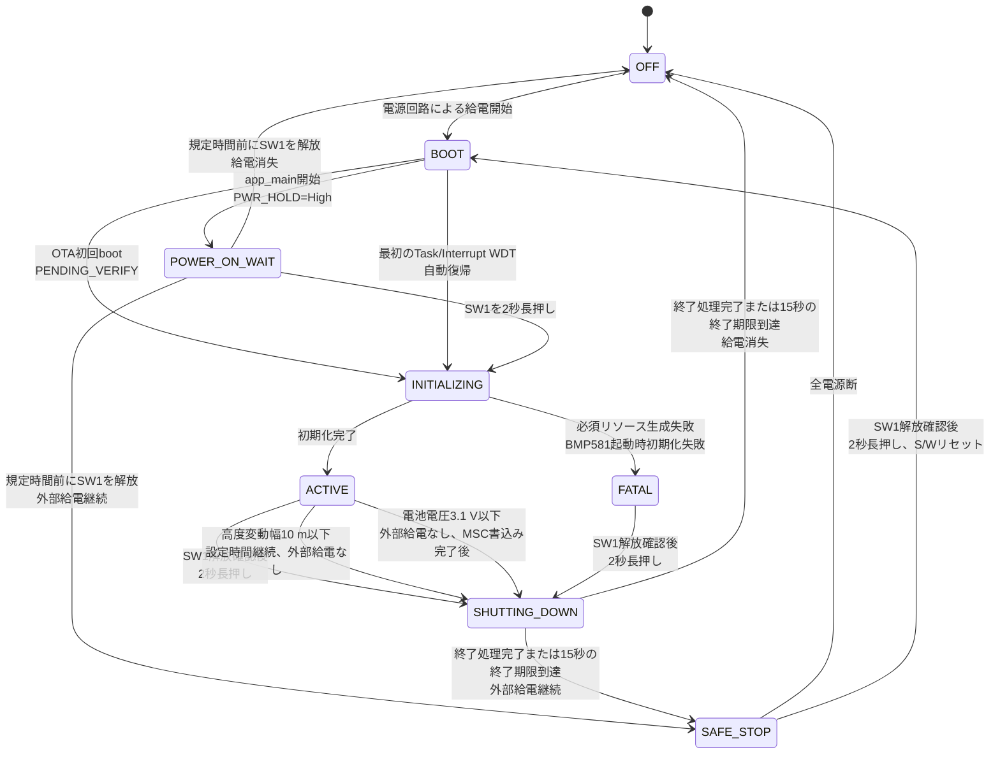
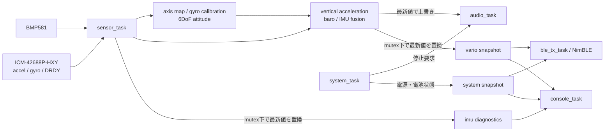

# バリオメーター ソフトウェア要件・簡易設計

- 対象機種: Aohazuku Rev.0
- MCU: ESP32-S3-WROOM-1-N16R8
- 開発環境: ESP-IDF 6.0系 / C言語
- 文書状態: 現行仕様

## 目的

本書は、ハンググライダーおよびパラグライダーで使用するバリオメーターのソフトウェア要件、ライフサイクル、データフロー、異常時動作および外部インターフェースを定義する。

BMP581の気圧とICM-42688P-HXYの姿勢補正済み鉛直加速度から高度と昇降率を求め、バリオ音とBLEで操縦者へ伝える。IMUを使用できない場合も気圧単独で動作を継続する。JSON、BLE、音および校正の詳細契約は各専門文書を正本とし、本書ではサブシステム間の関係を定義する。


## 機能

### 製品機能

- 電源自己保持、電源OFF処理
- スイッチ、LED、バッテリー電圧、外部電源状態の入出力
- BMP581による気圧・温度取得
- ICM-42688P-HXYの設定、生データ取得、静止較正、6DoF姿勢推定
- 気圧高度、高度、昇降率の気圧単独推定
- 姿勢補正済み鉛直加速度との融合、およびIMU異常時の気圧単独推定への自動縮退
- 上昇、沈下、無音域を知らせるバリオ音
- BLEによるXCTrack向けデータ送信
- TinyUSB CDCによる診断・設定、およびUSB MSCによるパラメータファイルの参照・編集
- USB MSC上の `UPDATE.BIN`によるdual-OTA更新と自動rollback

## 基本方針

1. ESP-IDFのFreeRTOS SMPを使用する。
2. 高周期のセンサー処理と音声処理を優先し、BLE、コンソールなどの遅延で停止させない。
3. GPIO番号、極性、I2C設定などのボード依存値は、Aohazuku Rev.0のボード設定モジュールへ集約する。
4. センサードライバ、推定アルゴリズム、バリオ音の判定ロジックを、ESP-IDFの周辺ドライバから分離する。
5. 異常な測定値や古い測定値では、誤った音声・BLEデータを出力しない。
6. 一部のデバイスが使用できない場合でも、安全を確保し、可能な範囲で動作を継続する。

## 機能要件

### 電源、スイッチ、LED

- `app_main()`の先頭で、他の初期化より先に `PIN_PWR_HOLD`（GPIO47）を出力Highへ設定し、電源を自己保持すること。ROM・2nd stage bootloaderの起動時間中はハードウェア側のラッチで電源を維持する。
- `BOOT`後は原則として `POWER_ON_WAIT`へ入り、安全GPIOと緑LED PWMを初期化してSW1を10 ms周期、30 msデバウンスで監視すること。`POWER_ON_HOLD_MS`（既定2000 ms）の連続押下成立まで、CPU1の一時taskでは専用NVSの読込みとブザー用LEDCの無音初期化だけを許可し、NVS消去・書込み、USB、センサー、通常のRTOS資源およびBLEを開始してはならない。ただし、実行中partitionが`ESP_OTA_IMG_PENDING_VERIFY`のOTA初回boot、またはRTC保持された正常な復帰記録に対する最初の`ESP_RST_TASK_WDT`／`ESP_RST_INT_WDT` bootでは長押し判定を省略し、緑LEDを100 %にして同じ起動準備と確定音を実行すること。後者は`ACTIVE`を5分継続するまで1回だけ許可し、5分以内の再発、RTC記録不正、generic WDT、panic、brownoutおよびsoftware resetは`POWER_ON_WAIT`を省略してはならない。
- `POWER_ON_WAIT`中はブザーと黄LEDを停止し、緑LEDを押下確定時間に比例して消灯から100 %まで線形増光すること。規定時間前にSW1を離した場合は両LEDを消灯して `PIN_PWR_HOLD`をLowにすること。
- 電源ON確定後は、専用NVSから復元した音量で起動サウンドを1回再生し、緑LEDを100 %、黄LEDを消灯のまま維持すること。NVSが未作成、不正または回復を必要とする場合は既定の小音量とし、NVS全消去を伴う回復は確定音の後に行うこと。BMP581起動完了後は、100 %を始点として選択されたライフサイクル表示へ移行すること。
- 電源OFF要求を受けた場合、直ちに新規BLE送信を禁止して通常のバリオ音を停止し、最終system snapshotを公開してから`SHUTTING_DOWN`への遷移時点から15秒の終了期限を開始すること。低優先度console taskはdirtyなスイッチ設定だけを専用NVSへ保存して停止ackを返し、system taskはほかの起動済みworkerの停止ackと処理開始済み永続化workerの完了を待つ。期限前にすべて完了した場合は終了サウンドの再生後に`PIN_PWR_HOLD`をLowにすること。`setting.json`の未保存RAM値を暗黙に保存してはならない。15秒の終了期限に達した場合は、SW1の状態、workerのack、書き込み、保存および終了サウンドの状態にかかわらず、直ちに`PIN_PWR_HOLD`をLowにすること。
- `PIN_PWR_EXT`（GPIO42）からUSB外部電源の有無を取得できること。
- `PIN_BAT_ADC`（GPIO1）はADC oneshot mode、12 bit、12 dB attenuationで読み、ADC calibration driverで校正済みmVへ変換すること。分圧はバッテリー側1 MΩ、GND側330 kΩとする。
- ボード設定は `BAT_ADC_R_HIGH_OHM=1000000`、`BAT_ADC_R_LOW_OHM=330000`、`BAT_ADC_SCALE=(R_HIGH+R_LOW)/R_LOW=133/33`、`BAT_ADC_GAIN_CORRECTION=1.0`、`BAT_ADC_OFFSET_V=0.0`を単一定義とする。実装では整数除算を避けること。バッテリー電圧は `battery_v = adc_mv / 1000 * BAT_ADC_SCALE * BAT_ADC_GAIN_CORRECTION + BAT_ADC_OFFSET_V` で求めること。
- 12 dB attenuationのADC入力上限約3.1 Vに対する分圧前の電気的測定上限は約12.49 Vである。この値は対応バッテリーの定格を意味しない。ADC rawのsaturation、校正失敗、非有限値または換算後の負値は電池電圧を無効とし、BLEのbatteryフィールドへ `999` を送ること。
- 分圧回路のThevenin抵抗は約248 kΩと高いため、ADCチャネル設定直後の初回値を破棄し、複数回取得後の値を使用すること。電圧換算にはボード定義の `BAT_ADC_GAIN_CORRECTION` と `BAT_ADC_OFFSET_V`を使用すること。
- バッテリーADCは10 Hzで取得し、直近5件の中央値を診断・BLE値に使用すること。ADC読出し失敗は無効値として扱い、センサー・音声処理を停止させないこと。
- USB外部給電がない起動時は、SW1確認後に有効な5点中央値を取得し、3.2 V以下なら起動サウンド、FAT／OTA、TinyUSB、センサーおよびBLEを開始せず、電源保持を解除して`SAFE_STOP`へ移ること。外部給電中または電池測定が無効な場合は、この起動禁止を適用しないこと。
- USB外部給電がない動作中に、有効かつ有限な5点中央値が3.1 V以下になった場合は電源OFF要求をラッチすること。BLE表示用の30秒値は保護判定に使用しないこと。MSC書込み中は書込み完了まで要求を保持し、その後、通常の15秒終了期限を持つシャットダウン処理を開始すること。一度成立した要求は電圧回復またはUSB接続によって解除しないこと。
- SW1～SW3は10 ms周期で読み、同じ入力を最初に観測してから30 msが経過した4回目のサンプリングで確定状態とすること。電源ラッチ回路を介するSW1は押下時High、外付けプルアップのSW2とSW3は押下時Lowとして扱うこと。初回加速度個体較正中のSW3は3秒長押しでそのbootの較正をスキップし、3秒未満で離した場合はパラメータセット切替として扱うこと。
- SW1は、起動後に一度「離された」状態を確認した後の2秒長押しで電源OFF要求を生成すること。起動のために押しているSW1をそのまま電源OFF操作と判定してはならない。
- 外部給電がなく、有限かつ有効な実センサー高度の期間内変動幅が10 m以下の状態が`auto_power_off_minutes`分継続した場合も電源OFF要求を生成すること。変動幅が10 mを超えた場合は現在高度から計時をやり直し、ちょうど10 mは範囲内とする。外部給電中、高度が無効・stale・非有限の場合、時刻が逆行した場合、および設定変更時は計時状態をリセットする。デバッグ高度を判定へ使用せず、`0`分では本機能を無効とする。
- LEDはLowで点灯、Highで消灯するものとして制御すること。
- GPIO43のROM起動ログによる一時的な黄LED点滅は許容し、アプリ初期化後はUART0として使用しないこと。

`PIN_PWR_HOLD` をLowにしてもMCUが動作を継続する場合は、ブザーとBLEを停止した安全停止状態を維持する。安全停止loopをTask Watchdogの監視対象とし、GPIO48のlevel wakeまたは1秒timeoutで起床して給餌する。SW1が押されたままSAFE_STOPへ入った場合はlow-level wakeで解放を待ち、解放確認後はhigh-level wakeで次の押下を待つ。30 msのdebounceおよび`POWER_ON_HOLD_MS`長押し判定中だけ10 ms周期とし、その間だけLight-sleep禁止lockを取得する。GPIO wakeを初期化できない場合は10 ms pollingへfallbackする。同じ5分window内の再発回数は解除せず、再度Watchdog resetしても通常動作へ自動復帰させないこと。SW1を一度解放した後、`POWER_ON_HOLD_MS`長押しした場合は電源ON要求と解釈し、復帰回数を解除して緑LEDを0→100 %で増光し、S/Wリセットを行ってBOOT状態に遷移すること。

#### 電源ライフサイクル

装置の電源状態は次のライフサイクルに従う。`OFF`はMCUが動作していないためソフトウェア外の状態である。センサー、BLE、音声などの個別機能の縮退は電源状態と分離し、回復可能な異常では`ACTIVE`を維持する。



| 電源状態 | `PIN_PWR_HOLD` | ブザー | BLE | LED | 状態の説明 |
| --- | --- | --- | --- | --- | --- |
| `OFF` | Low相当 | 停止 | 停止 | 消灯 | MCUへの給電がなく、ソフトウェアは動作していない |
| `BOOT` | ハードウェアラッチによる保持からHighへ移行 | 停止 | 未開始 | 消灯 | ROMおよび2nd stage bootloader通過後、`app_main()`の先頭で電源保持を確立する |
| `POWER_ON_WAIT` | High | 停止 | 未開始 | 緑を0→100 %で増光、黄消灯 | SW1を2秒間押し続けた場合だけ`INITIALIZING`へ進む。途中で離した場合は電源保持を解除する |
| `INITIALIZING` | High | 低電圧起動判定の通過後に1回、その後停止 | 原則未開始 | 緑100 %を保持後、BMP581起動完了時に診断状態へ連続移行 | 起動時電池電圧、GPIO、PM、RTOS資源、I2C、音声出力、タスクおよびBLEを順に初期化する |
| `ACTIVE` | High | 推定状態と設定に従う | 有効データと接続状態に従う | 診断状態に従う | 通常計測を行う。回復可能な周辺機能の異常時は縮退動作を行い、この電源状態を維持する |
| `FATAL` | High | 停止 | 未開始または停止 | 「LED（FATAL中）」の詳細表による | 必須RTOS資源・タスクの生成失敗、またはBMP581の起動時初期化失敗後、診断と電源OFF操作だけを受理する |
| `SHUTTING_DOWN` | 終了処理完了または15秒の終了期限到達時にLow | 通常音を停止し、期限前に終了処理が完了した場合だけ終了サウンドを鳴動 | 新規送信禁止後に停止 | 消灯 | 遷移時に15秒の終了期限を開始し、system task以外の起動済みworkerの停止ackと、処理開始済みの永続化workerの完了を待つ。期限到達時は直ちに電源保持を解除する |
| `SAFE_STOP` | Low | 停止 | 停止 | 通常は消灯。SW1電源ON要求中は緑を0→100 %で増光 | 外部給電によりMCUが動作を続ける安全停止状態。通常動作へ自動復帰せず、SW1解放確認後の2秒長押しによる電源ON要求を待機する |

`ACTIVE`または`FATAL`からは、起動後にSW1の解放を一度確認し、その後の2秒長押しを検出した場合に`SHUTTING_DOWN`へ遷移する。加えて`ACTIVE`では、高度停滞による自動電源OFF条件が成立した場合にも同じ遷移を行う。`SHUTTING_DOWN`へ遷移した時点で15秒の終了期限を開始し、通常のバリオ音を停止して新規BLE送信を禁止し、Event Groupへ停止要求を設定する。system task以外の起動済みworkerからのack、および既に処理を開始している永続化workerの完了を待つ。未保存のRAM上のパラメータを暗黙に保存せず、USB hostが所有するFAT領域へアクセスしない。期限前にすべての終了処理が完了した場合は終了サウンドを鳴らし、その再生完了後に`PIN_PWR_HOLD`をLowへ変更する。終了期限に達した場合は、SW1の状態、ack、書き込み、保存および終了サウンドの開始・再生状態にかかわらず、終了サウンドを開始または継続せず、直ちに`PIN_PWR_HOLD`をLowへ変更する。

`POWER_ON_WAIT`で規定時間前にSW1を解放した場合、および`SHUTTING_DOWN`で終了処理を完了した場合は、MSCのwrite sessionが終了してpending writeが0であることを確認し、アプリケーション側TinyUSB taskとUSB PHYを停止してから`PIN_PWR_HOLD`をLowへ変更する。TinyUSB停止に失敗しても電源保持解除は行うがLight-sleepは禁止する。給電が失われた場合は`OFF`へ遷移し、USBなどの外部給電によってMCUが動作を継続する場合は`SAFE_STOP`へ遷移する。この分岐は電源保持解除後の実際の給電状態によって決まり、`PIN_PWR_EXT`の値を理由に電源保持解除を省略してはならない。USB給電中もSAFE_STOPではアプリケーションのCDCとMSCを切断するが、ROM USB Serial/JTAGは別経路であり停止対象外とする。`SAFE_STOP`ではSW1の解放確認後に`POWER_ON_HOLD_MS`長押しを検出した場合だけ電源ON要求と解釈し、復帰回数を解除してS/Wリセットを行い`BOOT`へ遷移する。5分window内の2回目以降のWatchdog resetは自動復帰条件ではない。全電源が失われた場合は`OFF`へ遷移する。

#### LED表示

緑LEDは主に電源状態とセンサー状態、GPS状態(T.B.D)を表す。
黄LEDは主に異常状態とBLE状態、SDカード状態(T.B.D)を表す。

電源ライフサイクルに対応するLED表示は次の表の通りとする。`ACTIVE`中のLED表示は、センサー、GPS、BLEおよびSDカードの状態を含めて別途定め、本表では規定しない。

| 電源状態 | 緑LED | 黄LED | 表示要件 |
| --- | --- | --- | --- |
| `OFF` | 消灯 | 消灯 | MCUへ給電されていない状態であり、ソフトウェアによるLED制御は行わない |
| `BOOT` | 原則消灯 | 消灯 | 状態表示を行わない。ただし、GPIO43のROM起動ログによる一時的な黄LED点滅は許容する |
| `POWER_ON_WAIT` | SW1確定押下時間に比例して0→100 % | 消灯 | SW1を規定時間長押しした場合だけ起動する。規定時間前の解放時は直ちに消灯する |
| `INITIALIZING` | 100 %保持後、BMP581起動完了時に診断状態へ移行 | 消灯 | 電源ON確定を保持し、IMU初期化・較正中は100 %からホタル点滅へ連続移行する |
| `ACTIVE` | 原則、点灯 | 原則消灯 | UIアプリケーション仕様によって制御される |
| `FATAL` | 「LED（FATAL中）」の詳細表による | 「LED（FATAL中）」の詳細表による | 致命的エラーの種別を詳細表の表示で示す |
| `SHUTTING_DOWN` | 消灯 | 消灯 | 2秒の長押し成立時点で両LEDを消灯し、終了処理中も消灯を維持する |
| `SAFE_STOP` | 通常は消灯。SW1電源ON要求中は0→100 % | 消灯 | SW1解放確認後の2秒長押しで緑LEDを増光し、S/Wリセットする |

`BOOT`から`POWER_ON_WAIT`へ遷移してLED GPIOの制御を開始する。`POWER_ON_WAIT`から`INITIALIZING`へ遷移した時点では緑LEDの100 %を保持し、BMP581起動完了前に消灯を挟まない。BMP581起動完了を最初に観測した10 ms周期をLED位相0 msとし、IMU初期化・較正中なら100 %からホタル点滅の減光を開始する。

状態遷移が成立したときは、LEDの点滅などを待たず、即座に遷移先のLED表示に切り替える。

#### 起動サウンド

SW1の2秒長押し成立直後、またはOTA pending-verify起動で緑LEDを100 %にした直後に、`app_main`が電源ONを示す起動サウンドを同期的に1回再生する。起動サウンドは現在選択されている音量、デューティ50 %で、700 Hzを180 ms鳴動、80 ms無音、1200 Hzを120 ms鳴動する。全長は380 msとし、共有FAT、USB、センサーおよび通常taskの初期化より前に再生する。

現在音量は`POWER_ON_WAIT`と並行して専用NVSから復元し、SW1短押しで更新する消音・小・中・大の4段階とする。小・中・大はそれぞれPAM8904Eの1倍・2倍・3倍モードとし、消音では起動サウンドを鳴らさず、待ち時間を追加せず再生完了として扱う。SW2+SW3による起動時format、NVS未作成、不正、読込み失敗または回復要求では既定の小音量を使う。通常の音声taskは未起動であるため、起動サウンドとリフト音、シンク音または予測ブザーを同時に出力してはならない。

起動サウンドはセンサー初期化より前に再生するため、その後BMP581初期化失敗または必須task生成失敗で`FATAL`へ遷移する場合も再生済みとなる。`ACTIVE`移行後のBMP581再検出または再初期化では再生しない。`SAFE_STOP`からSW1解放確認後の2秒長押しでS/Wリセットした場合は新しい起動として再生する。

起動サウンドは同期再生し、完了後にブザーをshutdown状態へ戻す。音声初期化または出力失敗はfatalとせず、app resources生成後に警告を診断して起動を継続する。

#### シャットダウンシーケンス

SW1の長押しにより、電源OFF操作を行う。

- SW1を2秒間長押しした場合、シャットダウン処理を開始する。
- 2秒が経過する前にSW1を離した場合はシャットダウン処理を開始せず、電源ON状態を維持する。
- SW1の押下中は、緑LEDを点灯状態から徐々に減光し、押下開始から2秒後に完全消灯する。
- シャットダウン処理を開始する前にSW1を離した場合は、緑LEDを押下前の点灯状態へ戻す。

シャットダウン処理を開始した場合は、`SHUTTING_DOWN`への遷移と同時に15秒の終了期限を開始し、次の順に終了処理を行う。

1. 電源OFF要求直前の音量・シンク状態・dirtyを含む最終system snapshotを公開し、通常音を停止してからsystem task以外の起動済みworkerへ停止要求を通知する。
2. 低優先度console taskはdirtyな場合だけ最終snapshotを5 byte固定形式で専用NVSへ保存し、`nvs_commit()`完了後に停止ackを返す。保存失敗時もackを返して終了を継続する。ほかに処理開始済みの永続化workerがある場合は完了を待つ。`setting.json`の未保存RAM値は暗黙に保存せず、USB hostが所有するFAT領域へアクセスしない。
3. 終了期限前に待機対象がすべて完了した場合は、終了サウンドを鳴らす。
4. 終了サウンドの再生が終了期限前に完了した場合は、`PIN_PWR_HOLD`をLowへ変更する。

終了サウンドは音声制御タスクだけが出力し、電源OFF要求直前に確定した現在音量、デューティ50 %で、1200 Hzを120 ms鳴動、80 ms無音、700 Hzを180 ms鳴動する。全長は380 msとする。消音では鳴らさず、待ち時間を追加せず再生完了として扱う。再生中も15秒の終了期限を監視し、期限到達時は直ちに無音化する。

#### 終了期限による強制シャットダウン

- `SHUTTING_DOWN`への遷移時点から15秒後を終了期限とする。SW1を押し続けることは終了期限の条件ではない。
- 終了期限に達した場合は、SW1の状態、workerのack、書き込み、保存および終了サウンドの開始・再生状態にかかわらず、終了処理を中断して直ちに`PIN_PWR_HOLD`をLowへ変更する。

### BMP581

- GPIO4（SDA）、GPIO5（SCL）のI2C Masterを1MHzで使用すること。
- I2Cアドレス `0x46` を探索し、CHIP_ID `0x50` を確認すること。
- 温度1倍、気圧8倍のオーバーサンプリング、Normal mode、約100 Hzで測定すること。
- 初期設定後に `OSR_CONFIG=0x58`、`ODR_CONFIG=0xA9`、`DSP_CONFIG=0x03`、`DSP_IIR=0x00` をread-backして確認すること。
- `OSR_EFF`の`ODR_IS_VALID`を確認し、無効なOSR/ODR組合せのまま測定を開始しないこと。
- `INITIALIZING`中のBMP581起動時初期化に失敗した場合は、バリオとしての動作が期待できないため、`ACTIVE`へ遷移せず`FATAL`へ遷移すること。`FATAL`中は自動再検出を行わないこと。
- レジスタ `0x1D` から温度・気圧の6 byteを約10 ms周期で連続読み出しすること。
- 読み出した温度と気圧にタイムスタンプと有効状態を付けること。
- `ACTIVE`移行後にBMP581が未検出、staleまたは連続通信エラーとなった場合は、`ACTIVE`を維持して約2秒間隔で再初期化または再検出を試行すること。単発の通信エラーでは次周期の取得を継続すること。
- 連続10回の読出しエラー、または最後の有効サンプルから100 ms超過をBMP581 staleとし、推定を無効化すること。連続エラー回数はパラメータで変更可能とすること。
- 連続エラー時は、まずBMP581 device handleとBMP581だけを再初期化すること。BMP581 timeoutまたはSDA/SCL stuckにより共有I2C busを停止・再生成する場合は、先にICM-42688P-HXYのdevice handleとGPIO14割り込みも解除し、bus再生成後にHXY IMUを再初期化すること。
- 初期化ではソフトウェアリセット後2 ms以上待ち、POR/soft-reset完了状態とNVM readyを確認してから設定すること。

BMP581の割り込み端子は `PIN_INT_BMP`（GPIO21）とする。BMP581は周期読み出しで取得し、GPIO21は使用しない。

Data Ready割り込みを使用しないため、読出し成功ごとにsequenceを進める。取得周期、重複値率および周期超過を診断値として測定する。

### ICM-42688P-HXY取得、姿勢推定、鉛直加速度

- 対象部品はLCSC品番`C46550687`のHXY製`ICM-42688P-HXY`とする。TDK純正ICM-42688-Pのレジスタマップを流用しないこと。
- BMP581と同じGPIO4（SDA）、GPIO5（SCL）のI2C busを共有する。BMP581は1 MHzのままとし、ICM-42688P-HXYのdevice handleだけ400 kHz以下とすること。
- SDOはLow固定であるため、7 bit I2Cアドレスは`0x18`に固定する。`0x19`およびその他のアドレスを探索しないこと。
- `WHO_AM_I`レジスタ`0x01`を読み出し、`0x6A`であることを確認すること。ACKがあってもIDが不一致なら未検出として扱うこと。
- `sensor_task`だけがI2Cアクセスを行い、BMP581アクセスと直列化すること。transaction timeoutは5 ms以下とすること。
- 識別前のデバイスへ設定を書かないこと。識別成功後はソフトウェアリセット、電源起動、設定値の順で書き込み、各設定値を1 ms以上待ってread-backすること。電源起動後は10 ms以上待つこと。
- HXY版には500 HzのODR設定がないため、加速度とジャイロを400 Hzに設定すること。設定値は次表を単一の根拠とする。

| レジスタ | address | write値 | 用途 |
| --- | ---: | ---: | --- |
| `SOFT_RST` | `0x4A` | `0xA5` | ソフトウェアリセット |
| `PWR_CTRL` | `0x7D` | `0x0E` | 温度、ジャイロ、加速度を有効化 |
| `COM_CFG` | `0x05` | `0x50` | HXY I2C通信設定 |
| `ACC_CONF` | `0x40` | `0xAA` | high-performance、normal average 4、400 Hz |
| `ACC_RANGE` | `0x41` | `0x02` | ±8 g |
| `GYR_CONF` | `0x42` | `0xAA` | high-performance、normal average 4、400 Hz |
| `GYR_RANGE` | `0x43` | `0x00` | ±2000 dps |
| `INT_CFG1` | `0x06` | `0x03` | ジャイロData ReadyをINT1へ出力 |

- `DATA_STAT`（`0x0B`）から加速度・ジャイロのData Readyと設定エラーを確認し、出力レジスタ`0x0C`～`0x17`を同一transactionで連続読み出しすること。設定エラーbit mask `0x30`が非0、またはData Ready mask `0x03`が揃っていないframeは有効サンプルとしないこと。
- 3軸加速度と3軸ジャイロはbig-endianのsigned 16 bitとして復元すること。±8 gは4096 LSB/g、±2000 dpsは0.061 dps/LSBとしてSI単位へ変換すること。
- GPIO14はHXY INT1の立上りData Ready入力とする。ISRは`sensor_task`へのtask notificationだけを行い、I2C、姿勢計算、ログ整形またはBLE送信を行わないこと。
- config FAT直下の`mc_data.json`に有効な個体較正値がない場合は、基板上面を上にして水平静止させ、補正前の基板座標でX/Yが各±0.10 g以内、Zが+0.75～+1.25 g、各軸ジャイロ絶対値3 dps以下、加速度ノルム振動RMSが0.02 g以下となる800連続サンプルから加速度オフセットを求めること。収集時のZ範囲は上向き姿勢を確認する粗い判定とし、個体オフセットの妥当性は800サンプル平均から求めた各軸オフセットが±0.20 g以内であることにより最終判定する。収集中の条件違反では蓄積をやり直し、最終オフセットが範囲外の場合は保存しないこと。
- 加速度オフセットはセンサ座標で各軸±0.20 g以内とし、`mc_data.json`へ原子的に保存できた後だけ有効化すること。保存までは気圧単独・音・BLEおよびTinyUSB CDC診断を継続する一方、config FATを`APP_OWNED`に維持してMSC媒体を公開しない。保存失敗は2秒間隔で再試行すること。初回較正中にSW3を3秒長押しした場合は、そのbootに限って収集と保存再試行を中止し、未保存候補を破棄してIMUを停止した気圧単独動作へ移ること。スキップ状態をFATまたはNVSへ保存せず、正式buildではMSC媒体を公開し、次回bootでは再び初回較正を要求すること。
- 通常buildはMSC媒体の公開前にCDCを開始し、校正状態、永続化状態、収集数、確定オフセット、保存結果、Mahony信頼度、振動RMS、実効Kp/KiおよびKi activeを10 Hzモニターまたは`DIAG STATUS`へ出力すること。初回較正と起動時ファイル処理の完了まではconfig FATをESP32側の`APP_OWNED`に維持し、完了後は同一boot中にMSC媒体を公開すること。
- 有効な加速度オフセットを生のセンサ加速度から減算してから基板座標へ変換すること。センサ交換または再較正時はMSC上で`mc_data.json`を削除し、安全な取り外し後に再起動すること。
- 加速度補正後は、加速度ノルム0.9～1.1 gかつ各軸ジャイロ絶対値3 dps以下の連続サンプルで起動毎の静止ジャイロ較正を行うこと。水平や特定姿勢を要求せず、既定の完了条件は200サンプルとし、途中で静止条件を外れた場合は蓄積をやり直すこと。
- 静止加速度からroll/pitchを初期化し、ジャイロ積分と加速度の重力方向補正を行う6DoF姿勢推定を400 Hzサンプルの実時刻差で更新すること。磁気センサーを使用しないためyawは絶対方位として扱わないこと。
- 基板座標へ軸変換後、加速度を地球座標へ回転し、上向きZ成分から標準重力9.80665 m/s²を減算して鉛直加速度を得ること。
- Mahonyの加速度補正信頼度は、1 gからのノルム誤差0.15 gで0となる線形値、バイアス補正後角速度10 dps以下で1・90 dps以上で0となる線形値、および0.25秒EMAで求めた振動RMS 0.01 g以下で1・0.05 g以上で0となる線形値の最小値とする。実効Kpは設定Kpと信頼度の積とする。
- Kiは、1 gからの誤差0.03 g以内、角速度3 dps以下、振動RMS 0.01 g以下が0.5秒連続したときだけ更新する。非信頼時は積分値を保持して更新を止め、各軸を±5 dps相当に制限すること。
- 姿勢のタイムスタンプが逆行、同値または50 ms超の間隔となった場合、非有限値または正規化不能なquaternionとなった場合は、姿勢と較正を破棄し、気圧単独へ縮退して静止較正から再開すること。
- 未検出、無応答、ID不一致、連続通信エラー、100 ms超のstale、較正未完了または姿勢無効は非FATALとし、BMP581による気圧単独推定、音およびBLEを継続すること。再初期化は約2秒間隔とし、task delayで待たず次回試行時刻として管理すること。
- `imu_diagnostics_t`に有効、online、設定済み、加速度較正・保存状態、ジャイロ較正済み、姿勢有効、融合中、stale、アドレス、`WHO_AM_I`、`DATA_STAT`、最終エラー、試行・サンプル・連続エラー・各較正・取りこぼし回数、3軸加速度オフセット、加速度ノルム、ジャイロバイアス、信頼度、振動RMS、実効Kp/Ki、Ki有効状態、クォータニオンおよびroll／pitch／yawを保持し、10 Hz連続モニターと`DIAG STATUS`へ表示すること。yawは磁気方位ではなく、6DoF推定開始時を基準とする相対角として扱う。

TDK純正品向けの`0x68`、`WHO_AM_I=0x75/0x47`、User BankおよびBank Select方式は本部品へ適用しない。

### 高度・昇降率推定

- 気圧から次式で気圧高度を求めること。`altitude_m = 44330 * (1 - (pressure_pa / sea_level_pressure_pa)^(1 / 5.255))`
- 基準海面気圧の初期値を101325 Pa、許容範囲を80000～110000 Paとし、実行時に変更できること。
- BMP581のみで高度と昇降率を推定できること。
- `filter_mode=AUTO`かつIMU較正・姿勢・鉛直加速度が有効でfreshな場合は、気圧高度と姿勢補正済み鉛直加速度を融合すること。
- 加速度観測分散は `R_accel = min(10000, (0.25 + 0.25 * vertical_accel_mps2^2) / max(imu_confidence, 0.05)^2 + (imu_vibration_rms_g * 9.80665)^2)` とし、IMU信頼度低下または振動増加時は加速度観測の重みを連続的に下げること。信頼度0でも融合状態を即時破棄せず、上限付きの大きな観測分散により気圧主体へ移行すること。
- `filter_mode=BARO_ONLY`、IMU未検出、較正未完了、姿勢無効、通信異常またはstaleの場合も動作を停止せず、気圧単独推定へ切り替えること。
- 起動直後、およびBMP581のstale・再初期化からの復帰後は、連続する有効なBMP581サンプル100件をウォームアップに使用し、その間の推定値を無効として扱うこと。約100 Hzでは約1秒に相当するが、経過時間ではなく有効サンプル数を完了条件とすること。
- サンプルのタイムスタンプ差から実際の `dt` を求め、処理周期の揺らぎを計算へ反映すること。
- NaN、無限大、範囲外の気圧・加速度、時間逆行を検出し、無効な結果を配信しないこと。
- 出力元を気圧単独と融合の間で切り替える際は、融合フィルタを現在の気圧単独推定値へ整合させてから有効化し、切替だけを原因とする昇降率のスパイクを発生させないこと。

気圧単独フィルタ、姿勢推定および気圧・IMU融合フィルタは、同じ入力ログに対してホストPC上でも実行できる構成とする。

### バリオ音

操縦者が画面を見ずに上昇、沈下、無音域を区別できることを目的とする。詳細な要件は `vario_sound_spec.md` を参照する。設定可能な特性は具体値で重複定義せず、対応するパラメータ名で示す。

- `PIN_BUZZER_PWM`（GPIO40）からPWMを出力し、PAM8904Eを駆動すること。
- 初期化中、推定無効時、SW1が消音の場合、または推定値の経過時間が `audio_stale_ms` を超えた場合は、DINをLowとして無音にすること。
- 上昇時は断続音とし、上昇が強いほど音程を高く、テンポを速くすること。
- 強い沈下時は連続音とし、沈下が強いほど音程を低くすること。
- 通常の無音域では音を鳴らさないこと。予測ブザーは `predictive_buzzer_enabled` で制御すること。
- 音状態、音程およびテンポには`audio_climb_rate_average_s`秒の単純移動平均を使用すること。`0`では平均せず最新値を使用し、表示、BLEおよびログの上昇率は変更しないこと。
- リフト判定は `lift_start_mps` と `lift_end_mps`、シンク判定は `sink_start_mps` と `sink_end_mps` によるヒステリシスを持たせること。
- 平均履歴には異なるタイムスタンプの有効サンプルだけを追加し、欠測補間と重複加算を行わないこと。無効・stale入力、デバッグ入力源切替、設定変更および音響リセットで履歴を消去すること。
- 通常の音声状態を `audio_state_hold_ms` の間保持し、しきい値付近の細かな変動による音のばたつきを抑えること。
- 周波数、テンポ、しきい値、出力デューティ比およびPAM8904Eの増幅モードを、対応するバリオ音パラメータで調整できる構成とすること。
- 音声制御タスクだけがブザー用LEDC channelおよびブザー制御GPIOを操作すること。緑LEDの減光には、ブザー用とは別のLEDC timer/channelを使用すること。
- 鳴動中だけPAM8904EのEN1/EN2を選択した増幅モードへ設定し、無音時はDIN、EN1、EN2をLowにしてshutdown状態とすること。

音声状態と遷移条件は次のとおりとする。

- `SILENT`: 初期状態および通常の無音域。リフト、シンク、または有効な予測ブザー条件が成立するまで無音とする。
- `LIFT`: 平均上昇率が `lift_start_mps` を超えた場合に開始する。平均上昇率が `lift_end_mps` 未満となった場合は、予測範囲内なら直ちに`AUDIO_BUZZER`へ移り、それ以外では原則として現在の鳴動区間の終了時に停止する。
- `SINK`: SW2のシンク音設定がONで、平均上昇率が `sink_start_mps` 未満の場合に開始し、SW2設定がOFFまたは平均上昇率が `sink_end_mps` を超えた場合に終了する。
- `AUDIO_BUZZER`: `predictive_buzzer_enabled` が有効で、平均上昇率が `predictive_min_mps` 以上かつ `lift_start_mps` 以下の場合に使用する。平均上昇率が`lift_start_mps`を超えた場合は直ちに`LIFT`へ移る。
- `LIFT`と`AUDIO_BUZZER`の相互遷移では`audio_state_hold_ms`と鳴動区間完了待ちを適用せず、同じ周波数曲線のままON位相から新しい音型を開始する。
- しきい値と等しい場合は、等号を含む予測ブザー範囲を除き、新しい状態を開始または終了せず現在の状態を維持する。
- 推定無効、SW1が消音、または推定値の経過時間が `audio_stale_ms` を超える場合は強制無音条件とし、`audio_state_hold_ms` や鳴動区間の終了を待たず停止する。電源OFF要求時は通常のバリオ音を同様に直ちに停止するが、終了期限前に終了処理が完了した後の終了サウンドだけは例外として鳴らしてよい。強制シャットダウン時は、終了サウンドを開始または継続しない。

リフト音は、`lift_time_ms_at_0p2`、`lift_time_ms_at_1p0`、`lift_time_ms_at_2p5` および `lift_time_ms_at_5p0` をテンポ制御点として使用する。制御点間を連続的に補間し、範囲外では端の制御点を保持する。各制御点は、上昇率が強くなる方向に対して同じか短くなる関係を満たすこと。

リフト音の周波数は `lift_freq_base_hz`、`lift_freq_rate_hz_per_mps` および `lift_freq_max_hz` で定め、上昇が強くなるほど周波数を下げないこと。
シンク音の周波数は `sink_freq_start_hz`、`sink_freq_rate_hz_per_mps` および `sink_freq_min_hz` で定め、沈下が強くなるほど周波数を上げず、`sink_freq_min_hz` を下回らないこと。
予測ブザーの周波数はリフト音と同じ上昇率－周波数式で定めること。音型は鳴り始め間隔`predictive_interval_ms`と鳴動時間`predictive_duration_ms`で定め、`predictive_duration_ms <= predictive_interval_ms`を必須とすること。
出力特性は `audio_duty_percent` およびSW1の現在音量で定めること。

起動時と設定リセット時の既定値は、必ず単一のパラメータ定義を使用する。

### BLE・XCTrack連携

- NimBLEを使用し、BLE Peripheralとして動作すること。
- device nameを `CloudBaseVario` とし、connectable undirected advertisingを行うこと。NUS Service UUIDとBattery Service UUIDをadvertisingまたはscan responseへ含めること。
- advertising intervalの初期値を250 ms、送信出力を0 dBmとする。接続後は30～50 msのconnection interval、slave latency 1、supervision timeout 4秒を要求するが、peerが別の有効値を選んでも切断理由にせず実際の値を診断表示すること。
- ペアリング、ボンディング、暗号化を必須としないこと。NUS互換のためRX characteristicを公開するが、RXへ書き込まれたbyte列にはアプリケーション上の意味を持たせず、解釈せずに破棄すること。
- Nordic UART Service互換のService、TX Notify、RX Write characteristicを公開すること。
- Bluetooth SIG Battery Service `0x180F`をPrimary Serviceとして公開し、Battery Level `0x2A19`とBattery Level Status `0x2BED`をReadおよびNotifyとすること。ESP-IDF内蔵Battery Serviceとの重複登録を行わないこと。
- Battery Levelは100 ms周期の5点中央値のうち有効な値だけを30秒間収集し、その区間の最低電圧で表示値を30秒ごとに更新すること。最初の有効値は即時に表示し、ADC値が一時的に無効な場合は前回表示値を保持すること。表示電圧から残量への換算は、3.20 V＝0 %、3.50 V＝10 %、3.60 V＝20 %、3.70 V＝40 %、3.80 V＝60 %、3.90 V＝80 %、4.10 V＝100 %を結ぶ区分線形近似とする。区間内は線形補間して最も近い整数へ丸め、3.2 V以下は0 %、4.1 V以上は100 %とすること。Readは最新の表示値を返し、有効な容量値が変化した場合だけNotifyすること。起動後に有効値を一度も取得していない場合は0 %とすること。
- `ble_tx_task`からBattery Serviceへ反映する周期は1秒とし、task開始後の最初の反映は即時に行うこと。NUS TXが未subscribeの間はLK8EX1期限を起床条件に含めず、GAPの接続、切断およびsubscribe変更ではtask notificationにより直ちに再評価すること。NUS TXがsubscribe済みの場合は`bluetooth_notify_rate_hz`に従う1～50 HzのLK8EX1周期を維持すること。
- Battery Level StatusはGSSで定義されるFlags 1 byteとPower State 2 byteだけをlittle-endianで送信し、optional fieldを含めないこと。バッテリーは常にPresentとし、`PIN_PWR_EXT`がHighの場合はWired External Power Source ConnectedかつCharging、Lowの場合はDischarging: Activeとすること。Wireless External Power Source、Battery Charge LevelおよびCharging TypeはUnknownまたは未接続相当、Charging Fault Reasonはなしとすること。
- Battery Level StatusのReadは最新値を返し、Power Stateが変化した場合だけNotifyすること。更新はNUS TXの購読状態、気圧および昇降率の有効性に依存させず、満充電や充電電流を推定しないこと。
- 最新値から `$LK8EX1` センテンスを生成し、共有設定`bluetooth_notify_rate_hz`で指定した1～50 HzでXCTrackへNotifyすること。既定値は10 Hzとすること。
- 気圧はPa、昇降率はcm/sへ変換し、各フィールドの値が無効な場合は `ble.md` で定めたフィールド固有の無効値を使用すること。
- XCTrackでは、`vario_cm_s`を昇降率表示に使用し、`pressure_pa`をバリオ音の生成に使用するものとする。両フィールドを同じセンテンスで送信し、どちらか一方から他方を代用生成しないこと。
- センテンス末尾をCRLFとし、規定範囲のXORチェックサムを付加すること。
- 接続していない場合、Notifyが許可されていない場合、または気圧と昇降率の両方が無効な場合は送信しないこと。
- センテンスが `ATT_MTU - 3` を超える場合は、NUSのbyte streamとして必ず分割送信すること。MTU negotiationの成功を送信条件にしてはならない。
- BLE処理の遅延や切断がセンサー取得と音声処理を停止させないこと。

NUSのUUIDは次の値とする。

- Service: `6e400001-b5a3-f393-e0a9-e50e24dcca9e`
- RX Characteristic: `6e400002-b5a3-f393-e0a9-e50e24dcca9e`、Write / Write Without Response
- TX Characteristic: `6e400003-b5a3-f393-e0a9-e50e24dcca9e`、Notify

送信センテンスは次の形式とする。

```text
$LK8EX1,<pressure_pa>,99999,<vario_cm_s>,<temperature_c>,<battery>,*<checksum>\r\n
```

- `pressure_pa` はBMP581の有効な気圧をPa単位の整数へ丸めた値とし、気圧が無効な場合は `999999` とする。
- 高度フィールドは、XCTrack側で気圧高度を算出させるため `99999` とする。
- `vario_cm_s` は有効な昇降率をcm/s単位の整数へ丸めた値とし、昇降率が無効な場合は `9999` とする。
- `temperature_c` は常に `99` とし、BMP581の測定温度は送信しない。
- `battery` はBattery Serviceと共通の30秒最低表示値を使用する。共有設定`bluetooth_battery_mode`が`VOLTAGE`の場合、表示電圧をV単位・小数点以下2桁で表し、小数点には `.` を使用する。例えば3.95 Vは `3.95` とする。`PERCENT`の場合はBattery Levelと同じ3.2～4.1 Vの区分線形換算・四捨五入・0～100への制限による整数へ、LK8EX1規定どおり1000を加えて送信する。例えば0 %は`1000`、100 %は`1100`とする。最初の有効値を取得する前はどちらも`999`とし、その後の一時的なADC無効時は前回表示値を保持する。
- LK8EX1には充電状態を示す標準フィールドがないため独自フィールドを追加せず、充電状態はBattery Level Statusだけで公開する。
- チェックサムは、`$` の次の文字から `*` の直前までを対象に、カンマを含む各ASCII byteをXORして求め、大文字2桁の16進数で出力する。
- 1センテンスが `ATT_MTU - 3` を超える場合、CRLFまでのbyte列を複数Notifyへ順序どおり分割する。受信側が1行へ復元できるよう、別センテンスを途中へ割り込ませない。
- 切断、Notify無効化または送信エラーが発生した場合は残りのfragmentを破棄する。再接続後に途中から再開せず、新しい完全なセンテンスの先頭から送ること。
- 同一接続で複数のNotifyを同時に積み上げず、NimBLEのmbuf不足やbusy時はその送信周期のセンテンスを破棄して診断カウンタを加算すること。センサーまたは音声タスクを待たせて再送せず、処理遅延後に過去周期分を追いつき連送しないこと。

### ユーザーインターフェース

#### LED（ACTIVE中）
電源ライフサイクルが 'ACTIVE'時のLED表示を定める。

各状態は独立して成立し、複数の状態が同時に成立する場合がある。緑LED、黄LEDおよび備考はユーザーが定める。

- 点滅時間は「点灯時間／消灯時間」の各フェーズで定義する。1秒点灯／1秒消灯は、全体で2秒のサイクルとする。
- ホタル点滅は減光時間／増光時間の各フェーズで定義する。1秒かけて点灯から消灯まで減光し、1秒かけて消灯から点灯まで増光する場合は、全体で2秒のサイクルとする。
- ホタル点滅の減光・増光は、緑LED用5 kHzハードウェアPWMのデューティ比を10 ms周期で更新して行い、視認可能な低周波でLEDをON／OFFするソフトウェアPWMを使用しない。
- IMU初期化・較正中は、静止条件違反により静止較正をやり直してもホタル点滅の位相を再開せず、減光・増光を連続させる。
- BMP581起動完了とIMU初期化・較正中を最初に観測した時点では緑100 %から減光を開始する。IMU初期化・較正中と推定ウォームアップ中が同時に成立する場合はIMUのホタル点滅を優先する。
- 複数の状態が同時に成立する場合は、表の上から順に優先度が高いものとする。ただし、N/CのLEDは優先度を持たず、他の状態の点灯・点滅を妨げない。

| 状態 | 緑LED | 黄LED | 表示要件 | 備考 |
| --- | --- | --- | --- | --- |
| MSC実書込み中 | 20 %点灯 | 高速点滅 | 最初のWRITE(10)から最終実書込み完了後1秒までストレージ作業モードであることを示す | 黄LEDは0.1秒点灯／0.1秒消灯。SW1電源OFF長押し中は緑LEDだけを長押し進捗表示で上書きする |
| 推定値無効・stale | 消灯 | 点滅 | 有効かつ新しい昇降率を出力できず、通常のバリオ音を停止していることを示す | 0.5秒点灯／0.5秒消灯（1秒サイクル） |
| BMP581復旧中 | 点滅 | N/C | ACTIVE中にBMP581がstaleまたは連続読出しエラーとなり、測定値を無効化して再初期化または再検出を試行していることを示す | 1秒点灯／1秒消灯（2秒サイクル） |
| IMU初期化・較正中 | ホタル点滅(100%～0%) | N/C | IMUはonlineだが、静止較正または有効な姿勢の確立が完了していないことを示す | 1秒減光／1秒増光（2秒サイクル） |
| 推定ウォームアップ中 | 点滅 | N/C | BMP581の有効サンプルを蓄積中で、推定値をまだ出力できないことを示す | 1秒点灯／1秒消灯（2秒サイクル） |
| IMU縮退動作中 | ホタル点滅(100%～0%) | N/C | IMU未検出、通信異常またはstaleにより気圧単独推定へ縮退したことを示す | 0.5秒減光／0.5秒増光（1秒サイクル） |
| BLE接続中 | N/C | 点滅 | XCTrackと接続中で、Notify送信が行えている状態 | 0.1秒点灯、0.9秒消灯のサイクル |
| 低電池残量 | ホタル点滅(100%～20%) | N/C | USB外部電源が接続されておらず、電池残電圧が3.3V以下になったことを示す。 | 0.5秒減光／0.5秒増光（1秒サイクル） |
| 正常動作中 | 点灯 | 消灯 | 必須の計測機能が正常で、有効な推定値を出力できることを示す |  |

#### LED（FATAL中）
電源ライフサイクルが 'FATAL'時のLED表示を定める。緑LED、黄LEDおよび備考はユーザーが定める。

| 状態 | 緑LED | 黄LED | 表示要件 | 備考 |
| --- | --- | --- | --- | --- |
| 必須リソース・タスク生成失敗 | 点滅 | 点滅 | 必須のキュー、mutex、Event Groupまたはタスクを生成できず、通常動作を開始できないことを示す | 緑LEDと黄LEDを0.5秒間隔で交互に点灯（各LEDは0.5秒点灯／0.5秒消灯） |
| BMP581起動時初期化失敗 | 消灯 | 点滅 | `INITIALIZING`中にBMP581を検出または初期化できず、バリオとして動作できないことを示す | 緑LEDは消灯、黄LEDは0.5秒点灯／0.5秒消灯（1秒サイクル） |


### TinyUSB CDC + MSC構成

- ESP32-S3のUSB OTG内蔵PHYを使用し、CDC ACM 1 interfaceとMSC 1 LUNを同時に公開する。USB Serial/JTAG、UART consoleおよびUSB DFU interfaceは併用しない。
- TinyUSB device taskはcore0固定、priority 6、stack 4096 byteとする。CDC RX/TX/endpoint bufferは512/4096/512 byte、MSC転送bufferは8192 byteとする。
- CDCはESP-IDF log、10 Hzテレメトリーおよびコマンドコンソールを提供する。MSCは4 MiB共有FATを公開する。
- MSC class driverはFAT mountより先に初期化する。FATをmountできない場合はLUNへmediaを登録せず、CDC + MSC descriptorを維持してSCSI要求へ「メディアなし」として応答する。未初期化のMSC class callbackをhostへ公開してはならない。
- FAT mount失敗時もTinyUSB CDC、センサー、推定、音声およびBLEを継続する。MSC class driver自体を初期化できない場合はTinyUSB compositeを開始せず、USB以外の主要機能を継続する。
- self-powered deviceとしてGPIO42をVBUS監視に使用する。CDCまたはMSCがhostに接続している間はLight-sleepへ移行しない。
- `DIAG STATUS`はBOARD identity、製品serial、ESP MAC、firmware identity、TinyUSB driver、CDC、MSC class driver、MSC media、DTR、VBUS、FAT所有者、最後のstorage error、mount失敗、MSC作業モード、pending write、書込み回数・byte数・エラー数、休止timeout数、直近／最大実書込み時間、設定読込み・保存結果、スイッチ設定のNVS読込み元・現在値・dirty・直近load/save結果・失敗回数、OTA状態、およびWatchdog状態を表示する。firmware identityは手動管理versionと7桁Git hashを分離して示し、OTA診断では対象imageのversion、hashおよび64桁ELF SHA-256 fingerprintも区別する。Watchdog診断にはreset reason、boot action、5分window内の復帰回数、ACTIVE継続時間、前回boot stage、heartbeatから推定した停止task、登録／給餌失敗回数およびRTC記録の有効性を含める。OTA診断には起動時の外部給電、電池測定有効性、測定電圧、3.4 V閾値および更新許可結果を含める。
- MSCへ接続しているだけの状態ではセンサー、音声およびBLEの通常動作を継続する。最初のWRITE(10)を受信したときだけストレージ作業モードへ入り、BMP581／IMU取得、通常音、BLE NotifyおよびCDC 10 Hz自動monitorを休止する。BLE接続とGATT service、CDCコマンド、SW入力、Watchdogおよび電源保持は継続する。

### コンソールと診断

- 通常の診断・設定にはTinyUSB CDCを主コンソールとして使用し、設定ファイル公開用のMSCと同じUSB接続上の複合デバイスとして提供すること。UART0およびUSB Serial/JTAGをアプリ稼働中のコンソールとして使用しないこと。
- センサー検出状態、気圧、温度、高度、昇降率、融合状態、BLE状態、電源状態を確認できること。
- I2Cエラー数、周期超過数、キュー破棄数、各タスクのスタック余裕を確認できること。
- 現在のCPU周波数、アプリケーションPMロック状態、Light-sleep復帰回数、観測できた周波数遷移回数およびPMロック異常数を確認できること。
- パラメータの一覧、取得、変更、初期値への復帰ができること。
- パラメータファイルの読込み元、検証結果、保存結果、FAT領域の所有者およびUSB MSC状態を確認できること。
- 任意の昇降率を注入してバリオ音とBLEを確認し、注入状態を解除できること。
- 不正なコマンド、未知のパラメータ、範囲外の値にはエラーを返し、設定を変更しないこと。

コンソールは、次のコマンドを提供する。

```text
PARAM LIST
PARAM GET <name>
PARAM SET <name> <value>
PARAM RESET <name|ALL>
PARAM SAVE
DEBUG VARIO <mps> [pressure_pa]
DEBUG CLEAR
DIAG STATUS
```

- `PARAM SET` は型、値域、パラメータ間の関係を検証し、妥当な場合だけRAM上の設定へ変更を反映する。
- `PARAM RESET` は指定した項目または全項目をRAM上で既定値へ戻し、それだけではファイルを更新しない。
- `PARAM SAVE` はRAM上の全パラメータを `setting.json`へ明示的に保存する。USB hostがMSC領域を所有している場合はファイルを変更せず `BUSY`を返すこと。
- `DEBUG VARIO` はセンサー推定値とは区別できる診断状態として保持し、バリオ音とBLEの診断入力に使用する。開始時の有効高度または`0 m`を基準に、注入昇降率を経過時間で積分した診断高度を生成する。正負を変更した場合は通常入力と同じ符号反転基準を使用する。`pressure_pa`省略時は最新の有効なBMP581気圧を使用し、有効な気圧がない場合はLK8EX1の気圧フィールドを `999999` として、注入した昇降率を送信する。任意引数を指定した場合は30000～125000 Paの範囲だけ受理し、BLE用の診断気圧として使用する。
- `DEBUG CLEAR` は注入値を解除し、センサーから得た有効な推定値へ復帰する。
- `DIAG STATUS` はセンサー、推定、音声、BLE、電源、キュー、スイッチ設定NVS、Watchdog、および主要エラーカウンタの現在状態を表示する。軽量Watchdog診断はRTC保持であり、完全な電源断後の保持を保証しない。

TinyUSB CDCでhostがDTRをassertしている間は、`console_task`から100 ms周期で次の固定1行を連続出力する。明示的なSTART／STOP操作は設けず、各項目は機械処理可能な`key=value`形式とする。

`console_task`はDTR接続中に10 ms、未接続中に250 msの周期で入力・診断処理を確認する。未接続中は100 ms monitor期限とdrop数を進めず、DTRの再接続時に次回monitor期限を再設定する。

```text
BARO seq=... timestamp_us=... online=... pressure_valid=... raw_temp=... raw_pressure=... temp_c=... pressure_pa=... altitude_m=... climb_mps=... climb_valid=... estimate_valid=... i2c_errors=... overruns=... ble_pressure_pa=... ble_altitude_m=... ble_vario_cm_s=... ble_temperature_c=... ble_battery=... ble_available=... ble_notify=... imu_online=... imu_calibrated=... imu_attitude_valid=... imu_accel_calibrated=... imu_accel_cal_persisted=... imu_accel_cal_skipped=... imu_stale=... q_w=... q_x=... q_y=... q_z=... roll_deg=... pitch_deg=... yaw_deg=... vertical_accel_mps2=... vertical_accel_valid=... fusion_active=... kalman_accel_bias_mps2=... kalman_baro_innovation_m=... kalman_baro_innovation_valid=... kalman_accel_innovation_mps2=... kalman_accel_innovation_valid=... kalman_baro_r_m2=... kalman_accel_r_m2_s4=... imu_samples=... imu_missed=... imu_confidence=... imu_vibration_rms_g=... imu_kp_effective=... imu_ki_effective=... imu_ki_active=... imu_cal_samples=... imu_cal_save_pending=... imu_cal_storage=... imu_cal_storage_error=... stream_drops=...
```

`ble_*`の5値は、同じsnapshotからLK8EX1へ実際に整形する値と一致させ、無効値`999999`／`99999`／`9999`／`99`／`999`もそのまま表示する。yawは磁気センサーを使わない相対角であり、絶対方位として扱わない。host未接続時は行を蓄積せず、出力失敗または周期超過時は古い行を再送せず`stream_drops`を増加させる。

コマンドはASCII、行末CRまたはLF、最大128 byteとする。キーワードとパラメータ名は大文字・小文字を区別しない。空白だけの行は無視し、長すぎる行は行末まで破棄してエラーを返す。浮動小数点値はC localeの小数点 `.` だけを受理し、末尾に未解釈文字がある入力を拒否する。

コンソール出力がホスト未接続などで遅延しても、高周期タスクへ直接ログを書かない。高周期タスクは固定長の診断イベントまたはカウンタだけを更新し、文字列整形とUSB出力は `console_task` が行う。

### パラメータの保存と読み込み

#### 保存領域とUSBインターフェース

- 内蔵Flashに4 MiBの設定・更新共有FAT partitionを設け、512 byte sectorのwear levelling Safety modeを介して使用すること。Bluetooth Controller用NVSとは分離すること。
- FATをmountできない場合も自動formatしないこと。SW2とSW3を押したまま電源ONする明示操作または `idf.py config-flash`によってだけ初期化すること。
- ESP32-S3のUSB OTG peripheralと内蔵PHYをTinyUSBで使用し、CDCとMSCを同時に公開する複合デバイスとすること。USB OTGが内蔵PHYを使用している間はUSB Serial/JTAGを同時に使用しないこと。
- CDCは既存のコンソール入出力を提供し、MSCは設定保存用FAT partitionをリムーバブルストレージとして公開すること。
- FAT mount失敗時はMSC classをLUN数0の「メディアなし」として維持し、同じ複合デバイスのCDCとUSB以外の主要機能を継続すること。MSC class driver自体を生成できない場合はTinyUSB複合デバイスを開始せず、USB以外の主要機能を継続すること。
- CDCおよびMSCは標準USB classとして実装し、vendor固有driverを使用しないこと。
- 本機はバッテリー動作中にもUSB接続されるself-powered deviceとして構成し、`PIN_PWR_EXT`（GPIO42）をVBUS監視に使用すること。
- VBUS監視回路はVBUSが4.75 V以上のときvalid（GPIO42 High）、4.35 V以下のときinvalid（GPIO42 Low）となること。4.35 V超4.75 V未満は切替しきい値の許容帯とする。USB切断後3 ms以内にGPIO42がLowとなること。
- ROM download modeによる書込みおよび復旧手段を維持すること。ROM／bootloaderからアプリケーションへ移行してTinyUSBを開始するときのUSB再認識は許容する。
- FAT領域はESP32アプリケーションとUSB hostが同時にアクセスしてはならない。USB hostへMSCとして公開している間はhostだけが所有し、ESP32側からmount、読込みまたは書込みを行わないこと。
- USB hostが安全な取り外しを完了し、FAT領域の所有権がESP32側へ戻ったことを確認した後にだけ、ESP32側からファイル操作を再開すること。hostの未flushデータを破壊する可能性があるため、保存目的でMSCを強制切断しないこと。
- MSCのWRITE(10)はwear levelling領域への実書込みが完了するまでcommandを完了扱いにせず、その後にだけhostへ成功応答すること。SCSI SYNCHRONIZE CACHE(10/16)は受理済みWRITEが0で実媒体mutexを取得できた場合だけ成功応答すること。ejectまたはdetach開始時は新規host I/Oを閉じ、受理済みWRITEが残る場合はAPP側mountを遅延し、実書込みとTinyUSBの非同期完了処理が終わった後にだけ所有権をAPP側へ戻すこと。安全な取り外し完了時にdevice側の遅延書込みを残さないこと。
- 最初のWRITE(10)ではFlash消去前にsensor taskとaudio taskへ休止要求を出して最大100 ms待つ。休止timeout時もWRITEを失敗させず診断を加算する。pending writeが0になってから1秒間新しいWRITEがなければ自動復帰し、安全な取り外しまたはdetach時はpending writeが0なら直ちに復帰する。復帰時はI2C、BMP581、IMUおよび推定器を再初期化し、新しい有効推定値が得られるまで音とBLE LK8EX1 Notifyを再開しない。
- ストレージ作業モード中にSW1電源OFF要求が成立した場合は要求を保持し、pending writeが0となって作業モードを終了した時点から通常の15秒終了期限を開始する。作業モード中の時間は終了期限へ算入しない。高度停滞による自動電源OFFの計時は作業中に進めず、復帰時に観測windowをresetする。

#### MSCファイルによるファームウェア更新

- Aohazukuシリーズ共通のESP-IDF project nameを `CloudBaseVario-Aohazuku`とする。build成功時に通常のraw `CloudBaseVario-Aohazuku.bin` と同一内容の `UPDATE.UNSIGNED.BIN`を生成し、OTA slot最終4 KiBの認証記録を除く `0x37f000` byteを超える場合はbuildを失敗させる。所有者はリポジトリ外のECDSA P-256秘密鍵でraw applicationを明示的に署名し、固定長署名ヘッダとpayloadからなる `UPDATE.BIN`、および4 KiBの `FIRMWARE.AUTH`を生成する。
- release versionの正本は `SRC/firmware_version.h` の `CBV_FIRMWARE_VERSION`とし、`major.minor.patch`形式で手動管理する。初期値は`0.1.0`とする。build時のHEADを7桁小文字hexのGit hashとして取得し、dirty suffixは付けず、`esp_app_desc_t.version`へ `<version>+<hash>`形式で格納する。31文字を超える値、形式不正またはGit hashを取得できないbuildは失敗させる。バイナリ内容の識別には別途ELF/application SHA-256を維持する。
- USBドライブ直下へ `UPDATE.BIN`をコピーして安全な取り外しを行い、次回起動時にだけ更新を適用する。稼働中に検出または適用しない。
- 更新処理は通常task開始前に行い、GPIO42がHighの外部給電中、またはGPIO42がLowでも有効かつ有限な電池電圧が3.4 Vを超える場合に許可する。3.4 Vちょうどは許可しない。外部給電がない場合は電池ADCを一度だけ初期化し、100 ms間隔、最大5 sample（500 ms以内）で既存の中央値測定を成立させる。ADC初期化失敗、測定無効、非有限、saturationまたは3.4 V以下では、`UPDATE.BIN`を保持して `UPDATE_RESULT.TXT`へ外部給電、電池有効性、測定電圧および閾値を含むdeferred理由を記録し、現在のfirmwareを起動する。GPIO42がHighの場合は電池測定の成立を待たない。
- 入力は固定header（magic、format version、鍵ID、project、chip ID、payload size、payload SHA-256、ECDSA P-256 signature）とESP-IDF raw application payloadからなる単一の `UPDATE.BIN`とする。headerのproject、chip、サイズ、digestおよび所有者公開鍵によるsignatureをOTA書込み前に検証する。署名が無い、壊れている、別鍵・別project・別payloadの入力は拒否し、入力を残して `UPDATE_RESULT.TXT`へ認証拒否を記録する。payloadは `0x37f000` byte以下で、ESP image magic、ESP32-S3 chip ID、`esp_app_desc_t` magic、project nameのNUL終端、およびproject name `CloudBaseVario-Aohazuku`との完全一致を検証する。同じproject name内では同一versionとdowngradeを許可する。
- `esp_ota_begin/write/end`で検証済みpayloadだけをinactive OTA partitionへ書き、`esp_ota_end`のimage checksum確認後にpartition最終4 KiBへ同じ署名headerを記録する。認証記録のerase/writeが成功した場合だけboot partitionを変更する。更新中は電源保持を継続し、緑LEDを消灯、黄LEDを100 ms周期で点滅させ、通常taskを開始しない。
- partition tableは `nvs 0x9000/0x6000`、`phy_init 0xf000/0x1000`、`factory 0x10000/4 MiB`、`config 0x410000/4 MiB`、`otadata 0x810000/0x2000`、`ota_0 0x820000/0x380000`、`ota_1 0xba0000/0x380000`とする。
- `UPDATE.BIN`は未処理入力、`UPDATE.PND`は書込み済み・初回boot確認待ち、`UPDATE.BAD`はOTA書込み失敗またはrollbackされたimage、`UPDATE_RESULT.TXT`はASCIIの状態・理由・手動`version`・7桁Git `hash`・対象partitionを記録するstatus fileとする。署名なし・署名不正・破損した署名containerは`UPDATE.BIN`を保持して`REJECTED`を記録し、OTA書込みへ進まない。対象imageを検査できない状態では`version=-`、`hash=-`とする。旧形式の7桁hashだけを持つ同一project imageは拒否せず、`version=-`とhashへ分離する。version/hashはupgradeまたはdowngradeの拒否判定に使用しない。
- config FAT直下の`INFO.TXT`は実行中のボード情報を示す読み取り専用ASCIIファイルとし、既存のboard／version／Git hashに加え、`Firmware authenticity`、`Authenticity key ID`および`Firmware image SHA-256`をCRLF改行で記録する。実行中app partitionの最終4 KiBにある認証記録とraw payloadを再検証し、validなら`OFFICIAL`、記録なし・不正なら`NON_OFFICIAL`、partition読出しエラーなら`UNKNOWN`を表示する。内容は有効なboard identity/descriptorと実行imageの`esp_app_desc_t.version`から生成する。起動時にFATをAPP側へmountした直後、`setting.json`読込みおよびMSC公開前に必ず全量再生成する。既存ファイルは読み取り専用属性を一時解除して置換、flush/sync後に属性を再設定する。削除、編集または属性変更されても次回起動時に復元する。生成または属性設定に失敗した場合はMSCを公開しない。
- 更新firmwareの初回bootでは、実行中partitionの`ESP_OTA_IMG_PENDING_VERIFY`を安全GPIO初期化直後に確認し、SW1電源ON長押しを要求せず初期化を継続する。5個の必須application workerが生成されたことを条件に10秒後に有効化する。確認中もTinyUSB CDC診断を開始するが、config FATはESP32側の`APP_OWNED`に維持しMSC媒体を公開しない。有効化後、`UPDATE_RESULT.TXT`を `CONFIRMED`へ更新し、`UPDATE.PND`の削除に成功し、かつ必要な加速度個体較正の保存も完了した後にだけMSC媒体を公開する。状態ファイルの更新、削除または個体較正保存に失敗した場合はCDCを継続してMSC媒体だけを公開しない。BMP581、IMU、音声、BLEなど個別peripheralの失敗はOTA有効化を妨げず、加速度較正待ちでもCDC診断・気圧単独・音・BLEは継続する。必須worker生成前のcrash、resetまたは10秒timeoutはbootloader rollback対象とする。
- MSC更新が使用できない場合は、GPIO0 + resetによるROM download modeを復旧手段として使用する。
- MSC更新はapplicationだけを対象とし、bootloader、partition tableおよびfactoryは更新しない。これらの書込みと完全復旧にはROM download modeによる有線flashを使用する。

#### ファイル形式

設定ファイルはUSBドライブ直下の `setting.json`とし、次の形式とする。次のブロックは階層だけを示す抜粋であり、実ファイルでは`DOC/setting_json.md`に定める全項目を必須とする。

```json
{
  "format_version": 1,
  "mc_parameters": {
    "sea_level_pressure_pa": 101325.0,
    "auto_power_off_minutes": 60,
    "filter_mode": "AUTO",
    "bluetooth_battery_mode": "VOLTAGE",
    "bluetooth_notify_rate_hz": 10,
    "i2c_reinit_error_count": 10,
    "imu_gyro_calibration_samples": 200,
    "imu_mahony_kp": 5.0,
    "imu_mahony_ki": 0.05
  },
  "vario_parameter_sets": [
    {
      "parameter_number": 1,
      "parameters": {
        "predictive_buzzer_enabled": false,
        "audio_climb_rate_average_s": 1.0
      }
    }
  ]
}
```

- 出力はUTF-8、BOMなし、2 space indent、LF改行、末尾改行ありの整形済みJSONとする。読込みではUTF-8 BOM、LFおよびCRLFを許容するが、JSON commentは許容しない。
- top-levelには整数の `format_version`、共通9項目を持つobject型`mc_parameters`、array型の `vario_parameter_sets`だけを置き、正本はversion 1とする。配列は1～5件、各要素は1～5の重複しない整数`parameter_number`と、音関連22項目を持つobject型`parameters`だけを持つこと。保存時は番号順に整列すること。完全な例は`DOC/setting_json.md`を正本とする。
- version 1の規定構造だけを受理する。未知のparameter、誤った階層、項目不足、重複key、型違いまたは値域違反を含むファイルは全体を無効とし、自動変換しないこと。
- `mc_parameters`および各セットの`parameters`には値だけを格納する。パラメータ名、型、単位、値域、既定値および相互関係は、本書の単一パラメータ表と対応する実装テーブルを正本とすること。
- boolはJSON boolean、uint32は0以上の整数、floatは有限のJSON number、enumは定義済み名称のJSON stringとして表すこと。NaNおよび無限大を受理しないこと。
- ファイルサイズの上限は32 KiBとする。上限を超えるファイルは途中まで解析せず無効とすること。
- 共通項目および各セットの音関連項目はすべて必須とし、省略値を組込み既定値で補完しないこと。不正番号、番号重複、未知または誤配置の項目名、同一階層の重複key、未対応version、型違い、値域違反または相互関係違反が1件でもあれば、共通部と全セットを含むファイル全体を無効とすること。
- 設定ファイルには認証情報、秘密鍵、tokenなどの秘密情報を保存しないこと。

加速度個体較正は同じFAT直下の`mc_data.json`へ、`format_version=2`、対象`model`および3軸`offset_mps2`だけを格納する。`who_am_i`、座標系、校正方法および校正サンプル数は`model`ごとのファームウェア固定定義とし、ICM-42688P-HXYではそれぞれ`0x6A`、`SENSOR`、`LEVEL_Z_UP`、800とする。UTF-8 JSONとして厳格に検証し、非有限値、未知・重複key、対象不一致または±0.20 gを超える値を受理しない。保存は`mc_data.tmp`、`mc_data.bak`を使う全量置換とし、正本がない場合だけ有効なbackupを復元する。

#### 起動時の読み込み

- 起動時は組込み既定値から一時設定を作成し、USB MSCをhostへ公開する前にFAT領域をESP32側へmountして `setting.json`を読み込むこと。
- 安全GPIO初期化直後にSW2とSW3が同時押下されている状態を10 ms周期で確認し、30 ms継続した場合だけ、設定FATを明示的にformatしてからmountし、組込み既定値の `setting.json`を生成すること。この操作は保存済み設定を全消去する。SW2またはSW3の単独押下、30 ms未満の同時押下および通常起動ではformatしないこと。
- JSON全体の構文、形式version、key、型、値域およびパラメータ間の関係を一時設定上で検証し、すべて妥当な場合だけmutex下で実行時設定を一括置換すること。検証途中の値を部分的に反映してはならない。
- 有効なファイルを反映した後は、読込み元がファイルであることと形式versionを診断状態へ記録すること。
- `setting.json`が存在しない場合は組込み既定値で起動し、FAT領域をUSB hostへ渡す前に既定値を使用した整形済みファイルを自動生成すること。
- ファイルの構文または内容が無効な場合は、ファイルを自動上書きせずに組込み既定値で起動し、失敗理由を診断状態とconsole logへ記録すること。
- SW2とSW3による明示的な初期化要求がない状態でFAT領域をmountできない場合は自動formatせず、組込み既定値で主要機能を継続すること。設定ファイルの異常をセンサー取得、推定、音声またはBLEのfatal条件にしてはならない。
- USB hostが編集したファイルは動作中に自動再読込みせず、次回起動時に検証して反映すること。動作中の各機能は起動時またはconsole操作で確定したRAM上の設定を使用すること。

#### 明示保存

- `PARAM SET`および`PARAM RESET`は共通項目なら単一の共通値、音関連項目なら選択中セットだけを変更し、切替後も各セットの未保存値を保持すること。`PARAM RESET ALL`は共通値と選択中セットを既定値へ戻し、非選択セットを変更しないこと。通常シャットダウンを含め、`PARAM SAVE`なしで変更を暗黙に永続化してはならない。
- `PARAM SAVE`はRAM上の共通値と全セットを検証し、FAT領域をESP32側が所有している場合だけ保存を開始すること。USB hostが所有している場合は保存を予約せず、ファイルを変更せずに `BUSY`を返すこと。
- 保存は同じFAT領域の一時ファイルへ全量を書き、flushおよびmedia syncを行い、書き戻した内容を検証してから `setting.json`へrenameすること。既存の `setting.json`へ直接、途中まで上書きしてはならない。
- 保存中のresetまたは電源断が発生しても、次回起動時に途中内容を部分適用してはならない。起動時に残った一時ファイルは設定の正本として扱わず、診断へ記録した後にESP32側がFAT領域を所有しているときだけ削除してよい。
- 保存成功、`BUSY`、保存前検証失敗およびI/O失敗をconsole応答と診断状態で区別できること。通常シャットダウン要求後は新しい保存を開始せず、既に開始済みの保存だけを通常終了処理の対象とすること。

### スイッチ仕様

SW1～SW3の通常操作は以下の通りとする。

SW1：起動操作後に一度解放されたことを確認してから、2秒未満で離した短押しだけを音量変更として扱う。小→中→大→消音→小の順に変更し、変更後の音量で1000 Hz、80 ms、デューティ50 %の通知音を1回鳴らす。変更後が消音の場合は鳴らさない。2秒長押しが成立した場合は電源OFF要求だけを生成し、音量を変更しない。POWER_ON_WAIT、SAFE_STOPおよびFATAL fallbackでは電源操作専用とする。
SW2：30 msのdebounce成立時にシンク音ON/OFFを切り替える。NVS未保存時の初期値はON。現在音量で、ONでは700 Hzを180 ms鳴動、80 ms無音、1200 Hzを120 ms鳴動する低音→高音、OFFでは1200 Hzを120 ms鳴動、80 ms無音、700 Hzを180 ms鳴動する高音→低音で通知する。各通知の全長は380 ms、デューティは50 %とし、消音時は鳴らさない。
SW3：通常動作中は30 msのdebounce成立時に存在する次のパラメータ番号へ切り替える。番号昇順で欠番を飛ばし、最後から最初へ循環する。切替後の番号と同じ回数だけ1000 Hz、80 msを鳴らし、各音の間に80 msの無音を置く。消音時も切替は行うが通知音は鳴らさない。初回加速度個体較正中は3秒未満で離した場合だけ切り替え、3秒長押しではそのbootの較正スキップだけを実行する。

通知音は音声制御タスクだけが出力し、通常のバリオ音を停止して排他的に再生する。再生完了後はバリオ音状態をリセットして通常評価へ戻す。電源OFF要求または `FATAL`への遷移時は10 ms以内に停止する。通知要求は深さ1のlatest-value queueへ非ブロッキングで上書きし、連続操作時は音の区切りで最新番号の通知へ切り替える。

音量、シンク有効状態および選択番号はRAMへ即時反映し、起動時の保存値と異なる場合だけdirtyとする。操作時にはFlashへ書かず、変更後に保存値へ戻った場合はdirtyを解除する。通常電源OFF時だけ、namespace `switch_pref`、key `state`へversion・音量段階・シンク有効状態・選択番号・予約byteからなる5 byte固定blobを一括保存する。NVS未保存または不正時は小音量・シンク音ON・番号1（存在しない場合は最小番号）で主要機能を継続する。

SW2とSW3を同時に押したまま電源ONした場合は、30 msのdebounce成立後に設定FATをformatして番号1～3の組込み既定値を生成し、`switch_pref/state`だけを消去する。NVS全体は消去せずBLE用領域を保持する。起動判定に使用した押下状態をシンク音切替またはパラメータ切替として扱わない。

## 非機能要件

- BMP581の目標取得周期を10 ms、ICM-42688P-HXYの目標取得周期を2.5 ms、音声評価周期を10 ms以下とすること。IMUのData Ready通知が複数回蓄積した場合は最新frameを優先し、取りこぼし数を計数すること。未検出時は約2秒間隔で再初期化すること。
- BMP581の周期超過とI2Cエラーは別々に計数すること。
- 周期処理は単調増加時刻と絶対期限を使用し、処理時間を次周期へ累積させないこと。
- 最新値だけが必要な経路では、キュー満杯時に古い値を破棄し、高優先度タスクを待たせないこと。
- センサー取得および音声処理のアプリケーション経路は、USB処理またはファイル処理の完了を同期的に待たないこと。
- MSC連続書込み中は計画休止として扱い、BMP581／IMUのstale、通信エラーまたは再試行へ計上しないこと。最終WRITEから約1秒後にセンサー、音およびBLE LK8EX1 Notifyの復帰を開始すること。
- ISRおよびタイマーコールバックでは、I2Cアクセス、BLE送信、複雑な演算を行わないこと。
- GPIO35、36、37および通常動作で使用しないstrapping pinを初期化しないこと。
- GPIO、I2Cポート、LEDC channel、周期、しきい値などをソース各所へ重複定義しないこと。
- `app_main`の起動処理、`startup_prep`、`sensor_task`、`audio_task`および`system_task`をTask Watchdogの監視対象とする。起動処理は必須worker起動後に解除し、sensor/audioは正常loopとMSC計画休止中だけ給餌してFATALでは解除する。system taskは250 ms以下に分割した終了待ち、`SHUTTING_DOWN`および`SAFE_STOP`でも給餌する。console、BLE送信、NimBLE内部taskおよびTinyUSB taskは個別登録しない。登録失敗時はtask failureを診断して`FATAL`へ移り、Watchdog回避だけを目的に異常状態で給餌し続けないこと。
- 定常ループで動的メモリを確保・解放しないこと。NimBLEなどESP-IDF内部の動的確保はアプリケーション側の所有範囲外とする。

### ESP-IDFビルド設定

- targetは `esp32s3`、ESP-IDFは6.0.2とする。
- Bootloader RTC WDTは9秒、Interrupt WDTは両CPUを300 ms、Task WDTは両CPUのIdle taskを含め5秒で監視する。Task WDT timeoutはpanic handlerを起動し、panic診断後の待ち時間なしで再起動すること。Flash Core Dumpは使用しない。
- Flash sizeは16 MB、PSRAMは8 MB Octal modeとして設定し、起動時に検出容量を診断表示すること。検出容量が基板仕様と異なる場合は警告を出すこと。
- ESP-IDF標準の2コアFreeRTOSを使用し、`CONFIG_FREERTOS_UNICORE`と実験的Amazon SMP kernelを選択する`CONFIG_FREERTOS_SMP`はいずれも無効とする。`CONFIG_FREERTOS_NUMBER_OF_CORES=2`、tick rate 1000 Hzとすること。
- BluetoothはBLE + NimBLE Hostだけを有効にし、Classic BluetoothとWi-Fiを無効にすること。
- アプリケーションのstandard I/OをTinyUSB CDCへ接続し、同じTinyUSB deviceでMSCを提供すること。TinyUSBと競合する `CONFIG_ESP_CONSOLE_USB_CDC`、アプリ稼働中の `CONFIG_ESP_CONSOLE_USB_SERIAL_JTAG`およびUART consoleは使用せず、GPIO19/20をUSB OTG以外の通常GPIOとして再設定しないこと。
- CPU既定・最大周波数を80 MHz、DFS最小周波数を40 MHzとし、アプリケーションが `esp_pm_configure()` で明示的に設定すること。通常計測中はLight-sleep禁止ロックを保持し、全worker停止後の安全停止状態だけで解放すること。
- tickless idle、Bluetooth modem sleepおよびBluetooth low-power clockのmain XTALを有効にすること。通常動作中にTinyUSB CDCまたはMSCがUSB hostへ接続している間は自動Light-sleepを禁止すること。明示的な電源OFFではpending MSC writeがない状態でアプリケーション側TinyUSBを停止し、停止成功後はVBUSが残っていてもSAFE_STOPの自動Light-sleepを許可すること。
- Wi-Fi/Bluetoothソフトウェア共存制御、NimBLEの未使用role・標準service・BLE 5.x追加機能・DTM testを無効にし、NimBLEはPeripheral/GATT Server、接続数1、ATT MTU 23に限定すること。
- factory、4 MiB共有FAT、OTA dataおよび2個の3.5 MiB OTA slotを持つcustom partition tableを使用し、bootloader rollbackを有効にすること。
- `sdkconfig.defaults`とpartition tableをリポジトリへ含め、開発者個人の生成済み `sdkconfig` だけを前提にしないこと。

## 簡易ソフトウェア設計

### コアとタスク

ESP32-S3の両コアでESP-IDF標準FreeRTOSを動作させる。FreeRTOSをcore0、ベアメタル処理をcore1で動かすAMP構成はESP-IDF 6.0で未サポートのため使用しない。ESP-IDF内部タスクとの競合を抑えるため、高周期処理をcore1へ固定し、アプリケーションの通信・操作系タスクはcore0へ固定する。ESP-IDFが生成するNimBLE内部タスクのaffinityはESP-IDF設定に従う。

| タスク | Core | 優先度 | stack | 主な責務 |
| --- | --- | ---: | ---: | --- |
| `sensor_task` | core1固定 | 20 | 8192 byte | I2C所有、BMP581取得、HXY IMUの割り込み駆動取得・姿勢推定、気圧単独／IMU融合フィルタ、結果配信 |
| `audio_task` | core1固定 | 18 | 4096 byte | 最新昇降率の状態判定、LEDC、PAM8904E制御 |
| `system_task` | core0固定 | 12 | 4096 byte | スイッチ、LED、ADC、外部電源、電源OFF処理 |
| `ble_tx_task` | core0固定 | 8 | 6144 byte | LK8EX1生成とNimBLE Notify要求 |
| TinyUSB device task | core0固定 | 6 | 4096 byte | USB OTG device、CDC + MSC class処理 |
| `console_task` | core0固定 | 5 | 6144 byte | USBコンソール、パラメータ、デバッグ入力、診断文字列整形 |

優先度は `configMAX_PRIORITIES >= 25` を前提とする。表のstackを設定値とする。ESP-IDFの `xTaskCreatePinnedToCore()` へ渡すstackサイズはbyte単位である。

`sensor_task`はGPIO14のtask notification、次のBMP581絶対期限、BMP581再試行時刻、ICM-42688P-HXYのstale期限または再試行時刻のうち最も早い条件までblockし、busy loopにしない。NimBLE HostはESP-IDFが生成する専用タスクで動作し、`ble_tx_task`はセンサーキューやI2Cを直接操作しない。

### データの流れ



推定結果には、少なくとも次の情報を含める。

```c
typedef struct {
    uint32_t sequence;
    int64_t timestamp_us;
    int32_t raw_temperature;
    uint32_t raw_pressure;
    int32_t temperature_c_x100;
    int32_t pressure_pa_x100;
    float altitude_m;
    float climb_rate_mps;
    float vertical_accel_mps2;
    float kalman_accel_bias_mps2;
    float kalman_baro_innovation_m;
    float kalman_accel_innovation_mps2;
    float kalman_baro_r_m2;
    float kalman_accel_r_m2_s4;
    bool pressure_valid;
    bool climb_rate_valid;
    bool estimate_valid;
    bool bmp581_online;
    bool imu_online;
    bool imu_calibrated;
    bool imu_stale;
    bool imu_fusion_active;
    bool vertical_accel_valid;
    bool kalman_baro_innovation_valid;
    bool kalman_accel_innovation_valid;
    bool debug_input_active;
    uint32_t i2c_error_count;
    uint32_t bmp_period_overrun_count;
    uint32_t missed_imu_sample_count;
} vario_result_t;
```

出力選択に必要なIMU状態はvario結果に含め、詳細なICM-42688P-HXY状態は次の独立した診断snapshotで保持する。

```c
typedef struct {
    bool enabled;
    bool online;
    bool configured;
    bool accel_calibrated;
    bool accel_calibration_persisted;
    bool accel_calibration_save_pending;
    bool calibrated;
    bool attitude_valid;
    bool fusion_active;
    bool stale;
    uint8_t address;
    uint8_t who_am_i;
    uint8_t data_status;
    int32_t last_error;
    uint32_t retry_count;
    uint32_t sample_count;
    uint32_t consecutive_error_count;
    uint32_t calibration_sample_count;
    uint32_t accel_calibration_sample_count;
    uint32_t missed_interrupt_count;
    float accel_norm_g;
    float accel_offset_mps2[3];
    float gyro_bias_radps[3];
    float confidence;
    float vibration_rms_g;
    float kp_effective;
    float ki_effective;
    float quaternion[4];
    float roll_deg;
    float pitch_deg;
    float yaw_deg;
    int32_t accel_calibration_storage_result;
    int32_t accel_calibration_storage_error;
    bool ki_active;
} imu_diagnostics_t;
```

`pressure_valid`はBMP581の気圧値が範囲内かつfreshであること、`climb_rate_valid`は選択中の昇降率推定値が範囲内かつfreshであることを個別に表す。`estimate_valid`は高度および昇降率の推定結果を音声処理へ使用できることを表し、BLE送信可否を単独では決定しない。`imu_fusion_active`は現在の出力が融合フィルタ由来であること、`vertical_accel_valid`は直近の姿勢補正済み鉛直加速度を融合へ入力できることを表す。`kalman_accel_bias_mps2`は4状態フィルタが推定した加速度バイアス、`kalman_*_innovation*`は各観測更新直前の残差とその有効性、`kalman_*_r_*`は現在の実効観測分散を表す。`raw_temperature`、`raw_pressure`、`temperature_c_x100`および`pressure_pa_x100`は同一のBMP581サンプル由来とする。BMP581の温度はLK8EX1へ送信せず、温度フィールドを `99` とする。ICM-42688P-HXYの温度は取得しない。system snapshotには少なくとも、timestamp、外部電源状態、実測電池電圧とそのvalid flag、BLE表示電圧とそのvalid flag、debounce後のSW1～SW3、電源OFF要求を含める。

センサーから音声へのキューは長さ1とし、常に最新値で上書きする。`sensor_task`だけがvario snapshot、`system_task`だけがsystem snapshotを書き、BLEとコンソールはそれぞれをmutexまたは短いcritical sectionの下で構造体ごとコピーする。複数writerが古い構造体コピーで互いのフィールドを上書きしてはならない。ロックを保持したまま文字列整形、BLE送信またはUSB出力を行わない。状態変化イベントは最新snapshotと別の固定長診断キューへ置き、通常サンプルによって重要イベントが上書きされないようにする。

### モジュール分割

実装は、少なくとも次の責務を分離する。

| レイヤー | モジュール | 責務 |
| --- | --- | --- |
| `platform` | `board` | GPIO番号、極性、I2C、LEDC、ADC換算、軸方向 |
| `platform` | `bmp581` | レジスタ設定、検出、温度・気圧の一括読出しと変換 |
| `platform` | `icm42688_hxy` | HXY識別、設定read-back、GPIO14 ISR、accel/gyro一括読出しと物理値変換 |
| `platform` | `sensor_bus` | 共有I2C busの生成、参照および異常時再生成 |
| `domain` | `imu_fusion` | 個体加速度較正、軸変換、静止ジャイロ較正、信頼度付きMahony、6DoF姿勢、姿勢補正済み鉛直加速度 |
| `domain` | `imu_calibration_controller` | 初回加速度較正の収集、boot内スキップ、atomic保存と再試行の状態管理 |
| `domain` | `vario_estimator` | 気圧高度、気圧単独フィルタ、IMU品質連動の観測分散を持つ4状態の気圧・IMU融合、診断および出力切替 |
| `domain` | `vario_audio` | 音声状態、しきい値、音程・テンポ計算 |
| `platform` | `audio_output` | ESP-IDF LEDCとPAM8904E GPIO制御 |
| `domain` | `system_policy` | debounce、SW1～SW3操作、通知要求、電源OFF判定 |
| `domain` | `lk8ex1` | 送信値選択、ASCII整形、checksum |
| `domain` | `battery_level` | Battery ServiceとLK8EX1で共用する電圧から容量%への換算 |
| `domain` | `usb_storage_policy` | APP/HOST所有権とmount・公開可否の状態遷移 |
| `platform` | `ble_vario` | NimBLE NUS、接続、GATT、fragment、Notify |
| `platform` | `usb_device_service` | TinyUSB CDC + MSC transport、self-powered VBUS、接続診断 |
| `platform` | `firmware_update` | `UPDATE.BIN`検証、dual-OTA書込み、状態ファイル、初回boot確認とrollback |
| `platform` | `config_json` | version 1 JSON codecと厳格validation |
| `platform` | `config_storage` | wear levelling対応FAT、atomic保存、backup復旧 |
| `platform` | `imu_calibration_storage` | `mc_data.json`の厳格検証、backup復旧、atomic保存 |
| `platform` | `app_power` | 40/80 MHz DFS、センサーCPU lock、通常時Light-sleep禁止、安全停止時の解放、PM診断 |
| `domain` | `app_config` | 既定値、値域検証、実行時設定 |
| `app` | `main` / `startup` | 薄いESP-IDF入口と段階化した起動コーディネート |
| `app` | `app_tasks` | task生成、core・priority・stack・ACK、起動状態管理 |
| `app` | `app_workers` | sensor、audio、system、console workerの実行処理 |
| `app` | `ble_tx_worker` | BLE送信workerと停止ACK |
| `app` | `app_events` / `app_resources` | Event Group定義と共有resource |
| `app` | `diagnostics` | エラーカウンタ、周期、状態の収集 |

アルゴリズムとハードウェアアクセスを同じ関数へ混在させない。公開APIを保つfacadeと内部実装の境界を明示し、SDK非依存policyはhost Cテストから直接検証できる構造とする。

ソースは単一のESP-IDFコンポーネント内で `app`、`domain`、`platform` の3レイヤーへ分割する。`app` は起動、タスクおよび共有RTOS資源を管理し、`domain` はESP-IDFとFreeRTOSに依存しない型と純粋Cロジックを保持し、`platform` はESP-IDF、NimBLEおよびハードウェアアクセスを隠蔽する。依存方向は `app` から `domain`／`platform`、および必要な場合の `platform` から `domain` だけを許可し、`domain` から他レイヤー、または `platform` から `app` を参照してはならない。プロジェクト内ヘッダは `app/app_tasks.h`、`domain/app_types.h`、`platform/board.h` のようにレイヤー名を含むパスで参照する。

### 初期化順序

1. `PIN_PWR_HOLD`をHighにし、安全GPIO、LEDおよびブザーを安全な初期状態へ設定する。
2. CPU1に一回限りの`startup_prep` taskを開始し、ブザー用LEDCを無音状態で初期化して専用NVSの音量設定を読み込む。NVS全消去・書込みは行わない。
3. 実行中partitionが`ESP_OTA_IMG_PENDING_VERIFY`の場合、またはRTC記録が正常な最初のTask/Interrupt WDT再起動の場合は`POWER_ON_WAIT`を省略して緑LEDを100 %にする。それ以外はCPU0でSW1を10 ms周期、30 ms継続の条件で判定し、`POWER_ON_HOLD_MS`の連続押下成立まで緑LEDを0→100 %で増光する。同時にSW2+SW3の30 ms継続を設定FATの明示format要求として判定する。規定時間前にSW1を離した場合は`startup_prep`完了後に電源保持を解除し、給電が残る場合は`SAFE_STOP`へ入る。SW1確認成立時はWatchdog復帰回数を解除する。
4. `startup_prep`完了後、保存音量または既定小音量で起動サウンドを同期再生する。NVSが全消去を必要とする場合は起動サウンド後に消去して1回だけ再初期化し、SW2+SW3 format要求時は専用スイッチ設定を消去する。緑LEDは100 %を維持する。
5. ボード設定を検証し、診断カウンタと単一テーブルのパラメータ既定値を準備する。ADC分圧定数、ICM-42688P-HXYの固定アドレス、識別値、I2C速度、ODRおよびrangeが本書の確定値と一致しない場合は該当機能を無効として診断へ示す。
6. 最大80 MHz、最小40 MHz、Light-sleep許可でPMを初期化し、通常動作用Light-sleep禁止lockを取得する。初期化またはlock生成に失敗した場合は80 MHz固定・Light-sleep無効へ戻し、主要機能を継続する。
7. SW2とSW3による明示format要求がある場合だけ共有FATをformatする。ESP32側へmountして `setting.json`を検証・反映し、ない場合は既定値から生成する。mount失敗時は自動formatせず既定値で継続する。
8. 電池ADCを一度だけ初期化し、GPIO42 Lowの場合は100 ms間隔、最大5 sampleで起動時電池電圧を取得する。有効かつ有限な電圧が3.2 V以下なら、起動サウンドおよび以降の通常初期化へ進まず`SAFE_STOP`へ移る。同じ測定値をOTA電源判定にも再利用し、`UPDATE.PND/BAD/TXT`を整理した後、GPIO42 High、または電池電圧が3.4 Vを超え、かつ `UPDATE.BIN`がある場合はimageを検証してinactive OTA slotへ書き、成功時は再起動する。OTA pending-verify起動にも3.2 Vの起動禁止は適用するが、3.4 VのOTA適用条件は再適用せず10秒の確認taskを開始する。
9. TinyUSB CDCを開始して起動中の診断を可能にする。共有FATが正常な場合も、OTA確認、必要な初回加速度較正および起動時ファイル処理が完了するまでは所有者をESP32側の`APP_OWNED`に維持し、MSCのLUNをhostへ公開しない。すべて成功した後だけMSC媒体を有効化し、USB attach中なら`HOST_OWNED`へ切り替える。安全な取り外しまたはdetachではESP32側へ戻す。USBまたはFAT失敗はfatalとせず、利用できない機能を診断へ示す。
10. キュー、mutex、Event Groupを生成する。必須同期オブジェクトを生成できない場合はブザーを停止したfatal stateへ入り、電源OFF操作だけを受理する。
11. I2C busを初期化する。bus初期化に失敗した場合は、`sensor_task`の起動時初期化処理で再生成を試み、BMP581の初期化成否を確定するまで`ACTIVE`へ遷移しない。
12. `audio_task`、`system_task`、`sensor_task`、`console_task`、`ble_tx_task`の順に開始する。`system_task`はBMP581起動完了まで緑100 %を維持し、完了を最初に観測した周期をLED位相0 msとする。5 task生成後はperipheral成否を待たずOTA初回boot確認条件を満たしたと記録する。BMP581の起動時初期化に失敗した場合は`ACTIVE`へ遷移せず`FATAL`へ移り、ICM-42688P-HXYだけが未検出の場合は気圧単独のまま`ACTIVE`へ移る。
13. NimBLEを初期化して広告を開始する。失敗時もセンサー、推定、音声と利用可能なconsoleを継続する。
14. 有効な推定値が得られるまで通常のバリオ音を抑止する。BLEは有効な気圧または昇降率が得られた時点で送信可能とし、無効な側のフィールドには規定の無効値を使用する。

未使用のmicroSD CSは非選択状態を維持し、未使用の出力が周辺回路を誤動作させないようボード初期化で扱う。

### 縮退・異常時動作

| 異常 | 動作 |
| --- | --- |
| BMP581起動時初期化失敗 | 電源ON確定時の起動サウンドは再生済みとし、`INITIALIZING`から`ACTIVE`へ遷移せず`FATAL`へ移る。自動再検出は行わず、「LED（FATAL中）」の詳細表に従って表示する |
| `ACTIVE`移行後のBMP581未検出／stale | `ACTIVE`を維持し、推定値を無効化して無音とし、無効なBLE測定値を送らず、約2秒間隔で再初期化または再検出する |
| ICM-42688P-HXY未検出／ID不一致／設定失敗 | 気圧単独推定、音、BLEを継続し、`0x18`だけを約2秒間隔で再初期化する |
| ICM-42688P-HXY較正未完了／姿勢無効 | 気圧単独推定を継続し、静止条件を満たすサンプルで較正と姿勢初期化をやり直す |
| ICM-42688P-HXY連続通信エラー／100 ms超のstale | GPIO14割り込みとdevice handleを解除し、気圧単独推定へ直ちに縮退して約2秒間隔で再初期化する |
| 単発I2Cエラー | エラーを記録し、次周期の取得を継続する |
| `ACTIVE`中の連続I2Cエラー | `ACTIVE`を維持して対象デバイスを再初期化し、必要に応じてI2C busを復旧する。BMP581は約2秒間隔で再試行する |
| BLE初期化失敗／切断 | センサー取得、推定、音声を継続する |
| 最初のTask／Interrupt Watchdog reset | RTC記録が正常な場合だけSW1確認を省略して同じ起動音と初期化を実行し、5分の再発監視を開始する |
| 5分以内の2回目以降のTask／Interrupt Watchdog reset | 自動復帰せず`POWER_ON_WAIT`へ入り、SW1未成立なら電源保持を解除して電池駆動では`OFF`、外部給電中は`SAFE_STOP`へ移る |
| generic WDT／panic／brownout／software reset、またはRTC記録不正 | 自動復帰せず通常の`POWER_ON_WAIT`へ入る |
| 設定ファイルなし | 組込み既定値で起動し、MSC公開前に既定の `setting.json`を生成する |
| 設定ファイル不正 | ファイルを上書きせず全項目を組込み既定値として起動し、検証失敗理由を診断する |
| スイッチ設定NVSなし／不正／読込み失敗 | 小音量・シンク音ON・番号1（番号1がなければ最小番号）で主要機能を継続し、load結果と失敗を診断する |
| スイッチ設定NVS保存失敗 | 失敗を診断してconsole taskの停止ackを返し、設定保存より電源OFFを優先する |
| 設定用FAT mount失敗 | 自動formatせず組込み既定値で起動する。MSC class driverを維持してLUNを「メディアなし」とし、CDC、センサー取得、推定、音声およびBLEを継続する。mount失敗回数と最後のstorage errorを診断する |
| SW2＋SW3起動時format失敗 | 組込み既定値で主要機能を継続し、設定保存を無効化してformat失敗をconsole logと診断へ記録する |
| MSC class driver初期化失敗 | TinyUSB複合デバイスを開始せず、センサー取得、推定、音声およびBLEを継続する |
| TinyUSB CDC初期化失敗 | 利用できないconsole機能を診断し、センサー取得、推定、音声およびBLEを継続する |
| MSC host所有中の `PARAM SAVE` | 保存を予約せずファイルを変更せずに `ERR SAVE BUSY`を返す |
| USB外部給電なし、かつ起動時の有効な電池電圧が3.2 V以下 | 起動サウンドおよび通常初期化を開始せず、電源保持を解除して`SAFE_STOP`へ移る |
| USB外部給電なし、かつ動作中の有効な電池電圧が3.1 V以下 | 電源OFF要求をラッチする。MSC書込み中は完了まで延期し、その後は通常の安全終了シーケンスで停止する |
| USB外部給電なし、かつ電池測定無効または3.4 V以下 | `UPDATE.BIN`を変更せず保持し、電源判定値を `UPDATE_RESULT.TXT`へ記録して現行firmwareを継続する。次回起動時に再判定する |
| `UPDATE.BIN`のproject name不一致 | OTA partitionへ書き込まず入力を `UPDATE.BAD`へ移し、`firmware target mismatch`、期待project名、および安全にASCII化した実project名を `UPDATE_RESULT.TXT`へ記録して現行firmwareを継続する |
| `UPDATE.BIN`不正／OTA書込み失敗 | boot partitionを変更せず入力を `UPDATE.BAD`へ移し、理由を `UPDATE_RESULT.TXT`へ記録して現行firmwareを継続する |
| OTA初回bootで必須worker生成失敗／reset | CDC診断は利用可能としてもMSC媒体を公開せず、現firmwareを有効化せずbootloader rollbackを実行し、次回bootで `UPDATE.PND`を `UPDATE.BAD`へ移す |
| OTA確定後の状態ファイル更新／`UPDATE.PND`削除失敗 | CDC診断は継続するがMSC媒体を公開せず主要機能を継続し、次回bootでFATをhostへ公開する前に整理を再試行する |
| 起動サウンド初期化／出力失敗 | ブザーをshutdown状態へ戻し、app resources生成後に警告を診断して起動処理を継続する |
| キュー満杯 | 古い測定値を破棄し、最新値と高周期処理を優先する |
| 推定値無効／古い | ブザーを停止し、LK8EX1の昇降率を `9999` とする。有効な気圧がある場合は気圧送信を継続し、気圧も無効な場合はBLE測定値を送信しない |
| 電源OFF要求 | `SHUTTING_DOWN`への遷移時に15秒の終了期限を開始し、最終system snapshotを公開してEvent Groupへ停止要求を設定し、新規通信と通常のバリオ音を直ちに停止する。低優先度console taskはdirtyなスイッチ設定だけをNVSへ保存してackを返し、system taskは起動済みworkerのackを待つ。`setting.json`の新しい保存は開始せず、USB hostが所有するFAT領域へアクセスしない。期限前に完了した場合は終了サウンドの再生後に電源保持を解除し、期限到達時は書込みやackの状態にかかわらず直ちに電源保持を解除する |
| 必須キュー／mutex／タスク生成失敗 | ブザーをshutdown、BLE未開始または停止の`FATAL`とし、「LED（FATAL中）」の詳細表に従って表示して診断と電源OFF操作だけを継続する。`system_task`を生成できない場合は `app_main()` の低周期fallback loopがSW1と電源保持を扱う |

### パラメータ管理

- 既定値は単一のテーブルで定義し、起動時とRESET時で共用する。
- 型、最小値、最大値、相互関係を検証してから変更を反映する。
- センサー・音声タスクは周期の先頭で必要な設定をローカルへコピーし、処理途中で設定が変化しないようにする。
- 起動時に有効なversion 1の`setting.json`がある場合は、共通9項目と音関連22項目を持つ全セットをRAMへ一括反映し、選択時に完全な実行時設定へ合成する。Bluetooth Controller用NVSとユーザーパラメータ保存を混同しない。
- consoleによる変更は `PARAM SAVE`が成功するまでRAMだけに保持し、再起動時は最後に正常保存されたファイルから再構成する。
- 公開パラメータは本節の表に定義した項目だけとする。SW1音量、SW2シンク状態、SW3選択番号は専用NVSを正本とし、`PARAM LIST/GET/SET/RESET/SAVE`の対象外とする。

公開するパラメータを次に示す。

| name | 型 | 既定値 | 許容範囲／関係 |
| --- | --- | ---: | --- |
| `sea_level_pressure_pa` | float | 101325 | 80000～110000 Pa |
| `auto_power_off_minutes` | uint32 | 60 | 0～1440 min。`0`は無効 |
| `filter_mode` | enum | `AUTO` | `AUTO` / `BARO_ONLY`。`AUTO`は有効なIMUを融合し、利用不可時は自動縮退 |
| `i2c_reinit_error_count` | uint32 | 10 | 1～100 |
| `imu_gyro_calibration_samples` | uint32 | 200 | 50～2000 samples |
| `imu_mahony_kp` | float | 5.0 | 0～20 |
| `imu_mahony_ki` | float | 0.05 | 0～5 |
| `predictive_buzzer_enabled` | bool | 組込み定義 | 予測ブザーの有効／無効 |
| `audio_climb_rate_average_s` | float | 1.0 | 0～10 s。`0`は平均化無効 |
| `lift_start_mps` | float | 組込み定義 | `lift_end_mps <= lift_start_mps` |
| `lift_end_mps` | float | 組込み定義 | `sink_end_mps < lift_end_mps` |
| `sink_start_mps` | float | 組込み定義 | `sink_start_mps <= sink_end_mps` |
| `sink_end_mps` | float | 組込み定義 | `sink_end_mps < lift_end_mps` |
| `audio_state_hold_ms` | uint32 | 組込み定義 | 通常状態の最小保持時間 |
| `audio_stale_ms` | uint32 | 組込み定義 | 強制無音とする入力鮮度期限 |
| `lift_freq_base_hz` | uint32 | 組込み定義 | `lift_freq_base_hz <= lift_freq_max_hz` |
| `lift_freq_rate_hz_per_mps` | float | 組込み定義 | 非負の周波数変化率 |
| `lift_freq_max_hz` | uint32 | 組込み定義 | リフト音の上限周波数 |
| `lift_time_ms_at_0p2` | uint32 | 組込み定義 | 最弱側のリフトテンポ制御点 |
| `lift_time_ms_at_1p0` | uint32 | 組込み定義 | 直前の制御点以下 |
| `lift_time_ms_at_2p5` | uint32 | 組込み定義 | 直前の制御点以下 |
| `lift_time_ms_at_5p0` | uint32 | 組込み定義 | 直前の制御点以下 |
| `sink_freq_start_hz` | uint32 | 組込み定義 | シンク開始側の基準周波数 |
| `sink_freq_rate_hz_per_mps` | float | 組込み定義 | 非負の周波数変化率 |
| `sink_freq_min_hz` | uint32 | 組込み定義 | `sink_freq_min_hz <= sink_freq_start_hz` |
| `audio_duty_percent` | uint32 | 組込み定義 | PWM出力デューティ比 |
| `predictive_interval_ms` | uint32 | 1000 | 20～2000 ms |
| `predictive_duration_ms` | uint32 | 150 | 10～1000 ms、かつ`predictive_interval_ms`以下 |
| `predictive_min_mps` | float | 0.01 | `predictive_min_mps <= lift_start_mps` |

`PARAM SET`は単一項目の変更後に全パラメータの相互関係を検証し、失敗時は構造体全体を変更前へ戻す。しきい値は `sink_start_mps <= sink_end_mps < lift_end_mps <= lift_start_mps` を必須とし、各リフト時間制御点は上昇率の増加に対して同じか短くなること。読取り側が部分更新を観測しないよう、mutex下で設定構造体を一括置換する。


## センサー・推定アルゴリズム設計

センサーのレジスタアクセスとESP-IDFドライバ処理は、物理値変換、姿勢推定、フィルタ、音声判定から分離する。アルゴリズム層はESP-IDFの型や周辺機器APIを参照せず、記録データをホストPC上で入力できるCモジュールとする。

### BMP581の物理値変換

- 温度と気圧はレジスタ `0x1D` から6 byteを一括で読み出す。
- 温度生値は2の補数の符号付き24 bit、リトルエンディアンとして復元し、`int32_t`へ符号拡張する。
- 気圧生値は符号なし24 bit、リトルエンディアンとして復元し、`uint32_t`へ格納する。気圧を符号拡張してはならない。
- 温度は `temperature_c = raw_temperature / 65536.0` で℃へ変換する。
- 気圧は `pressure_pa = raw_pressure / 64.0` でPaへ変換する。
- 内部整数表現は温度を0.01 ℃単位、気圧を0.01 Pa単位とし、最も近い整数へ丸める。負の温度も0から遠ざかる側を含む対称なround-to-nearestとし、Cの整数除算による単純な切捨てを使用しないこと。
- 生値、変換値、取得時刻、および有効状態を同一サンプルとして扱う。

### 姿勢と鉛直加速度

- HXY資料に基づいて変換した3軸角速度を積分し、3軸加速度による重力方向の補正を加えた6DoF姿勢推定を行う。
- ボード設定で定義した軸変換と符号補正を、姿勢推定へ入力する前に適用する。
- ボード軸変換は起動時にpermutationと符号を検証し、不正な固定定義を有効化しない。`setting.json`またはconsoleから変更可能にしてはならない。
- 個体加速度オフセットはセンサ座標で保持し、生値から減算した後に軸変換する。個体較正は水平・上面上向きだけを要求するが、その後の起動毎ジャイロ較正とroll/pitch初期化は任意の静止姿勢を許容する。
- 基板座標は上面視でX=右、Y=上、Z=基板上面法線の上向きとなる右手系とし、地球座標のZと上昇率・鉛直加速度は上向きを正とすること。
- ジャイロ較正完了後の静止加速度からroll/pitch初期値を求める。磁気センサーを使用しないためyaw絶対方位は未観測とし、初期値0 radとして診断上も絶対方位として公開しないこと。
- 姿勢quaternionは各更新後に正規化し、normが有限でない、または正規化できない場合は姿勢を無効化して静止較正から再初期化すること。
- 地球座標へ変換したZ軸加速度から標準重力加速度を減算し、鉛直加速度を求める。
- ジャイロバイアス較正が未完了、IMUがstale、入力値が異常、または姿勢が無効な場合は、鉛直加速度を融合処理へ渡さない。
- 姿勢更新の `dt` はIMUサンプルの単調増加タイムスタンプ差から求める。
- 飛行中の加速度ノルム、角速度または振動により信頼度が低下した場合はKpを連続的に弱め、Ki更新を停止する。保持済みKi積分値はfusion resetまでジャイロバイアス補正として適用を続ける。

### 高度・昇降率フィルタ

- 気圧単独フィルタは、高度と鉛直速度を状態とし、気圧高度を観測値とする。
- 起動後のBMP581有効サンプル100件をウォームアップに使用し、その間は高度・昇降率を外部出力用の有効値としない。
- 気圧・IMU融合フィルタは、高度、鉛直速度、鉛直加速度、加速度バイアスを状態とし、気圧高度と姿勢補正済み鉛直加速度を観測値とする。
- 気圧単独フィルタはIMUの状態にかかわらず更新を継続し、融合結果を使用できない場合の出力元とする。
- フィルタの `dt` はサンプルの単調増加タイムスタンプ差から求める。`dt <= 0`または`dt > 0.5秒`の場合はその値で予測せず、出力を無効化してフィルタと100サンプルのウォームアップを再開始すること。長い欠測を0.5秒として扱って計算を継続してはならない。
- NaN、無限大、時間逆行、または設定した物理範囲外の入力を検出した場合、そのサンプルによる更新を行わない。

物理範囲はBMP581気圧30000～125000 Pa、温度-40～85 ℃とする。IMUは設定したフルスケールを超えないことに加え、姿勢補正へ使用する加速度ノルム範囲を個別に検証する。範囲外値を安全な上限へ丸めて有効値として扱わない。


## 確定した基板固有項目

基板固有値を次に示す。`board`モジュールと `HW_spec.md` でも同じ値を使用し、別の既定値を持たないこと。

| 項目 | 確定値 | 実装条件 |
| --- | --- | --- |
| バッテリーADC換算 | バッテリー側1 MΩ、GND側330 kΩ、scale=`133/33`（約4.030303）、gain correction=1.0、offset=0 V | ADC校正後の端子電圧へscale、gain correction、offsetを適用する |
| ICM-42688P-HXY通信・取得 | SDO Low、7 bit address=`0x18`、`WHO_AM_I` register=`0x01`、value=`0x6A`、I2C最大400 kHz、ODR=400 Hz、accel=±8 g、gyro=±2000 dps、INT1=GPIO14 | `0x19`を探索せず、HXY版レジスタだけを使用し、GPIO14 ISRはtask notificationだけを行う |

リフト・シンク周波数とPAM8904E増幅モードの正本は、単一の既定値テーブルと [vario_sound_spec.md](vario_sound_spec.md) とする。


## 関連文書

- `hw_spec.md`: GPIO、信号極性、周辺回路の仕様
- `vario_sound_spec.md`: CloudBaseVarioのバリオ音状態、パラメータおよび安全動作の詳細
- `ble.md`: XCTrack向けNUS／LK8EX1インターフェース
- `CODING_RULES.md`: 実装時のコーディング規約
- [Bosch Sensortec BMP581 product page / datasheet](https://www.bosch-sensortec.com/products/environmental-sensors/pressure-sensors/bmp581/): BMP581公式データシート
- [Bosch Sensortec BMP5 SensorAPI](https://github.com/boschsensortec/BMP5_SensorAPI): BMP581の公式C実装例。温度rawはsigned 24 bit、気圧rawはunsigned 24 bitとして扱う
- [HXY ICM-42688P-HXY Datasheet](https://www.hxymos.com/web/userfiles/productfile/Adatasheet/Other/LGA_14_2_5x3x1_00_ICM_42688P_HXY.pdf): C46550687搭載品のアドレス、識別値、I2C速度およびレジスタ仕様
- [LCSC C46550687 product page](https://www.lcsc.com/product-detail/Accelerometers_HXY-MOSFET-ICM-42688P-HXY_C46550687.html): 対象部品とメーカーの識別
- [TDK InvenSense ICM-42688-P Datasheet](https://www.invensense.tdk.com/en-us/products/consumer/icm-42688-p): 純正品との比較資料。HXY品の実装値として流用しない
- [ESP-IDF USB Device Stack](https://docs.espressif.com/projects/esp-idf/en/stable/esp32s3/api-reference/peripherals/usb_device.html): TinyUSB CDC、MSC、内蔵PHYおよびself-powered deviceの要件
- [ESP-IDF USB Serial/JTAG Controller Console](https://docs.espressif.com/projects/esp-idf/en/stable/esp32s3/api-guides/usb-serial-jtag-console.html): ROM download modeとUSB Serial/JTAGの制約
- [ESP-IDF NimBLE-based Host APIs](https://docs.espressif.com/projects/esp-idf/en/stable/esp32s3/api-reference/bluetooth/nimble/index.html): NimBLE HostとController初期化
- [ESP-IDF ESP32-S3 ADC](https://docs.espressif.com/projects/esp-idf/en/stable/esp32s3/api-reference/peripherals/adc/index.html): ADC oneshot、attenuationおよび校正の前提
