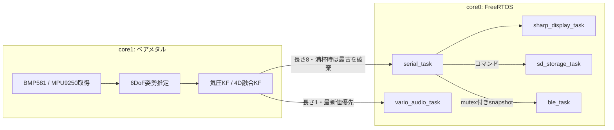
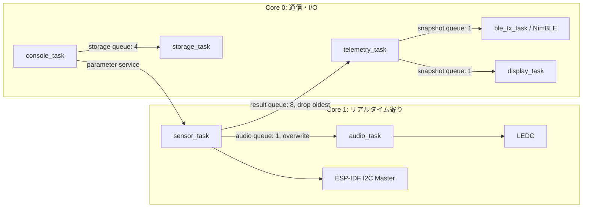

# ESP32-S3移植向け 機能要件・基本ソフトウェア設計

- 作成日: 2026-07-18
- 解析対象: Raspberry Pi Pico 2 W向け `BMP581` 現行ソース
- 移植先想定: ESP32-S3 / ESP-IDF 6.0系 / C言語中心

## 1. 目的

本書は、現行のRaspberry Pi Pico 2 W向けバリオメーターソフトウェアを解析し、ESP32-S3へ移植する際の基準となる次の内容をまとめる。

- 現行ソフトウェアが実現している機能と挙動
- ESP32-S3版が満たすべき機能要件と非機能要件
- ESP-IDFを用いた基本的なソフトウェア構成
- Pico固有実装からESP32-S3実装への置換方針
- 移植前に解消すべき不整合と未決事項

本書は「現行機能との互換性」を移植の第一段階とし、GPS、電池残量、Wi-Fi、OTA、フライトログ拡張などは将来拡張として扱う。

## 2. 結論

現行ソフトウェアは、次の責務を持つ組込みバリオメーターである。

1. BMP581から約100 Hzで気圧・温度を取得する。
2. MPU9250系IMUを既定500 Hzで取得し、姿勢補正した鉛直加速度を求める。
3. 気圧単独または気圧・IMU融合カルマンフィルタにより、高度と昇降率を推定する。
4. 昇降率に応じて、上昇音、沈下音、任意の予測ブザーをPWM出力する。
5. シリアル、Sharp Memory LCD、BLE NUS、SDカードへ状態を出力する。
6. シリアルコマンドでフィルタ・IMU・音声パラメータを実行時変更する。

ESP32-S3版では、Pico固有の「core1ベアメタル処理」「PIO」「Pico DMA」「Pico SDK queue」を移植せず、ESP-IDFのFreeRTOS SMP、I2C Master、SPI Master、LEDC、NimBLE、FATFSへ置き換える。フィルタ、姿勢推定、音声状態機械、BMP581レジスタ定義などのプラットフォーム非依存ロジックは、可能な限り再利用する。

## 3. 解析対象

主要な解析対象は次のとおりである。

| 領域 | 主な現行ファイル |
| --- | --- |
| 起動・タスク・データ連携 | `main.c`, `FreeRTOSConfig.h`, `CMakeLists.txt` |
| BMP581 | `lib_bmp581.c`, `lib_bmp581.h` |
| 高度・昇降率推定 | `kalman_altitude.c`, `kalman_vario4d.c` |
| IMU・姿勢推定 | `imu.c`, `mpu9250_i2c.c`, `attitude_6dof.c` |
| バリオ音 | `vario_audio.c`, `param.c`, `config.h` |
| BLE | `ble_uart.c`, `nus_profile.gatt`, `doc/ble.md` |
| 表示 | `sharp_memory_display.c`, `sharp_gfx.cpp` |
| SDカード | `sd_storage.c`, `hw_config.c` |
| コンソール・設定 | `serial_command.c`, `param.c`, `param.h` |

## 4. 現行Pico版の構成

### 4.1 実行モデル

現行のFreeRTOSは `configNUMBER_OF_CORES = 1` であり、FreeRTOSスケジューラはcore0で動作する。センサー取得処理だけを `multicore_launch_core1()` でcore1へ起動し、core1ではFreeRTOS APIを使わずベアメタルループとして実行している。



### 4.2 起動順序

現行 `main()` の起動順序は次のとおりである。

1. UART標準入出力を初期化する。USB標準入出力は無効である。
2. I2C0を400 kHz、SDA=GP8、SCL=GP9で初期化する。
3. BMP581用I2Cバス抽象化とPico DMAを初期化する。
4. センサーイベントキューとバリオ音PWMを初期化する。
5. Sharp Memory LCDを初期化し、起動画面を表示する。
6. SD書込みキューを初期化する。
7. BLE共有スナップショット用mutexを生成する。
8. core1でセンサー取得ループを開始する。
9. core0にシリアル、音声、表示、SD、BLEタスクを生成する。
10. FreeRTOSスケジューラを開始する。

ディスプレイ初期化、mutex生成、タスク生成に失敗した場合はpanicする。一方、BMP581、IMU、SD、BLEのデバイス不在は、可能な範囲で縮退動作する。

## 5. 現行機能の詳細

### 5.1 BMP581取得

#### インターフェース

- I2C0、400 kHz
- 候補アドレス: `0x46`, `0x47`
- 許容CHIP_ID: `0x50`, `0x51`
- 温度・気圧の6バイトをレジスタ `0x1D` から連続読出し

#### 既定設定

| 項目 | 現行値 | 最終レジスタ値 |
| --- | --- | --- |
| 温度オーバーサンプリング | 1x |  |
| 気圧オーバーサンプリング | 8x | `OSR_CONFIG = 0x58` |
| 気圧測定 | 有効 | `OSR_CONFIG = 0x58` |
| ODR | 100.299 Hz |  |
| 電源モード | Normal | `ODR_CONFIG = 0xA9` |
| Deep standby | 無効 | `ODR_CONFIG = 0xA9` |
| DSP設定 | `0x03` | `DSP_CONFIG = 0x03` |
| 温度・気圧IIR | Bypass | `DSP_IIR = 0x00` |
| 割込みソース | `0x01` | `INT_SOURCE = 0x01` |
| FIFO | 無効 | `FIFO_CONFIG = 0x00`, `FIFO_SEL = 0x00` |

#### 周期動作

- 初期化成功後の初回待ち: 30 ms
- サンプル周期: 10 ms
- センサー未検出時の再試行: 2000 ms
- Pico DMAタイムアウト: 25 ms
- メインポーリングのアイドル待ち: 1 ms
- DMAを開始できない場合は、ブロッキングI2C読出しへフォールバックする。
- サンプル読出し失敗時はエラーイベントを発行するが、現行実装では直ちに再初期化せず次周期の読出しを継続する。

#### データ形式

- 温度: `temperature_c_x100`、単位0.01 ℃
- 気圧: `pressure_pa_x100`、単位0.01 Pa
- 元の24 bit値も保持する。

### 5.2 IMU取得と姿勢推定

- 対象: MPU9250、MPU9255、MPU6500
- I2Cアドレス: 設定値を優先し、`0x68`, `0x69`へフォールバックする。
- 対応WHO_AM_I: `0x71`, `0x73`, `0x70`
- 既定サンプル周波数: 500 Hz。設定可能範囲は実装上50～1000 Hzへクランプされる。
- 加速度レンジ: ±8 g
- ジャイロレンジ: ±2000 dps
- 起動時ジャイロバイアス較正: 既定200サンプル、各サンプル間2 ms。較正中は機体を静止させる必要がある。
- 軸の入替えと符号反転をパラメータで設定できる。
- 6DoF Mahony型姿勢推定を使用し、地球座標Z軸加速度から重力加速度を減算する。
- 加速度ノルムが既定0.75～1.25 gの範囲にある場合のみ、加速度を姿勢補正へ使用する。
- IMUの最終正常値が100 msを超えて古い場合はstaleとする。
- BMP581のPico DMA実行中は、同じI2Cバスを使うIMU読出しを行わない。

IMUが未検出、stale、姿勢無効、またはBMP581周期内に有効な加速度サンプルがない場合は、気圧単独フィルタへ自動的にフォールバックする。

### 5.3 高度・昇降率推定

#### 気圧高度

現行の気圧高度は次式で求める。

```text
altitude_m = 44330 * (1 - (pressure_pa / sea_level_pressure_pa)^(1 / 5.255))
```

基準海面気圧の既定値は101325 Paであり、実行時パラメータで変更できる。

#### 気圧単独フィルタ

- 状態: 高度 `z`、鉛直速度 `v`
- 観測: BMP581から求めた気圧高度
- 100サンプルのウォームアップを行う。100 Hz時は約1秒に相当する。
- ウォームアップ期間の分散を測定分散の初期値に使用する。
- `timestamp_ms` の差から実測 `dt` を計算し、最大0.5秒にクランプする。

#### 気圧・IMU融合フィルタ

- 状態: 高度 `z`、鉛直速度 `v`、鉛直加速度 `a`、加速度バイアス
- 観測: 気圧高度、姿勢補正済み鉛直加速度
- 気圧単独フィルタと並行して更新する。
- 融合結果が有効な場合は融合値を採用し、無効な場合は気圧単独結果を採用する。
- `param_vario_filter_mode = 1` の場合は常に気圧単独とする。既定の0は自動選択である。

### 5.4 センサーデータ配信

センサーイベントには、開始、検出成功、未検出、正常サンプル、読出し失敗がある。正常サンプルには以下を含む。

- シーケンス番号、タイムスタンプ
- BMP581アドレス、CHIP_ID、温度、気圧
- 生高度、フィルタ高度、昇降率、有効フラグ
- IMU検出、融合使用、stale、鉛直加速度、WHO_AM_I
- キュー破棄累計数

core1からcore0へのキュー長は8である。満杯の場合は最古データを1件捨てて最新データを追加し、破棄数を加算する。したがって、低速な出力処理がセンサー取得を停止させない設計である。

### 5.5 バリオ音

#### 出力

- GP18のPWM出力
- 既定デューティ50 %
- 音声タスクの評価周期10 ms
- 最新昇降率キューの長さは1。新しい値が来た場合は古い値を上書きする。
- 無効データ、500 msを超えた古いデータ、または音声無効時は無音とする。

#### 状態

| 状態 | 開始条件 | 終了・遷移条件 | 音型 |
| --- | --- | --- | --- |
| SILENT | 初期状態 | 上昇、沈下、予測ブザー条件へ遷移 | 無音 |
| LIFT | `climb_rate > +0.1 m/s` | `climb_rate < +0.05 m/s` を検出後、鳴動周期境界で停止 | 同じ長さのON/OFFを繰り返す断続音 |
| SINK | シンク有効かつ `climb_rate < -1.0 m/s` | シンク無効、または `climb_rate > -0.8 m/s` | 連続音 |
| AUDIO_BUZZER | 予測ブザー有効かつ `-0.1～+0.1 m/s` | 明確な上昇・沈下、範囲外、機能無効 | 800 Hz、20 ms ON / 20 ms OFF |

状態の最小保持時間は60 msである。開始・終了しきい値を分け、ヒステリシスを持たせている。

#### 現行コードの音程・テンポ式

```text
lift_on_ms = lift_off_ms
           = max(500 - climb_rate_mps * 86, 70) * rate_multiplier

lift_frequency_hz = lift_base_hz + climb_rate_mps * 100

sink_frequency_hz = max(400 - abs(climb_rate_mps) * 100, 130)
```

`rate_multiplier` の既定値は1.0である。現行起動値を使ったリフト音の例は次のとおりである。

| 上昇率 | ON/OFF時間 | 起動直後の音程 |
| --- | --- | --- |
| +0.2 m/s | 約483 ms / 約483 ms | 約1320 Hz |
| +1.0 m/s | 約414 ms / 約414 ms | 約1400 Hz |
| +2.5 m/s | 約285 ms / 約285 ms | 約1550 Hz |
| +5.0 m/s | 70 ms / 70 ms | 約1800 Hz |

シリアルの `DEBUG VARIO <mps>` で任意の昇降率を強制し、`DEBUG CLEAR` で解除できる。

### 5.6 シリアルコンソール

現行はUART標準入出力を使用し、センサーメッセージをテキスト出力する。同じUARTから次のコマンドを受ける。

```text
PARAM LIST
PARAM GET <name>
PARAM SET <name> <value>
PARAM RESET <name|ALL>
PARAM HELP
DEBUG VARIO <mps>
DEBUG CLEAR
DEBUG HELP
SD STATUS
SD TEST
```

パラメータ型はbool、uint32、floatである。現在値の変更はRAM上だけであり、再起動後の永続化機能はない。また、値域やパラメータ間の関係を検証する共通機構はない。

### 5.7 Sharp Memory LCD

- 400×240 pixel、1 bpp、フレームバッファ12,000 byte
- PIOによるLSB-first SPI相当、2 MHz
- SCLK=GP2、MOSI=GP3、DISP=GP4、CS=GP5
- DMAで全画面転送する。
- 通常画面の更新周期は200 ms、すなわち5 Hzである。
- 表示内容: 気圧、高度、昇降率、鉛直加速度、シーケンス番号、BLE状態
- 500 ms以内に画面更新要求がない場合も、VCOM反転コマンドを送る。

描画側と転送側で同じフレームバッファを共有しており、明示的なmutexやダブルバッファはない。

### 5.8 BLE

- ロール: BLE Peripheral
- 広告名: `BMP581-Vario`
- サービス: Nordic UART Service互換
- RX: Write / Write Without Response。現行実装では受信内容を無視する。
- TX: Notify。接続かつCCCDでNotifyが有効な場合だけ送信する。
- 送信周期: 100 ms、10 Hz
- フィルタ結果が有効な場合だけ送信する。

送信センテンスは次の形式である。

```text
$LK8EX1,<pressure_pa>,99999,<vario_cm_s>,<temperature_c>,999*<checksum>\r\n
```

チェックサムは `$` と `*` の間の本文を1 byte XORして大文字2桁16進数にする。高度と電池は未実装のため、それぞれ `99999` と `999` を送る。

### 5.9 SDカード

- 現行Pico版はPIO SDIOとFreeRTOS+FATを使用する。
- マウントポイントは `/sd0`、再試行周期は2000 msである。
- 書込みキュー長は4であり、満杯または未マウント時は要求を破棄してカウントする。
- 起動後に `/sd0/system.log` へマウント完了行を追記する。
- `SD TEST` でテスト行を追記する。
- 各行の書込み後にディスクをflushする。

現行では、センサー値を連続記録するフライトロガー機能は実装されていない。

## 6. ESP32-S3版の機能要件

### 6.1 必須要件

- ESP32-S3上でESP-IDFのFreeRTOSを使用して動作すること。
- センサー取得・推定処理は、シリアル、BLE、表示、SD処理の遅延によって停止しないこと。
- 各周期処理は単調増加タイマーを使用し、時刻差から実際の `dt` を求めること。
- BMP581のI2Cアドレス `0x46`, `0x47` を検出し、CHIP_IDを検証すること。
- BMP581を現行と同じ設定値で初期化し、約100 Hzで温度・気圧を取得すること。
- BMP581が起動時に存在しない場合、約2秒ごとに再検出すること。
- MPU9250/9255/6500を検出し、既定500 Hzで加速度・角速度を取得できること。
- IMU未検出またはstale時も、BMP581による気圧単独動作を継続すること。
- 気圧から生高度を計算し、気圧単独カルマンフィルタで高度・昇降率を推定すること。
- IMUが有効な場合、姿勢補正済み鉛直加速度を用いる4状態融合フィルタを選択できること。
- 約1秒のフィルタウォームアップ中は、昇降率出力を無効として扱うこと。
- 融合処理が無効になった場合、自動的に気圧単独結果へフォールバックすること。
- 無音、上昇、沈下、予測ブザーの4状態を持つこと。
- 上昇率に応じて上昇音の音程を上げ、ON/OFF時間を短くすること。
- 沈下率に応じて沈下連続音の音程を下げ、最低130 Hzでクランプすること。
- 音声データが無効または500 msより古い場合は直ちに無音にすること。
- 開始・終了しきい値と最小保持時間により、しきい値付近のチャタリングを抑止すること。
- 400×240、1 bppのSharp Memory LCDへ、気圧、高度、昇降率、加速度、BLE状態を約5 Hzで表示すること。
- Sharp Memory LCDのVCOM反転周期を、表示デバイスの要求範囲内に維持すること。現行互換値は500 msである。
- NUS互換GATTサービスをPeripheralとして公開し、`BMP581-Vario` として広告すること。
- 有効な測定値をLK8EX1形式、10 HzでNotifyすること。
- Notify未許可、未接続、または推定値無効時は送信しないこと。
- 現行のPARAM、DEBUG、SDコマンドと応答形式を維持すること。
- 不正な構文、未知パラメータ、不正な数値を検出し、エラー応答を返すこと。
- SDカードをFATFSとしてマウントし、失敗時は約2秒ごとに再試行すること。
- ファイル書込みは専用キューと専用タスクで実行し、センサー処理をブロックしないこと。
- BMP581、IMU、BLE、SDの一部が利用できない場合でも、利用可能な機能を継続すること。
- センサー状態、フィルタ状態、キュー破棄数、SD状態、BLE状態を診断できること。

### 6.2 非機能要件

- BMP581取得の目標周期は10 ms、IMU取得の目標周期は2 msとする。長時間平均と最大遅延を計測できること。
- 音声状態機械の評価周期は10 ms以下を目標とする。
- キュー満杯時は高優先度処理を待たせず、最新値を優先して古い値を破棄すること。
- I2C、SPI、LEDC、BLE、FATFSの所有タスクまたは排他規則を明確にすること。
- ISRおよびタイマーコールバック内で、I2Cアクセス、ファイル書込み、複雑な浮動小数点演算を行わないこと。
- タスクスタック使用量、ヒープ残量、キュー破棄数、I2Cエラー数を確認できること。
- センサー・フィルタ・音声ロジックはESP-IDFドライバ層から分離し、ホスト単体テスト可能なCモジュールとすること。
- GPIO、I2Cポート、SPIホスト、周波数などのボード依存値はKconfigまたはboard設定へ集約すること。

## 7. ESP32-S3版の基本ソフトウェア設計

### 7.1 採用方針

- フレームワークはESP-IDFを使用し、Arduino依存を持たせない。
- ESP-IDFの新I2C Masterドライバを使用する。legacy `driver/i2c.h` は使用しない。
- FreeRTOS SMP上の全処理をFreeRTOSタスクとして実行し、Pico版のベアメタルcore1を再現しない。
- 高周期センサータスクだけをcore1へ固定し、BluetoothなどESP-IDF内部処理との干渉を抑える。
- PIOやPico DMAを直接模倣せず、ESP-IDFドライバの割込み・DMA機能を利用する。
- プラットフォーム非依存ロジックとESP-IDFアダプタを別componentにする。

### 7.2 推奨アーキテクチャ



`telemetry_task` はセンサー結果の配信役とし、UART整形、BLE用スナップショット、表示用スナップショットを分離する。表示タスクだけがフレームバッファとLCD用SPIデバイスを所有し、ストレージタスクだけがファイルを所有する。

### 7.3 タスク設計

以下は初期実装時の目安であり、実機でスタックHigh Water Markと実行時間を測定して調整する。ESP-IDFの `xTaskCreatePinnedToCore()` のスタックサイズはbyte単位であり、Pico版のstack word値をそのまま転用してはならない。

| タスク | Core | 初期優先度案 | 初期スタック案 | 主責務 |
| --- | --- | ---: | ---: | --- |
| `sensor_task` | 1固定 | 12 | 6144 B | I2C取得、姿勢推定、フィルタ、結果配信 |
| `audio_task` | 1固定 | 11 | 4096 B | 最新昇降率の状態機械、LEDC制御 |
| `ble_tx_task` | 0固定または無指定 | 6 | 4096 B | 10 Hz LK8EX1生成、Notify |
| `display_task` | 0固定または無指定 | 5 | 8192 B | 5 Hz描画、SPI転送、VCOM維持 |
| `console_task` | 0固定または無指定 | 4 | 4096 B | UART入力解析、診断出力、パラメータ変更 |
| `storage_task` | 0固定または無指定 | 3 | 6144 B | SDマウント、キュー書込み、flush |

BluetoothホストはNimBLEが生成する内部タスクを利用する。アプリ側の `ble_tx_task` はNotify要求だけを担当する。

### 7.4 センサータスク

#### スケジューリング

- `CONFIG_FREERTOS_HZ=1000` を前提候補とし、2 msの絶対周期でIMUを処理する。
- 5回に1回、すなわち10 msごとにBMP581を取得する。
- `vTaskDelayUntil()` または `esp_timer_get_time()` による絶対期限を使い、処理時間を周期へ累積させない。
- 周期超過回数と最大処理時間を診断値として保持する。
- タイマーコールバックを使う場合、コールバックはtask notificationを送るだけにし、I2C処理は `sensor_task` で行う。

#### I2C

- `i2c_new_master_bus()` で400 kHzのI2C Master busを生成する。
- BMP581とMPU9250系を個別device handleとして登録する。
- レジスタ読出しは、repeated-startを生成する `i2c_master_transmit_receive()` を使用する。
- 単一の `sensor_task` がセンサーデバイスを順次操作するため、アプリ側のI2C mutexは原則不要である。
- ESP-IDF I2Cドライバが処理するため、Pico版のI2Cレジスタ直書きDMAコードは移植しない。100 Hz/500 Hzを満たせないことが計測で確認された場合のみ非同期APIを検討する。
- I2Cタイムアウト、NACK、連続エラー回数を分けて記録する。

#### エラー回復

- BMP581未検出時は2秒後に再検出する。
- 読出し単発失敗では次周期を継続する。
- 連続失敗が規定回数に達した場合はdevice handleとセンサーを再初期化する。規定回数はKconfigまたはパラメータ化する。
- IMU失敗時は融合を無効化して気圧単独へ切り替え、バックグラウンドで再検出する。

連続失敗後の再初期化は現行Pico版より堅牢にする推奨拡張である。完全な現行互換試験では、単発失敗後も10 ms周期を継続する点を維持する。

### 7.5 再利用するアルゴリズム層

次のモジュールは、Pico SDKヘッダとハードウェア型を外せばほぼ再利用できる。

- `kalman_altitude.c/.h`
- `kalman_vario4d.c/.h`
- `attitude_6dof.c/.h`
- `imu.c/.h` の軸変換
- `param.c/.h` の型・テーブル概念
- `vario_audio.c` の状態機械と音程・時間計算
- `lib_bmp581.c` のレジスタ定義、設定値、デコード、周期状態

一方、次の部分は分離または置換する。

- `lib_bmp581.h` から `hardware/i2c.h` とPico DMA contextを除去する。
- BMP581コアドライバはread/write/delay/timeの抽象インターフェースだけを参照する。
- `bmp581_bus_espidf.c` でESP-IDF I2C handleを実装する。
- `mpu9250_i2c.c` のPico I2C呼出しと `busy_wait_ms()` をESP-IDFへ置換する。
- `vario_audio.c` のPico PWM部分を `vario_audio_output_ledc.c` へ分離する。

### 7.6 データモデルとキュー

推奨する公開結果型の例を次に示す。

```c
typedef struct {
    uint32_t sequence;
    int64_t timestamp_us;
    int32_t temperature_c_x100;
    int32_t pressure_pa_x100;
    float raw_altitude_m;
    float filtered_altitude_m;
    float climb_rate_mps;
    float vertical_accel_mps2;
    bool estimate_valid;
    bool bmp581_online;
    bool imu_online;
    bool imu_fusion_active;
    bool imu_stale;
    uint32_t sensor_drop_count;
    uint32_t i2c_error_count;
} vario_result_t;
```

キュー規則は次のとおりとする。

| 経路 | 長さ | 満杯時 |
| --- | ---: | --- |
| sensor → telemetry | 8 | 最古を捨て、最新を追加し、drop countを加算 |
| sensor → audio | 1 | `xQueueOverwrite()` で最新値へ置換 |
| telemetry → BLE | 1 | 最新スナップショットへ置換 |
| telemetry → display | 1 | 最新スナップショットへ置換 |
| console/producer → storage | 4 | タイムアウト後に破棄し、drop countを加算 |

イベント通知と連続サンプルを同一キューで扱う場合、重要イベントがサンプルで上書きされないようにする。推奨は、状態変化をEvent Groupまたは別のsystem event queueへ分けることである。

### 7.7 バリオ音出力

- ESP32-S3のLEDC low-speed channelを1チャネル使用する。
- 音声出力GPIO、LEDC timer/channel、duty resolutionはboard設定に置く。
- 周波数変更とデューティ更新は `audio_task` だけが行う。
- 音程・状態遷移・stale判定は現行ロジックを再利用する。
- LEDCの周波数と分解能の組合せに制約があるため、130～2000 Hz程度の実使用範囲で生成誤差を測定する。
- 無音化はdutyを0にし、必要に応じて出力GPIOを既知レベルへ戻す。

### 7.8 Sharp Memory LCD

- ESP-IDF SPI Masterを使用し、2 MHz、LSB-firstで送信する。
- `SPI_DEVICE_TXBIT_LSBFIRST` または同等のdevice flagを使用する。
- フレームバッファとwire bufferは内部RAMへ配置する。DMA使用時は必要なアラインメントとDMA-capable memory条件を満たす。
- `display_task` だけがフレームバッファを更新・転送する。
- 5 Hzの画面更新と500 msのVCOM期限を、同じタスクのtimeout待ちで処理する。
- 将来別タスクから描画する必要がある場合は、ダブルバッファまたは描画コマンドキューを導入する。

現行のAdafruit GFX描画資産を再利用する場合、ESP-IDF componentとしてC++ビルドし、C APIラッパーを維持する。依存を減らす場合は、必要な線・矩形・文字描画だけを小さな1 bpp描画モジュールへ置き換える。

### 7.9 BLE

- BLEのみを使用するため、ESP-IDFではNimBLEを第一候補とする。
- 現行と同じNUS UUID、RX/TX characteristic、CCCDを定義する。
- RX書込みは受理するが、互換段階では内容を無視する。
- 接続、切断、CCCD変更、MTU変更を接続contextに保持する。
- `ble_tx_task` が100 msごとに最新の有効値からLK8EX1を生成する。
- Notify APIを複数タスクから呼ばず、BLE送信経路を1か所に限定する。

LK8EX1センテンスは通常20 byteを超える。現行GATT定義はcharacteristic長20 byteで、現行送信関数はセンテンス全体を1回でNotifyしているため、ATT MTUによっては送信できない。ESP32-S3版では次のどちらかを必ず実装する。

1. 接続時に十分なMTUを確立し、`MTU - 3` 以下であることを確認して1 Notifyで送る。
2. `MTU - 3` ごとに分割し、NUSのbyte streamとして連続Notifyする。

XCTrack実機との互換試験では、1 Notify方式と分割方式の双方を確認し、採用方式を固定する。

### 7.10 SDカード

- SDカード配線が確保できる場合はSDMMC 4 bitまたは1 bitを使用する。
- GPIO制約や基板都合がある場合はSDSPIを代替とする。
- ESP32-S3では `esp_vfs_fat_sdmmc_mount()` または `esp_vfs_fat_sdspi_mount()` を使用する。
- マウントポイントはESP-IDF慣例に合わせて `/sdcard` としてよいが、シリアル応答や既存ツールが `/sd0` を前提とする場合は互換名を維持する。
- `storage_task` だけがファイルhandleとmount/unmountを所有する。
- 書込み失敗時はファイルを閉じ、カード状態をERRORへ遷移させ、明示的にunmountしてから再マウントする。
- 現行互換段階ではboot logと `SD TEST` だけを実装する。連続センサーログは別要件とする。

### 7.11 パラメータ管理

現行の `volatile` グローバル変数を複数coreから直接参照する方式は、ESP32-S3版では避ける。推奨方式は次のとおりである。

1. 全パラメータを `app_config_t` に集約する。
2. 更新時はmutexを取得し、型、値域、パラメータ間関係を検証する。
3. 高周期タスクは周期冒頭で必要項目だけをローカルスナップショットへコピーする。
4. `PARAM SET` は検証成功後にのみ反映する。
5. 起動時既定値と `PARAM RESET` の既定値を単一テーブルから生成する。

現行互換では設定はRAMのみとする。NVS永続化を追加する場合は、`PARAM SAVE`、`PARAM LOAD`、設定schema version、CRCまたは妥当性検証を別要件として追加する。

### 7.12 初期化と縮退動作

推奨する `app_main()` の処理順序は次のとおりである。

1. NVSを初期化する。BLEが使用するため、パラメータ永続化を行わない場合も初期化する。
2. board設定とパラメータ既定値を読み込む。
3. UART console、診断カウンタ、キュー、mutex、Event Groupを生成する。
4. I2C bus、BMP581、IMUを初期化する。
5. LEDCを無音状態で初期化する。
6. SPI LCDを初期化し、表示タスクを開始する。
7. SDストレージタスクを開始する。
8. NimBLEを初期化し、広告を開始する。
9. telemetry、console、BLE送信、音声、センサーの順にタスクを開始する。
10. センサータスク開始後にシステムRUNNINGイベントを設定する。

| 障害 | 必須の動作 |
| --- | --- |
| BMP581不在 | 音声・BLE測定値を無効化し、2秒周期で再検出 |
| IMU不在 | 気圧単独フィルタで継続 |
| LCD不在 | ログへ記録し、測定・音声・BLEを継続することを推奨 |
| SD不在 | 測定を継続し、2秒周期で再マウント |
| BLE初期化失敗 | ローカル測定・音声・表示・UARTを継続 |
| キュー満杯 | 既定の破棄規則を適用し、カウンタを更新 |
| メモリ確保失敗 | 起動必須資源なら安全停止、任意機能なら機能無効化 |

## 8. Pico固有機能とESP32-S3置換表

| Pico版 | ESP32-S3版 |
| --- | --- |
| `multicore_launch_core1()` | `xTaskCreatePinnedToCore()` またはcore affinity |
| core1ベアメタルループ | core1固定のFreeRTOS `sensor_task` |
| `pico/util/queue.h` | FreeRTOS Queue、`xQueueOverwrite()` |
| `get_absolute_time()` | `esp_timer_get_time()` |
| `i2c_write_blocking/read_blocking` | 新I2C Master API |
| I2Cレジスタ直書きDMA | ESP-IDF I2Cドライバ。必要時のみ非同期callback |
| PWM slice/channel | LEDC timer/channel |
| PIO LSB-first SPI | SPI Master + LSB-first flag |
| PIO + DMA display transfer | SPI Master interrupt transaction + DMA |
| PIO SDIO + FreeRTOS+FAT | SDMMC/SDSPI + VFS FATFS |
| BTstack + CYW43 | ESP Bluetooth Controller + NimBLE |
| Pico UART stdio | ESP-IDF console/UARTまたはUSB Serial/JTAG |
| `panic()` | `ESP_ERROR_CHECK`、状態遷移、必要時 `esp_restart()` |

## 9. 推奨component構成

```text
esp32_vario/
├── CMakeLists.txt
├── sdkconfig.defaults
├── SRC/
│   ├── app_main.c
│   ├── app_tasks.c
│   ├── app_queues.c
│   └── CMakeLists.txt
└── components/
    ├── board/
    │   ├── Kconfig
    │   └── board_config.c
    ├── bmp581/
    │   ├── bmp581.c
    │   ├── bmp581.h
    │   └── bmp581_bus_espidf.c
    ├── imu/
    │   ├── imu.c
    │   ├── mpu9250.c
    │   └── attitude_6dof.c
    ├── vario_estimator/
    │   ├── kalman_altitude.c
    │   └── kalman_vario4d.c
    ├── vario_audio/
    │   ├── vario_audio_state.c
    │   └── vario_audio_ledc.c
    ├── display/
    │   ├── sharp_memory_lcd.c
    │   └── vario_screen.cpp
    ├── ble_vario/
    │   ├── nus_service.c
    │   └── lk8ex1.c
    ├── storage/
    │   └── storage_task.c
    ├── console/
    │   └── command_console.c
    └── app_config/
        ├── app_config.c
        └── param_table.c
```

アルゴリズムcomponentからESP-IDF peripheral headerを参照しない構成とする。

## 10. 移植手順案

### Phase 1: 最小センサー動作

1. ESP-IDFプロジェクトとboard設定を作る。
2. 新I2C Master APIでBMP581のCHIP_ID、設定レジスタ、6 byteデータを確認する。
3. ホストテストでPico版と同じ生値デコード結果になることを確認する。
4. 100 Hz取得と時刻揺らぎを計測する。

### Phase 2: 高度・昇降率

1. 気圧単独カルマンフィルタを移植する。
2. 記録済み気圧系列をPico版とESP32-S3版へ入力し、出力差を比較する。
3. MPU9250系、軸変換、ジャイロ較正、姿勢推定を移植する。
4. 4状態融合フィルタと気圧単独フォールバックを確認する。

### Phase 3: 音声

1. LEDCで固定周波数・デューティを確認する。
2. 音声状態機械を移植する。
3. `DEBUG VARIO` に相当する注入テストで境界値とstale動作を確認する。
4. 実ブザーと筐体で音程・音量を評価する。

### Phase 4: UI・通信・ストレージ

1. Sharp Memory LCDのLSB-first送信とVCOMを確認する。
2. NimBLE NUSとLK8EX1を実装し、XCTrackと接続試験する。
3. BLE MTUまたは分割送信方式を確定する。
4. SDMMC/SDSPI、FATFS、system logを実装する。
5. シリアルコマンドとパラメータテーブルを移植する。

### Phase 5: 統合・耐久

1. 全機能同時動作でI2C周期、音声遅延、BLE欠落、表示周期を測定する。
2. センサー抜去、SD抜去、BLE切断、キュー飽和、I2C NACKを注入する。
3. 1時間以上の連続動作でヒープ、スタック、エラー数の増加を確認する。
4. Pico版と同じ入力ログに対する高度・昇降率・音声状態を比較する。

## 11. 受入試験の基準案

- BMP581設定後に `OSR_CONFIG=0x58`, `ODR_CONFIG=0xA9`, `DSP_CONFIG=0x03`, `DSP_IIR=0x00` をread-backできる。
- BMP581正常時、10 ms目標で気圧サンプルが連続取得される。
- IMU正常時は融合がactiveになり、IMU停止後100 ms超で気圧単独へ切り替わる。
- 起動後100 BMPサンプルまでは推定無効で、その後有効になる。
- 出力処理を意図的に停止してもセンサー取得が継続し、キュー破棄数が増える。
- `DEBUG VARIO 0.2`, `1.0`, `2.5`, `5.0` で、上昇率に応じて音程が上がりテンポが速くなる。
- `+0.1 m/s` 以下ではLIFTを開始せず、LIFT中に `+0.05 m/s` 未満となると周期境界で停止する。
- `-1.0 m/s` 未満でSINKを開始し、`-0.8 m/s` より大きくなると停止する。
- 500 msを超えて新しい推定値が来ない場合、LEDC出力が無音になる。
- LCDは約5 Hzで更新され、画面更新がない場合もVCOMが500 ms周期で維持される。
- XCTrackがNUSへ接続し、10 HzのLK8EX1から気圧と昇降率を受信できる。
- Notify payloadがATT MTUを超えない、または分割後に受信側で完全なCRLFセンテンスへ復元できる。
- SDなしで起動しても測定を継続し、SD挿入後に再マウントできる。
- PARAM LIST/GET/SET/RESET、DEBUG、SDコマンドが現行互換の応答を返す。

## 12. 移植前に解消すべき不整合・未決事項

### 12.1 起動値とRESET既定値の不一致

| パラメータ | 起動時変数 | PARAM RESET後 |
| --- | ---: | ---: |
| `param_imu_accel_min_g` | 0.75 | 0.5 |
| `param_imu_accel_max_g` | 1.25 | 1.5 |
| `param_lift_freq_base_hz` | 1300 Hz | 1000 Hz |

ESP32-S3版では、起動値とRESET値を単一の定義から生成し、どちらを正式値とするか決定する必要がある。

### 12.2 音声要求文書と現行式の不一致

`doc/vario_audio_requirements.adoc` のテンポ例は、+1.0 m/sで約220 ms、+2.5 m/sで約100 msとしている。一方、現行コードの式ではそれぞれ約414 ms、約285 msである。ESP32-S3版の互換基準を「現行コード」とするか「要求文書」とするかを、実装前に決定する必要がある。

### 12.3 BLEセンテンス長

現行GATT定義のcharacteristic長は20 byteだが、実際のLK8EX1センテンスは通常20 byteを超える。ESP32-S3版ではMTU確立または分割送信を必須設計とする。

### 12.4 BLE文書と現行フォーマット

`doc/ble.md` の例はbattery値と `*` の間にカンマを含むが、現行コードはカンマを入れない。チェックサムも変わるため、XCTrackで実際に受理される形式を確認して固定する。

### 12.5 パラメータの値域と永続化

現行は共通の値域検証と永続化を持たない。ESP32-S3版でNVS保存を行うか、RAMのみの現行互換とするかを決定する必要がある。

### 12.6 GPIO割当て

ESP32-S3のGPIO割当ては、採用するモジュール、Flash/PSRAM構成、USB、strapping pin、SDMMC幅によって変わる。本書では固定値を決めず、回路図確定後にboard設定へ集約する。

### 12.7 現行TODOの扱い

`README.md`の「ロードマップ」にある電池残量、GPS、OTAは本移植の互換範囲外である。基礎移植完了後に独立した要件として追加する。

## 13. ESP-IDF公式リファレンス

本設計で参照したESP-IDF 6.0系の公式資料を示す。

- [FreeRTOS supplemental features / core affinity](https://docs.espressif.com/projects/esp-idf/en/stable/esp32s3/api-reference/system/freertos_additions.html)
- [ESP32-S3 I2C Master driver](https://docs.espressif.com/projects/esp-idf/en/stable/esp32s3/api-reference/peripherals/i2c.html)
- [ESP32-S3 SPI Master driver](https://docs.espressif.com/projects/esp-idf/en/stable/esp32s3/api-reference/peripherals/spi_master.html)
- [ESP32-S3 LEDC](https://docs.espressif.com/projects/esp-idf/en/stable/esp32s3/api-reference/peripherals/ledc.html)
- [ESP32-S3 Bluetooth API](https://docs.espressif.com/projects/esp-idf/en/stable/esp32s3/api-reference/bluetooth/index.html)
- [ESP32-S3 SDMMC Host driver](https://docs.espressif.com/projects/esp-idf/en/stable/esp32s3/api-reference/peripherals/sdmmc_host.html)
- [ESP32-S3 FATFS support](https://docs.espressif.com/projects/esp-idf/en/stable/esp32s3/api-reference/storage/fatfs.html)

ESP-IDFのAPIはversion間で変更されるため、実装開始時に使用versionを固定し、そのversionのドキュメントとexamplesを基準にすること。
